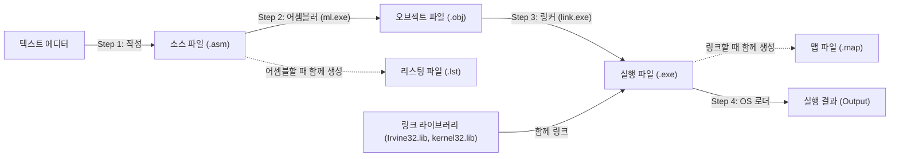
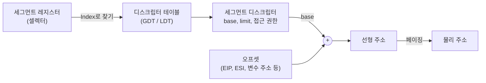

# x86 어셈블리 언어 기초 (Assembly Language Fundamentals)


> Kip R. Irvine, *Assembly Language for x86 Processors* — Chapter 3. Assembly Language Fundamentals 강의 정리
>
> 슬라이드의 핵심 내용에 슬라이드에 없는 배경 지식, 동작 원리, 추가 예제, 자주 하는 실수를 보충했다.
> 슬라이드의 오타나 잘못된 설명은 본문에 정정 박스로 표시하고 [부록 F](#부록-f-슬라이드-정정-사항-모음)에 모아 두었다.
> 발표 주제인 플래그 레지스터와 세그먼트 레지스터는 [부록 B](#부록-b-플래그-레지스터-eflags)와 [부록 C](#부록-c-세그먼트-레지스터-segment-registers)에서 따로 자세히 다룬다.

---

## 한눈에 보기 (TL;DR)

- 어셈블리 문장은 CPU가 실행하는 **명령어**(instruction)와 어셈블러가 처리하는 **디렉티브**(directive)로 나뉜다.
- 명령어 형식은 `[label:] mnemonic [operands] [;comment]`이다.
- 정수 리터럴은 접미사로 진법을 표시한다: `h`(16진), `b`(2진), `q`/`o`(8진), `d`(10진). 문자로 시작하는 16진수는 앞에 `0`을 붙인다(`0A3h`).
- 상수 식은 **어셈블할 때** 계산된다. 우선순위는 `( )` → 단항 `+ -` → `* / MOD` → `+ -` 순이다.
- 32비트 프로그램의 뼈대: `.386` → `.model flat, stdcall` → `.stack` → `.data` → `.code` → `main PROC ... main ENDP` → `END main`
- 빌드 과정: 편집(.asm) → 어셈블(.obj, .lst) → 링크(.exe, .map) → OS 로더가 적재·실행
- 데이터 정의는 `이름 타입 초기값` 형식이다. `?`는 미초기화, `DUP`은 반복이며, 타입 키워드는 **크기만** 정한다.
- x86은 **리틀 엔디안**이다. `12345678h`는 메모리에 `78 56 34 12` 순서로 저장된다.
- `=`, `EQU`, `TEXTEQU`로 만든 심볼릭 상수는 메모리를 차지하지 않는다. 배열 크기는 `($ - 배열) / 원소크기`로 구한다.

---

## 목차

| 구분 | 내용 |
|---|---|
| [들어가며](#들어가며-어셈블리-언어의-특징) | 어셈블리 언어의 특징, 고급 언어와의 비교 |
| [3.1 기본 언어 요소](#31-기본-언어-요소-basic-language-elements) | 정수·실수·문자·문자열 리터럴, 상수 식, 예약어, 식별자, 디렉티브, 명령어(레이블·니모닉·피연산자·주석·NOP) |
| [3.2 정수 더하기와 빼기](#32-예제-정수-더하기와-빼기-adding-and-subtracting-integers) | 개발 환경 설정, AddTwo·AddSub2 분석, 실행 결과 해석, 디버깅, 템플릿 |
| [3.3 어셈블, 링크, 실행](#33-어셈블-링크-실행-assembling-linking-and-running-programs) | 빌드 사이클, 명령줄 빌드, 리스팅 파일(기계어 해석), 맵 파일 |
| [3.4 데이터 정의](#34-데이터-정의-defining-data) | 내장 데이터 타입, BYTE ~ REAL10, 문자열, DUP, packed BCD, IEEE 754, 리틀 엔디안, .DATA? |
| [3.5 심볼릭 상수](#35-심볼릭-상수-symbolic-constants) | `=` 디렉티브, 위치 카운터, 배열 크기 계산, EQU, TEXTEQU |
| [3.6 64비트 프로그래밍](#36-64비트-프로그래밍-64-bit-programming) | 32비트 코드와 64비트 코드의 차이 |
| [부록 A](#부록-a-레지스터-한눈에-보기) | 범용 레지스터 한눈에 보기 |
| [부록 B](#부록-b-플래그-레지스터-eflags) | 플래그 레지스터(EFLAGS) — 발표 주제 |
| [부록 C](#부록-c-세그먼트-레지스터-segment-registers) | 세그먼트 레지스터 — 발표 주제 |
| [부록 D](#부록-d-핵심-용어-정리) | 핵심 용어 정리 |
| [부록 E](#부록-e-셀프-체크-퀴즈) | 셀프 체크 퀴즈 (정답 접기) |
| [부록 F](#부록-f-슬라이드-정정-사항-모음) | 슬라이드 정정 사항 모음 |
| [참고 자료](#참고-자료) | 교재, 공식 문서, 참고 사이트 |

---

## 들어가며: 어셈블리 언어의 특징

어셈블리 언어는 CPU가 직접 실행하는 기계어(0과 1)를 사람이 읽을 수 있는 짧은 단어로 옮긴 **저수준 언어**다. 어셈블리 명령어 한 줄은 대부분 기계어 명령 하나에 대응한다. 슬라이드 첫 장의 네 키워드로 특징을 정리하면 다음과 같다.

| 키워드 | 슬라이드 설명 | 보충 설명 |
|---|---|---|
| Assembly Language | 세밀한 제어를 위한 핵심 언어 | 명령어 하나하나가 CPU 동작 하나와 대응하므로 실행 흐름, 속도, 메모리 사용을 직접 통제할 수 있다 |
| Total Information | CPU 레지스터와 플래그에 접근 | 고급 언어가 숨기는 레지스터(EAX 등)와 상태 비트(CF, ZF 등)를 직접 읽고 쓴다 |
| Responsibility | 데이터와 명령어 형식 관리 | 타입 검사나 자동 형 변환이 거의 없다. 크기·부호·메모리 배치를 맞추는 일은 모두 프로그래머 몫이다 |
| Simple Program | 두 수를 더하는 예제 | 이 장은 `5 + 6`을 계산하는 AddTwo 프로그램에서 출발한다 |

### 고급 언어와 비교

같은 일을 C와 어셈블리로 쓰면 다음과 같다.

```c
int sum;
sum = 5 + 6;
```

```asm
.data
sum DWORD ?          ; 4바이트 변수 선언 (초깃값 없음)

.code
mov eax, 5           ; EAX ← 5
add eax, 6           ; EAX ← EAX + 6
mov sum, eax         ; sum ← EAX
```

- **계산은 레지스터를 거친다.** 값을 레지스터로 가져와 계산한 뒤 다시 메모리에 저장한다. x86은 메모리끼리 직접 계산하는 것을 허용하지 않는다.
- **변수 영역과 코드 영역이 나뉜다.** 변수는 `.data`, 실행 코드는 `.code`에 쓴다.
- **타입 대신 크기를 지정한다.** `int`처럼 의미가 담긴 타입이 아니라 `DWORD`(4바이트)처럼 저장 공간의 크기만 정한다.

이 장에서는 **리터럴(상수), 식별자, 디렉티브, 명령어**를 선언하고 사용하는 방법, 프로그램을 빌드하고 디버깅하는 방법, 데이터를 정의하는 방법을 배운다.

---

## 3.1 기본 언어 요소 (Basic Language Elements)

### 첫 번째 어셈블리 프로그램

슬라이드의 첫 예제는 5와 6을 더하는 프로그램이다.

```asm
main PROC                    ; 메인 프로시저 시작 = 프로그램의 진입점(entry point)
    mov  eax, 5              ; EAX 레지스터에 5를 넣는다
    add  eax, 6              ; EAX에 6을 더한다 → EAX = 11

    INVOKE ExitProcess, 0    ; Windows 서비스(함수)를 호출해 프로그램 종료
main ENDP                    ; 메인 프로시저의 끝
```

| 요소 | 의미 |
|---|---|
| `main PROC` | 프로시저(procedure, 다른 언어의 함수) 시작. 여기서는 `main`이 프로그램의 진입점이다 |
| `mov`, `add` | 명령어 니모닉. 각각 값 복사와 덧셈 |
| `eax` | CPU 안에 있는 32비트 범용 레지스터 |
| `;` | 세미콜론부터 줄 끝까지는 주석 |
| `INVOKE ExitProcess, 0` | Windows 서비스(함수라고도 부름)를 호출해 프로그램을 멈추고 제어권을 운영체제에 돌려준다. `0`은 종료 코드(정상 종료) |
| `main ENDP` | 메인 프로시저가 끝나는 지점을 표시 |

> [!WARNING]
> **슬라이드 정정**
> - `move eax, 5` → `mov eax, 5` : x86에는 `move`라는 명령어가 없다. 그대로 쓰면 어셈블 오류가 난다.
> - `sum DRWORD 0` → `sum DWORD 0`
> - `/* AddTwo program */` 같은 C 스타일 주석은 MASM에서 쓸 수 없다. `;` 또는 `COMMENT` 디렉티브를 쓴다.
> - 왼쪽의 줄 번호(`1:`, `2:` …)는 설명을 위한 것이며 실제 소스에는 쓰지 않는다.

#### 변수를 추가한 버전

```asm
.data                        ; 데이터 세그먼트: 변수를 선언하는 영역
sum DWORD 0                  ; 32비트 변수 sum 생성 (초깃값 0)

.code                        ; 코드 세그먼트: 실행할 명령어가 들어가는 영역
main PROC
    mov  eax, 5              ; EAX = 5
    add  eax, 6              ; EAX = 11
    mov  sum, eax            ; 결과를 변수 sum에 저장

    INVOKE ExitProcess, 0
main ENDP
```

- `.data`와 `.code`는 **디렉티브**로, 프로그램을 데이터 세그먼트와 코드 세그먼트로 나눈다.
- `DWORD`는 32비트 크기를 뜻하는 키워드다. 어셈블리에는 `BYTE`, `WORD`, `DWORD` 등 여러 크기 키워드가 있지만, 이들은 **크기만 지정**할 뿐 C의 `int`나 `float`처럼 값의 쓰임새까지 정하지는 않는다.
- 이 장에서 배울 언어 요소는 크게 네 가지다: 리터럴(상수), 식별자, 디렉티브, 명령어.

### 정수 리터럴 (Integer Literals)

리터럴(literal)은 코드에 직접 적은 값이다. 정수 리터럴의 형식은 다음과 같다. 대괄호는 생략 가능, 중괄호는 그중 하나를 고른다는 뜻이다.

```
[{+ | -}] digits [radix]
```

| 접미사 | 진법 | 접미사 | 진법 |
|:---:|---|:---:|---|
| `h` | 16진수 (hexadecimal) | `r` | 인코딩된 실수 (encoded real) |
| `q` / `o` | 8진수 (octal) | `t` | 10진수 (대체 표기) |
| `d` | 10진수 (decimal) | `y` | 2진수 (대체 표기) |
| `b` | 2진수 (binary) | | |

| 리터럴 | 진법 | 10진수 값 |
|---|---|---:|
| `26` | 10진수 (접미사가 없으면 10진수) | 26 |
| `26d` | 10진수 | 26 |
| `11010011b` | 2진수 | 211 |
| `42q` | 8진수 | 34 |
| `42o` | 8진수 | 34 |
| `1Ah` | 16진수 | 26 |
| `0A3h` | 16진수 | 163 |

아래 줄은 표기만 다를 뿐 모두 같은 값(26)을 AL에 넣는다.

```asm
mov al, 26          ; 10진수
mov al, 26t         ; 10진수 (대체 표기)
mov al, 11010b      ; 2진수
mov al, 11010y      ; 2진수 (대체 표기)
mov al, 32q         ; 8진수
mov al, 1Ah         ; 16진수
```

> [!IMPORTANT]
> **문자(A ~ F)로 시작하는 16진수는 반드시 앞에 0을 붙인다.**
> `A3h`라고 쓰면 어셈블러는 숫자가 아니라 `A3h`라는 이름(식별자)으로 해석한다. `0A3h`처럼 써야 16진수로 인식된다.

- 접미사는 대소문자를 구분하지 않는다. (`1Ah` = `1AH` = `1ah`)
- `.RADIX` 디렉티브로 기본 진법을 바꿀 수 있다. 예를 들어 `.RADIX 16`이면 접미사 없는 숫자가 16진수가 되는데, 이때 `b`와 `d`는 16진수 숫자 B, D와 헷갈린다. 그래서 대체 접미사 `y`(2진수)와 `t`(10진수)가 존재한다.
- 부호를 붙일 수 있다: `-26`, `+1Ah`

#### 진법 변환 빠른 참고

16진수 한 자리는 2진수 네 자리(니블, nibble)와 정확히 대응하고, 8진수 한 자리는 2진수 세 자리와 대응한다. 그래서 2진수를 16진수로 바꿀 때는 오른쪽부터 4자리씩 끊으면 된다. 예: `1101 0011b` = `D3h` = 211

| 16진 | 0 | 1 | 2 | 3 | 4 | 5 | 6 | 7 |
|:---:|:---:|:---:|:---:|:---:|:---:|:---:|:---:|:---:|
| 2진 | 0000 | 0001 | 0010 | 0011 | 0100 | 0101 | 0110 | 0111 |
| **16진** | **8** | **9** | **A** | **B** | **C** | **D** | **E** | **F** |
| 2진 | 1000 | 1001 | 1010 | 1011 | 1100 | 1101 | 1110 | 1111 |

### 상수 정수 식 (Constant Integer Expressions)

상수 정수 식은 정수 리터럴과 산술 연산자로 이루어진 수식이다. **어셈블러가 어셈블하는 시점에 계산**하며, 결과는 32비트 정수 범위 안에 들어가야 한다.

| 연산자 | 이름 | 우선순위 |
|:---:|---|:---:|
| `( )` | 괄호 | 1 (가장 높음) |
| `+`, `-` | 단항 플러스, 단항 마이너스 | 2 |
| `*`, `/` | 곱셈, 나눗셈 | 3 |
| `MOD` | 나머지 (modulus) | 3 |
| `+`, `-` | 덧셈, 뺄셈 | 4 (가장 낮음) |

| 식 | 계산 순서 | 결과 |
|---|---|---:|
| `4 + 5 * 2` | 곱셈 → 덧셈 | 14 |
| `12 - 1 MOD 5` | MOD → 뺄셈, 즉 `12 - (1 MOD 5)` | 11 |
| `-5 + 2` | 단항 마이너스 → 덧셈 | -3 |
| `(4 + 2) * 6` | 괄호 → 곱셈 | 36 |
| `16 / 5` | 정수 나눗셈 (소수점 아래 버림) | 3 |
| `-(3 + 4) * (6 - 1)` | 괄호 → 단항 마이너스 → 곱셈 | -35 |
| `-3 + 4 * 6 - 1` | 단항 마이너스 → 곱셈 → 덧셈·뺄셈(왼쪽부터) | 20 |
| `25 MOD 3` | 나머지 | 1 |

- 우선순위가 같으면 왼쪽에서 오른쪽으로 계산한다.
- `/`는 정수 나눗셈이다. `16 / 5`는 3이고, 나머지는 `16 MOD 5` = 1로 따로 구한다.
- 산술 연산자 외에도 비트 연산자(`AND`, `OR`, `XOR`, `NOT`, `SHL`, `SHR`)와 관계 연산자(`EQ`, `NE`, `LT`, `LE`, `GT`, `GE`)를 상수 식에 쓸 수 있다.
- 헷갈리는 식은 괄호로 의도를 드러내는 편이 좋다.

> [!TIP]
> 상수 식은 CPU가 아니라 어셈블러가 미리 계산해서 **결괏값만 기계어에 넣는다.** 그래서 `mov eax, 60 * 60 * 24`라고 써도 실행 파일에는 `mov eax, 86400`이 들어가며 실행 속도에는 아무 영향이 없다. 오히려 숫자의 의미(하루 = 60초 × 60분 × 24시간)가 드러나서 코드를 읽기 쉬워진다.

### 실수 리터럴 (Real Number Literals)

```
[sign]integer.[integer][exponent]

sign       {+, -}
exponent   E[{+, -}]integer
```

| 리터럴 | 의미 |
|---|---|
| `2.` | 2.0 (소수점만 있어도 실수) |
| `+3.0` | 3.0 |
| `-44.2E+05` | -44.2 × 10⁵ = -4,420,000 |
| `26.E5` | 26 × 10⁵ = 2,600,000 |

- 숫자가 최소 한 자리 있고 **소수점이 반드시 있어야** 실수로 인식된다. `2`는 정수, `2.`는 실수다.
- 이렇게 10진수로 쓰는 것을 10진 실수(decimal real)라고 하고, IEEE 754 비트 패턴을 16진수로 직접 쓰고 `r`을 붙이는 것을 인코딩된 실수(encoded real)라고 한다.

```asm
flt1 REAL4 1.0            ; 10진 실수
flt2 REAL4 3F800000r      ; 인코딩된 실수 → flt1과 완전히 같은 값 (+1.0)
```

#### IEEE 754 단정밀도(32비트) 구조

슬라이드의 `+1.0` 비트 그림을 정리하면 다음과 같다.

```
bit    31  30          23 22                                   0
      ┌───┬──────────────┬──────────────────────────────────────┐
      │ 0 │  0111 1111   │  000 0000 0000 0000 0000 0000        │
      └───┴──────────────┴──────────────────────────────────────┘
        S    E (8 bits)     M (23 bits)

16진수로 묶으면: 0011 1111 1000 0000 0000 0000 0000 0000 = 3F800000h
```

| 필드 | 비트 위치 | 크기 | +1.0일 때의 값 |
|---|---|---|---|
| 부호 S (sign) | 31 | 1비트 | `0` (양수, 1이면 음수) |
| 지수 E (exponent) | 30 ~ 23 | 8비트 | `01111111` = 127 |
| 가수 M (mantissa, fraction) | 22 ~ 0 | 23비트 | 전부 `0` |

```
값 = (-1)^S × 1.M × 2^(E - 127)

+1.0  →  S = 0, E = 127, M = 0  →  (+1) × 1.0 × 2^0 = 1.0
```

> [!NOTE]
> 슬라이드 그림은 구획선이 한 칸 어긋나 지수가 7비트, 가수가 24비트처럼 보이지만, 실제로는 부호 1비트 · 지수 8비트(`01111111`) · 가수 23비트(전부 0)다.
> 지수에는 실제 지수에 127을 더한 값을 저장한다(바이어스, bias). 이렇게 하면 음수 지수도 부호 비트 없이 표현할 수 있다.
> 정규화된 수는 항상 `1.xxx` 꼴이므로 맨 앞의 `1`은 저장하지 않는다(숨은 비트, hidden bit).

**변환 연습: 5.75를 REAL4로**

```
1) 2진수로 바꾸기   5 = 101,  0.75 = 0.5 + 0.25 = .11   →  101.11
2) 정규화          101.11 = 1.0111 × 2^2
3) 부호            양수 → S = 0
4) 지수            2 + 127 = 129 = 1000 0001
5) 가수            소수점 아래 0111 뒤에 0을 채워 23비트 → 0111 0000 0000 0000 0000 000
6) 조합            0 | 10000001 | 01110000000000000000000
                   = 0100 0000 1011 1000 0000 0000 0000 0000 = 40B80000h
```

| 10진수 | 정규화 | S | E (지수 + 127) | 16진수 |
|---|---|:---:|---|---|
| +1.0 | 1.0 × 2⁰ | 0 | 127 = `01111111` | `3F800000h` |
| +5.75 | 1.0111 × 2² | 0 | 129 = `10000001` | `40B80000h` |
| -0.75 | 1.1 × 2⁻¹ | 1 | 126 = `01111110` | `BF400000h` |

> [!NOTE]
> `-1.2`처럼 2진수로 딱 떨어지지 않는 값은 **근삿값**으로 저장된다(`REAL4 -1.2` → `BF99999Ah`). 10진수 0.1이 2진수에서 무한소수가 되는 것과 같은 이유다. 실수를 `==`로 비교하면 안 되는 이유이기도 하다.

### 문자 리터럴 (Character Literals)

작은따옴표나 큰따옴표로 감싼 **문자 하나**다. 메모리에는 그 문자의 ASCII 코드(1바이트)로 저장된다.

```asm
mov al, 'A'       ; AL = 41h (65)
mov bl, "d"       ; BL = 64h (100)
```

자주 쓰는 ASCII 값:

| 문자 | 16진 | 10진 | 기억할 점 |
|---|---|---|---|
| `'0'` ~ `'9'` | 30h ~ 39h | 48 ~ 57 | 숫자 문자에서 `'0'`(30h)을 빼면 실제 숫자 |
| `'A'` ~ `'Z'` | 41h ~ 5Ah | 65 ~ 90 | 대문자 |
| `'a'` ~ `'z'` | 61h ~ 7Ah | 97 ~ 122 | 대문자 + 20h = 소문자 (비트 5 차이) |
| 공백 | 20h | 32 | |
| CR (Carriage Return) | 0Dh | 13 | 커서를 줄 맨 앞으로 |
| LF (Line Feed) | 0Ah | 10 | 커서를 다음 줄로 |
| NUL | 00h | 0 | 문자열의 끝 표시 |

### 문자열 리터럴 (String Literals)

작은따옴표나 큰따옴표로 감싼 **문자들의 나열**(공백 포함)이다.

```asm
'ABC'
'X'
"Good night, Gracie"
'4096'
"This isn't a test"            ; 큰따옴표 안에 작은따옴표
'Say "Good night," Gracie'     ; 작은따옴표 안에 큰따옴표
```

- 문자열 안에 따옴표를 넣으려면 **다른 종류의 따옴표**로 감싼다. 같은 종류를 쓰려면 두 번 연달아 쓴다: `'This isn''t a test'`
- `'4096'`은 정수 4096이 아니라 문자 4개(`34h 30h 39h 36h`)짜리 문자열이다.
- 메모리에는 한 글자당 1바이트씩 연속으로 저장된다.
- 문자열 끝의 널(0) 바이트는 **자동으로 붙지 않는다.** 필요하면 직접 `,0`을 붙인다([문자열 정의](#문자열-정의-defining-strings) 참고).

### 예약어 (Reserved Words)

예약어는 어셈블러에서 특별한 의미를 가진 단어다. 정해진 문맥에서만 쓸 수 있고 **이름(식별자)으로는 쓸 수 없다.** 대소문자는 구분하지 않는다(`MOV` = `mov` = `Mov`).

| 분류 | 설명 | 예 |
|---|---|---|
| 명령어 니모닉 | CPU 명령어의 이름 | `MOV`, `ADD`, `MUL`, `JMP` |
| 레지스터 이름 | CPU 레지스터의 이름 | `EAX`, `AX`, `AL`, `ESP`, `CS` |
| 디렉티브 | 어셈블러에게 어셈블 방법을 알려 주는 명령 | `.DATA`, `.CODE`, `PROC`, `ENDP`, `INCLUDE` |
| 속성 (attribute) | 변수와 피연산자의 크기·사용 정보 | `BYTE`, `WORD`, `DWORD`, `SBYTE` |
| 연산자 | 상수 식에서 사용 | `+`, `-`, `*`, `/`, `MOD`, `DUP` |
| 미리 정의된 심볼 | 어셈블 시점에 정수 상수 값을 돌려줌 | `@data`, `@Model` |

### 식별자 (Identifiers)

식별자는 프로그래머가 정하는 이름으로, 변수·상수·프로시저·코드 레이블 등에 붙인다.

**규칙**

1. 길이는 1 ~ 247자
2. 대소문자를 구분하지 않는다 (기본 설정 기준)
3. 첫 글자는 영문자(`A..Z`, `a..z`), 밑줄(`_`), `@`, `?`, `$` 중 하나여야 한다. 두 번째 글자부터는 숫자도 쓸 수 있다.
4. 예약어와 같은 이름은 쓸 수 없다.

| 식별자 | 가능 여부 | 이유 |
|---|:---:|---|
| `var1`, `Count`, `lineCount` | ✅ | 영문자로 시작 |
| `_main`, `$first`, `?temp` | ✅ | `_`, `$`, `?`로 시작 가능 |
| `1stValue` | ❌ | 숫자로 시작 |
| `my-var` | ❌ | 하이픈(`-`)은 쓸 수 없음 |
| `total sum` | ❌ | 공백은 쓸 수 없음 |
| `mov`, `ADD`, `eax` | ❌ | 예약어 (대소문자 무관) |

- `Count`, `COUNT`, `count`는 모두 같은 이름이다. 대소문자를 구분하려면 `OPTION CASEMAP:NONE` 디렉티브나 ml의 `/Cp` 옵션을 쓴다.
- `@`로 시작하는 이름은 `@data` 같은 미리 정의된 심볼과 겹칠 수 있으니 피하는 것이 좋다.
- `x1`보다 `lineCount`처럼 의미가 드러나는 이름을 쓰자.

### 디렉티브 (Directives)

디렉티브는 **소스 코드 안에 넣는 명령으로, 어셈블러가 인식해서 처리한다.** 프로그램이 실행될 때 CPU가 실행하는 것이 아니다. 대소문자를 구분하지 않는다(`.data` = `.DATA`).

| 구분 | 디렉티브 (directive) | 명령어 (instruction) |
|---|---|---|
| 누가 처리하나 | 어셈블러 | CPU |
| 언제 처리하나 | 어셈블할 때 | 프로그램이 실행될 때 |
| 기계어 생성 | 대부분 만들지 않음 | 기계어 바이트로 번역됨 |
| 예 | `.data`, `.code`, `DWORD`, `PROC`, `INCLUDE` | `mov`, `add`, `sub`, `jmp` |

```asm
myVar DWORD 26        ; DWORD: 디렉티브 → "4바이트 공간을 잡고 26을 넣어라" (어셈블러에게)
mov   eax, myVar      ; mov:   명령어   → 실행할 때 CPU가 수행
```

#### 세그먼트 정의 디렉티브

| 디렉티브 | 역할 |
|---|---|
| `.data` | 변수를 정의하는 영역 |
| `.code` | 실행할 명령어가 들어가는 영역 |
| `.stack 100h` | 런타임 스택을 담는 영역과 그 크기 (100h = 256바이트) |

> [!NOTE]
> 명령어 집합(`mov`, `add` …)은 x86 CPU가 정하지만, **디렉티브는 어셈블러마다 다르다.** 같은 x86 코드라도 MASM, NASM, GAS의 문법은 서로 다르다.
>
> | 목적 | MASM | NASM | GAS (AT&T 문법) |
> |---|---|---|---|
> | 데이터 영역 | `.data` | `section .data` | `.data` |
> | 32비트 변수 | `count DWORD 100` | `count dd 100` | `count: .long 100` |
> | 코드 영역 | `.code` | `section .text` | `.text` |
> | 5를 EAX에 | `mov eax, 5` | `mov eax, 5` | `movl $5, %eax` |

### 명령어 (Instructions)

명령어는 프로그램이 실행될 때 CPU가 수행하는 문장이다. 어셈블러가 명령어를 **기계어 바이트**로 번역해서 오브젝트 파일에 넣는다.

```
[label:] mnemonic [operands] [;comment]
```

| 구성 요소 | 필수 여부 | 예 |
|---|---|---|
| 레이블 (label) | 선택 | `L1:` |
| 명령어 니모닉 (instruction mnemonic) | 필수 | `add` |
| 피연산자 (operand) | 대개 필수 (0 ~ 3개) | `eax, 10` |
| 주석 (comment) | 선택 | `; EAX에 10을 더한다` |

```
L1:   add   eax, 10     ; EAX에 10을 더한다
│     │     │           │
│     │     │           └─ 주석 (선택)
│     │     └─ 피연산자 (대개 필수)
│     └─ 니모닉 (필수)
└─ 레이블 (선택)
```

#### 레이블 (Label)

레이블은 **명령어나 데이터의 위치를 표시하는 식별자**다. 어셈블러는 레이블을 그 위치의 주소(오프셋)로 바꿔 넣는다.

```asm
.data
count DWORD 100        ; 데이터 레이블: 콜론 없음. 변수 count의 위치를 가리킨다

.code
target:                ; 코드 레이블: 콜론 필수. 아래 명령어의 위치를 가리킨다
    mov  ax, bx
    ; ...
    jmp  target        ; target 위치로 점프 (이 예는 무한 루프)
```

| 구분 | 데이터 레이블 | 코드 레이블 |
|---|---|---|
| 표시하는 것 | 변수의 위치(주소) | 명령어의 위치(주소) |
| 콜론(`:`) | 붙이지 않음 | 반드시 붙임 |
| 주 용도 | 변수 이름으로 메모리에 접근 | `JMP`, `LOOP` 같은 점프 명령의 목표 |
| 예 | `count DWORD 100` | `target:` |

- 코드 레이블은 명령어와 같은 줄에 써도 된다: `L1: mov ax, bx`
- 레이블은 식별자 규칙을 따르며, 같은 범위 안에서 중복되면 안 된다.
- 프로시저(`PROC`) 안의 코드 레이블은 기본적으로 그 프로시저 안에서만 보인다. 다른 프로시저에서도 점프해야 하는 전역 레이블은 콜론 두 개(`::`)를 붙인다.

#### 명령어 니모닉 (Instruction Mnemonic)

니모닉(mnemonic)은 '기억을 돕는 말'이라는 뜻이다. CPU가 실제로 읽는 기계어 opcode(예: `B8h`, `03h`) 대신 외우기 쉬운 짧은 영단어로 명령어를 나타낸다.

| 니모닉 | 설명 | 예 |
|---|---|---|
| `MOV` | 값을 다른 곳으로 옮긴다(대입) | `mov eax, 10` |
| `ADD` | 두 값을 더한다 | `add eax, ebx` |
| `SUB` | 한 값에서 다른 값을 뺀다 | `sub eax, 5` |
| `MUL` | 두 값을 곱한다 (부호 없음) | `mul ebx` → EDX:EAX = EAX × EBX |
| `JMP` | 새 위치로 점프한다 | `jmp L1` |
| `CALL` | 프로시저를 호출한다 | `call DumpRegs` |
| `INC` / `DEC` (보충) | 1 증가 / 1 감소 | `inc ecx` |
| `CMP` (보충) | 두 값을 비교한다 (뺄셈 결과로 플래그만 설정) | `cmp eax, 0` |
| `PUSH` / `POP` (보충) | 스택에 넣기 / 스택에서 꺼내기 | `push eax` |
| `RET` (보충) | 프로시저에서 호출한 곳으로 돌아간다 | `ret` |

#### 피연산자 (Operands)

피연산자는 명령어의 **입력이나 출력으로 쓰이는 값**이다.

| 예 | 피연산자 종류 | 설명 |
|---|---|---|
| `96` | 정수 리터럴 | 즉시값(immediate)이라고도 한다. 기계어 안에 값이 직접 들어간다 |
| `2 + 4` | 정수 식 | 어셈블러가 6으로 계산해서 넣는다 |
| `eax` | 레지스터 | CPU 내부 저장 공간. 가장 빠르다 |
| `count` | 메모리 | 변수 이름. 메모리의 해당 주소에 접근한다 |

```asm
stc                  ; 피연산자 0개: Carry 플래그를 1로 설정
inc  eax             ; 피연산자 1개: EAX에 1을 더함
mov  count, ebx      ; 피연산자 2개: count ← EBX
imul eax, ebx, 5     ; 피연산자 3개: EAX ← EBX × 5
```

- 피연산자가 2개일 때 **왼쪽이 목적지**(destination), **오른쪽이 소스**(source)다. `mov count, ebx`는 `count = ebx`라는 대입문처럼 읽으면 된다.
- 이 순서는 인텔(Intel) 문법 기준이다. 리눅스의 GAS가 쓰는 AT&T 문법은 순서가 반대다(`movl %ebx, count`).

> [!CAUTION]
> **자주 하는 실수: 피연산자 규칙** (4장 MOV에서 자세히 배운다)
> - 두 피연산자가 모두 메모리일 수 없다: `mov var1, var2` ❌ → 레지스터를 거친다(`mov eax, var2` 후 `mov var1, eax`).
> - 두 피연산자의 크기가 같아야 한다: `mov ax, bl` ❌ (16비트 ← 8비트)
> - 즉시값은 목적지가 될 수 없다: `mov 5, eax` ❌
> - CS, EIP, IP는 목적지가 될 수 없다: `mov eip, eax` ❌
> - 세그먼트 레지스터에 즉시값을 직접 넣을 수 없다: `mov ds, 1234h` ❌

#### 주석 (Comments)

주석은 어셈블러가 무시하는 설명문이다. 어셈블리 코드는 한 줄 한 줄이 짧고 의도가 잘 드러나지 않아서 고급 언어보다 주석이 훨씬 중요하다.

**주석에 쓰면 좋은 내용**

- 프로그램의 목적
- 프로그램을 만들거나 수정한 사람
- 작성 날짜와 수정 날짜
- 구현에 관한 기술적인 메모

**주석의 두 종류**

1. 한 줄 주석: 세미콜론(`;`)으로 시작한다. 세미콜론 뒤부터 그 줄 끝까지 모두 무시된다.
2. 블록 주석: `COMMENT` 디렉티브 뒤에 사용자가 정한 기호를 쓴다. 같은 기호가 다시 나올 때까지의 모든 줄이 무시된다.

```asm
COMMENT !
    This line is a comment.
    This line is also a comment.
!

COMMENT &
    구분 기호는 아무 문자나 쓸 수 있다.
    단, 본문에 그 문자가 나오면 그 줄에서 주석이 끝나 버리므로
    본문에 쓰지 않는 기호를 고른다.
&
```

프로그램 맨 위에 두는 헤더 주석 예:

```asm
;------------------------------------------------------------
; Program : AddSub2.asm
; Purpose : 32비트 정수를 더하고 빼서 결과를 변수에 저장한다
; Author  : 홍길동
; Created : 2026-09-22
; Revised : 2026-09-30  DumpRegs 출력 추가
;------------------------------------------------------------
```

> [!TIP]
> "EAX에 1을 더한다"처럼 코드를 그대로 읽어 주는 주석보다, "다음 원소로 이동"처럼 **왜** 그렇게 하는지를 적는 주석이 더 쓸모 있다.

#### NOP (No Operation) 명령어

`NOP`은 **아무 일도 하지 않는** 명령어로, 프로그램 저장 공간 1바이트(`90h`)를 차지한다. 컴파일러나 어셈블러가 코드를 효율적인 주소 경계에 맞춰 **정렬**(align)할 때 끼워 넣는다.

```
오프셋     기계어      소스
00000000   66 8B C3    mov ax,bx
00000003   90          nop           ; 다음 명령어 정렬
00000004   8B D1       mov edx,ecx
```

- `mov ax,bx`는 3바이트다. 32비트 모드에서 16비트 레지스터를 쓰려면 앞에 피연산자 크기 접두사(operand-size prefix) `66h`가 붙기 때문이다.
- 다음 명령어는 원래 주소 3에서 시작해야 하지만, `nop` 1바이트를 끼워 넣어 `mov edx,ecx`가 **4의 배수 주소**(더블워드 경계)에서 시작하도록 맞췄다.
- CPU는 정렬된 주소의 코드와 데이터를 더 효율적으로 가져온다(fetch). 그래서 컴파일러는 루프 시작 지점 등을 정렬하려고 NOP을 넣기도 한다.
- 디버깅이나 패치 과정에서 기존 명령어를 지우지 않고 무력화할 때 NOP으로 덮어쓰기도 한다.
- 참고로 `90h`는 원래 `xchg eax, eax`(EAX를 자기 자신과 교환)와 같은 인코딩이다. 결과적으로 아무것도 바뀌지 않으므로 NOP으로 쓰인다.

---

## 3.2 예제: 정수 더하기와 빼기 (Adding and Subtracting Integers)

### 개발 환경 설정 (MASM + Visual Studio 2022)

교재 저자가 제공하는 라이브러리(Irvine32)와 샘플 프로젝트를 받아 Visual Studio에서 MASM 프로그램을 빌드한다.

> [!NOTE]
> Visual Studio를 설치할 때 **C++를 사용한 데스크톱 개발** 워크로드를 선택해야 MASM 어셈블러(`ml.exe`, `ml64.exe`)가 함께 설치된다.

**1단계. 파일 내려받기**

교재 사이트([asmirvine.com](https://www.asmirvine.com/))의 *Getting Started with MASM and Visual Studio 2022* 안내에 따라 GitHub 프로젝트 페이지 [surferkip/asmbook](https://github.com/surferkip/asmbook)에서 다음 파일을 받는다. 파일을 클릭한 뒤 오른쪽 위의 **Download raw file** 버튼을 누르면 된다.

| 파일 | 내용 |
|---|---|
| `Irvine.zip` | 교재 예제 코드와 필수 라이브러리 (`Irvine32.inc`, `Irvine32.lib` 등) |
| `Project32_VS2022.zip` | VS2022용 32비트 샘플 프로젝트 |
| `Project64_VS2022.zip` | VS2022용 64비트 샘플 프로젝트 ([3.6절](#36-64비트-프로그래밍-64-bit-programming)) |

**2단계. 압축 풀기**

- `Irvine.zip` → `C:\Irvine` 폴더에 푼다. 프로젝트 설정이 이 경로를 기준으로 한다.
- `Project32_VS2022.zip` → 원하는 작업 폴더에 푼다.

```
C:\Irvine
├── Irvine32.inc, Irvine32.lib, ...    ← include 파일과 라이브러리
└── Examples
    └── ch03
        ├── 64 bit\
        ├── 16-bit.asm
        ├── AddTwo.asm
        ├── AddTwoSum.asm
        ├── AddTwoSum_64.asm
        ├── AddVariables.asm
        └── template.asm

Project32_VS2022
├── AddSub2.asm
├── AddTwo.asm
├── Project.sln            ← 이 파일로 솔루션을 연다
├── Project.vcxproj
└── ...
```

**3단계. Visual Studio 설정 초기화 (권장)**

도구(T) → 설정 가져오기 및 내보내기(I)… → **모두 다시 설정**(R) → 다음 → 아니요, 다시 설정하여 현재 설정을 덮어씁니다(O) → 다음 → **Visual C++** 선택 → 마침(F)

Visual C++ 개발 설정으로 맞추면 메뉴 구성과 디버깅 단축키(F9, F10, F11 등)가 교재 설명과 같아진다.

**4단계. 프로젝트 속성 설정**

`Project.sln`을 열고 솔루션 탐색기 → 프로젝트 우클릭 → 속성

| 위치 | 항목 | 값 |
|---|---|---|
| 구성 속성 → 링커 → 일반 | 추가 라이브러리 디렉터리 | `C:\Irvine` |
| 구성 속성 → Microsoft Macro Assembler → General | Include Paths | `C:\Irvine` |
| 구성 속성 → 링커 → 입력 (확인용) | 추가 종속성 | `Irvine32.lib`가 들어 있는지 확인 |
| 구성 속성 → 링커 → 시스템 (확인용) | 하위 시스템 | 콘솔 (`/SUBSYSTEM:CONSOLE`) |

> [!TIP]
> **새 빈 프로젝트에서 시작한다면**
> 1. 프로젝트 우클릭 → 빌드 종속성 → 빌드 사용자 지정 → `masm(.targets, .props)` 체크. 이걸 해야 `.asm` 파일이 MASM으로 어셈블된다.
> 2. 솔루션 플랫폼을 x86(Win32)으로 선택한다.
> 3. `.asm` 파일을 추가한 뒤 위 표의 속성을 똑같이 설정한다.

#### 자주 만나는 오류

| 증상 | 원인 | 해결 |
|---|---|---|
| `cannot open file : Irvine32.inc` (A1000) | include 경로 미설정 | MASM → General → Include Paths에 `C:\Irvine` |
| `cannot open file 'Irvine32.lib'` (LNK1104) | 라이브러리 경로 미설정 | 링커 → 일반 → 추가 라이브러리 디렉터리에 `C:\Irvine` |
| `module unsafe for SAFESEH image` (LNK2026) | 안전한 예외 처리기 옵션 충돌 | 링커 → 고급 → 이미지에 안전한 예외 처리기 포함: **아니요** (`/SAFESEH:NO`) |
| `.asm` 파일이 어셈블되지 않고 진입점 오류(LNK1561 등)가 남 | MASM 빌드 사용자 지정이 꺼져 있음 | 빌드 종속성 → 빌드 사용자 지정 → `masm` 체크 |
| `cannot open input file '….obj'` (LNK1181) | 어셈블 단계에서 `.obj`가 만들어지지 않음 | 출력 창에서 어셈블 오류부터 고친다. 리스팅 옵션 중 Generate Preprocessed Source Listing(`/EP`)을 켰다면 끄고 다시 빌드해 본다 |
| `invalid character in file` | 코드에 전각 문자(전각 공백, 전각 쉼표 등)가 섞임 | 한글 입력 상태에서 친 기호를 반각으로 다시 입력 |
| 실행하자마자 콘솔 창이 닫힘 | 프로그램이 바로 끝남 | 중단점을 걸거나 Ctrl+F5(디버그하지 않고 시작) 사용 |

### AddTwo 프로그램 분석

3.1의 예제에 필요한 디렉티브를 모두 붙인 **완전한 32비트 프로그램**이다.

```asm
; AddTwo.asm - adds two 32-bit integers
; Chapter 3 example

.386                                ; ①
.model flat, stdcall                ; ②
.stack 4096                         ; ③
ExitProcess PROTO, dwExitCode:DWORD ; ④

.code                               ; ⑤
main PROC                           ; ⑥
    mov  eax, 5                     ; move 5 to the eax register
    add  eax, 6                     ; add 6 to the eax register

    INVOKE ExitProcess, 0           ; ⑦
main ENDP
END main                            ; ⑧
```

| # | 코드 | 설명 |
|:---:|---|---|
| ① | `.386` | 이 프로그램에 필요한 최소 CPU를 지정한다. 80386부터 32비트 레지스터(EAX 등)와 32비트 주소를 쓸 수 있다 |
| ② | `.model flat, stdcall` | flat: 보호 모드(protected mode)용 코드를 생성한다. 코드와 데이터가 하나의 연속된 32비트 주소 공간(최대 4GB)을 함께 쓴다([부록 C](#부록-c-세그먼트-레지스터-segment-registers)).<br>stdcall: Windows 함수를 호출할 수 있게 해 주는 호출 규약이다. 인자를 오른쪽에서 왼쪽 순서로 스택에 넣고, 호출된 함수가 스택을 정리한다 |
| ③ | `.stack 4096` | 런타임 스택으로 4096바이트를 예약한다. 4096바이트(4KB)는 x86 메모리 페이지 하나의 크기다 |
| ④ | `ExitProcess PROTO, dwExitCode:DWORD` | Windows 함수 `ExitProcess`의 원형(prototype) 선언. 함수 이름과 매개변수(DWORD 1개)를 어셈블러에게 알려 준다 |
| ⑤ | `.code` | 실행할 명령어가 들어가는 코드 세그먼트의 시작 |
| ⑥ | `main PROC` ~ `main ENDP` | main 프로시저의 시작과 끝 |
| ⑦ | `INVOKE ExitProcess, 0` | 프로시저나 함수를 호출하는 디렉티브. 인자를 스택에 넣는 코드와 `call`을 자동으로 만들고, PROTO 선언과 인자 개수·타입이 맞는지도 검사한다. [리스팅 파일](#리스팅-파일-listing-file)에서 `push` + `call`로 바뀐 모습을 확인할 수 있다 |
| ⑧ | `END main` | 어셈블할 마지막 줄을 표시하고, 프로그램의 진입점이 `main`임을 지정한다 |

> [!NOTE]
> **슬라이드 보충·정정**
> - 슬라이드는 `ExitProcess`를 "procedure from Irvine32 link lib"라고 설명하지만, 정확히는 **Windows API 함수**다. `kernel32.dll`에 들어 있고 `kernel32.lib`를 통해 링크된다. Irvine32 라이브러리를 쓰는 프로그램에서는 `Irvine32.inc`가 이 원형 선언까지 대신 포함해 준다.
> - "MS Widows functions" → Windows (오타)

### AddSub2 프로그램 (Irvine32 라이브러리 사용)

Irvine32 라이브러리를 쓰면 코드가 짧아지고, `DumpRegs`로 레지스터 값을 화면에 찍어 볼 수 있다.

```asm
; AddSub2.asm
; This program adds and subtracts 32-bit integers
; and stores the sum in a variable.

INCLUDE Irvine32.inc          ; Irvine32 라이브러리 선언 파일 포함

.data
val1     DWORD 10000h
val2     DWORD 40000h
val3     DWORD 20000h
finalVal DWORD ?              ; 값을 정하지 않은 변수

.code
main PROC
    mov  eax, val1            ; start with 10000h
    add  eax, val2            ; add 40000h
    sub  eax, val3            ; subtract 20000h
    mov  finalVal, eax        ; store the result (30000h)
    call DumpRegs             ; display the registers

    exit                      ; INVOKE ExitProcess, 0 과 같다
main ENDP
END main
```

| AddTwo | AddSub2 | 이유 |
|---|---|---|
| `.386`, `.model`, `.stack`, `PROTO`를 직접 작성 | `INCLUDE Irvine32.inc` 한 줄 | include 파일 안에 이미 들어 있다 |
| `INVOKE ExitProcess, 0` | `exit` | `Irvine32.inc`에 `exit EQU <INVOKE ExitProcess,0>`으로 정의된 텍스트 매크로라서 그대로 바뀌어 들어간다([EQU](#equ-디렉티브) 참고) |
| 결과를 확인할 방법이 없음 | `call DumpRegs` | Irvine32의 프로시저. 레지스터와 플래그 값을 콘솔에 출력한다 |

**실행 흐름 추적**

| 명령어 | 실행 후 EAX | 설명 |
|---|---|---|
| `mov eax, val1` | `00010000h` | val1을 EAX로 복사 |
| `add eax, val2` | `00050000h` | 10000h + 40000h |
| `sub eax, val3` | `00030000h` | 50000h − 20000h |
| `mov finalVal, eax` | `00030000h` | finalVal = 30000h (10진수 196,608) |

### 실행 결과 읽기

`DumpRegs`가 출력한 결과(슬라이드 화면)는 다음과 같다.

```
EAX=00030000  EBX=00343000  ECX=004010AA  EDX=004010AA
ESI=004010AA  EDI=004010AA  EBP=0019FF80  ESP=0019FF74
EIP=0040367B  EFL=00000206  CF=0  SF=0  ZF=0  OF=0  AF=0  PF=1
```

- **EAX = 00030000**: 우리가 계산한 결과
- EBX, ECX, EDX, ESI, EDI: 이 프로그램이 건드리지 않은 레지스터로, 운영체제와 시작 코드가 쓰던 값이 남아 있을 뿐이다. 실행할 때마다 달라질 수 있다.
- ESP, EBP: 스택 영역의 주소 (`0019xxxx` 부근)
- EIP: 명령어 포인터. 실행 중인 코드 위치로, 32비트 실행 파일의 기본 로드 주소 `00400000h` 근처다.
- **EFL = 00000206**: EFLAGS 레지스터 전체 값. 비트별로 풀면 아래와 같다.

| 비트 | 11 | 10 | 9 | 8 | 7 | 6 | 5 | 4 | 3 | 2 | 1 | 0 |
|---|:---:|:---:|:---:|:---:|:---:|:---:|:---:|:---:|:---:|:---:|:---:|:---:|
| 플래그 | OF | DF | IF | TF | SF | ZF | – | AF | – | PF | – | CF |
| 값 | 0 | 0 | **1** | 0 | 0 | 0 | 0 | 0 | 0 | **1** | **1** | 0 |

`206h` = `0010 0000 0110b`이므로 비트 9, 2, 1이 1이다. 플래그 값은 마지막으로 플래그를 바꾼 명령어인 `sub eax, val3`(결과 `30000h`)를 기준으로 해석한다.

| 플래그 | 값 | 이유 |
|---|:---:|---|
| CF (Carry) | 0 | 50000h − 20000h에서 빌림(borrow)이 없다 |
| SF (Sign) | 0 | 결과의 최상위 비트가 0 → 양수 |
| ZF (Zero) | 0 | 결과가 0이 아니다 |
| OF (Overflow) | 0 | 부호 있는 오버플로가 없다 |
| AF (Auxiliary) | 0 | 비트 3에서 빌림이 없다 |
| PF (Parity) | 1 | 결과의 최하위 바이트 `00h`에서 1인 비트가 0개(짝수) |
| IF (Interrupt) | 1 | 하드웨어 인터럽트 허용. 일반 응용 프로그램 실행 중에는 보통 1이다 |
| 비트 1 | 1 | 예약 비트. 항상 1이다 |

플래그 하나하나의 의미는 [부록 B](#부록-b-플래그-레지스터-eflags)에서 예제와 함께 자세히 다룬다.

### 디버깅하기 (Visual Studio)

1. **중단점 설정**: 코드 왼쪽 회색 여백을 클릭하거나 F9 → 빨간 점이 생긴다.
2. **디버깅 시작**: 디버그(D) → 디버깅 시작(F5) → 중단점에서 멈춘다. 노란 화살표는 **다음에 실행될** 줄을 가리킨다. 즉 화살표가 있는 줄은 아직 실행 전이다.
3. **창 열기**: 디버그 → 창(W) → 레지스터, 조사식, 메모리, 디스어셈블리
4. **한 줄씩 실행**: F10 또는 F11로 한 줄씩 진행하며 값의 변화를 관찰한다. 방금 값이 바뀐 레지스터는 빨간색으로 표시된다.

| 기능 | 단축키 | 설명 |
|---|---|---|
| 디버깅 시작 / 계속 | F5 | 다음 중단점까지 실행 |
| 디버깅 중지 | Shift+F5 | |
| 디버그하지 않고 시작 | Ctrl+F5 | 끝나도 콘솔 창이 유지된다 |
| 중단점 설정/해제 | F9 | |
| 프로시저 단위 실행 (Step Over) | F10 | `call`을 한 번에 실행하고 다음 줄로 |
| 한 단계씩 코드 실행 (Step Into) | F11 | `call`한 프로시저 안으로 들어간다 |
| 프로시저 나가기 (Step Out) | Shift+F11 | 현재 프로시저 끝까지 실행하고 복귀 |
| 레지스터 창 | Ctrl+Alt+G | 디버그 → 창 → 레지스터 |
| 조사식 창 | Ctrl+Alt+W, 1 | 변수 값 관찰 |
| 메모리 창 | Ctrl+Alt+M, 1 | 메모리 바이트 직접 보기 |
| 디스어셈블리 창 | Ctrl+Alt+D | 기계어와 주소까지 표시 |

> [!TIP]
> **디버깅 창 활용 팁**
> - 레지스터 창에서 우클릭 → **플래그**(Flags)를 체크하면 플래그 값이 표시되고, **CPU 세그먼트**(CPU Segments)를 체크하면 CS, DS, SS 등 세그먼트 레지스터가 표시된다. 두 발표 주제를 직접 눈으로 확인할 수 있다.
> - Visual Studio는 플래그를 다른 약자로 표시한다.
>
>   | VS 표기 | OV | UP | EI | PL | ZR | AC | PE | CY |
>   |---|---|---|---|---|---|---|---|---|
>   | 플래그 | OF | DF | IF | SF | ZF | AF | PF | CF |
>
> - 조사식 창의 값이 10진수로 보이면(예: val1 = 65536) 우클릭 → **16진수 표시**를 켠다.
> - 메모리 창의 주소 칸에 `&val1`처럼 입력하면 변수가 실제로 어떤 바이트로 저장됐는지 볼 수 있다. 리틀 엔디안을 확인하기 좋다.
> - 디버깅을 시작한 직후 EAX에 보이는 값(예: `0019FFCC`)은 이전 값이 남아 있는 것이므로 의미가 없다.

### 프로그램 템플릿

새 프로그램을 만들 때 복사해서 쓰는 뼈대다.

```asm
;------------------------------------------------------------
; Program Template            (Template.asm)
; 설명   :
; 작성자 :
; 작성일 :
; 수정   :  날짜 / 수정자 / 내용
;------------------------------------------------------------

.386
.model flat, stdcall
.stack 4096
ExitProcess PROTO, dwExitCode:DWORD

.data
    ; 변수 선언

.code
main PROC
    ; 코드 작성

    INVOKE ExitProcess, 0
main ENDP

; (필요하면 다른 프로시저 추가)

END main
```

Irvine32 라이브러리를 쓰는 버전:

```asm
INCLUDE Irvine32.inc

.data
    ; 변수 선언

.code
main PROC
    ; 코드 작성

    exit
main ENDP
END main
```

---

## 3.3 어셈블, 링크, 실행 (Assembling, Linking, and Running Programs)

### 어셈블-링크-실행 사이클



| 단계 | 도구 | 입력 → 출력 | 하는 일 |
|---|---|---|---|
| Step&nbsp;1 | 텍스트 에디터 | → 소스 파일 (`.asm`) | 프로그래머가 코드를 작성한다 |
| Step&nbsp;2 | 어셈블러 (`ml.exe`) | `.asm` → 오브젝트 파일 (`.obj`), 리스팅 파일 (`.lst`, 선택) | 소스를 기계어로 번역한다. 다른 파일에 있는 함수(ExitProcess 등)의 주소는 아직 모른다 |
| Step&nbsp;3 | 링커 (`link.exe`) | `.obj` + 링크 라이브러리 (`.lib`) → 실행 파일 (`.exe`), 맵 파일 (`.map`, 선택) | 여러 오브젝트 파일과 라이브러리를 하나로 합치고, 외부 함수의 주소를 채워 넣는다 |
| Step&nbsp;4 | OS 로더 | `.exe` → 메모리 | 실행 파일을 메모리에 올리고 진입점부터 실행을 시작한다 |

Visual Studio에서 **빌드**(Ctrl+Shift+B)를 누르면 Step 2와 3이 자동으로 진행되고, **디버깅 시작**(F5)을 누르면 Step 4까지 진행된 뒤 디버거가 붙는다.

### 명령줄에서 직접 빌드하기

슬라이드의 명령어처럼 IDE 없이도 빌드할 수 있다. 시작 메뉴의 **x86 Native Tools Command Prompt for VS 2022**를 열고 실행한다.

```bat
ml /c /coff AddTwo.asm
link AddTwo.obj kernel32.lib /SUBSYSTEM:CONSOLE /OUT:AddTwo.exe
AddTwo.exe
echo %ERRORLEVEL%
```

- 첫 줄은 슬라이드의 어셈블 명령 그대로다. 리스팅 파일도 함께 만들려면 `/Fl`을 더한다: `ml /c /coff /Fl AddTwo.asm`
- AddTwo는 Windows 함수 `ExitProcess`를 부르므로 링크할 때 `kernel32.lib`를 함께 넘긴다.
- 마지막 줄은 방금 실행한 프로그램의 종료 코드를 보여 준다. `INVOKE ExitProcess, 0`으로 끝냈으므로 `0`이 출력된다.
- 여러 파일로 나뉜 프로그램은 슬라이드처럼 오브젝트 파일을 모두 나열해서 링크한다: `link file1.obj file2.obj file3.obj /SUBSYSTEM:CONSOLE /OUT:Program.exe`

| 옵션 | 의미 |
|---|---|
| `/c` | 어셈블만 하고 링크는 하지 않는다 |
| `/coff` | Windows 표준 오브젝트 형식인 COFF 형식의 `.obj`를 만든다 |
| `/Fl` | 리스팅 파일(`.lst`)을 만든다 |
| `/Zi` | 디버깅 정보를 넣는다 (선택) |
| `/SUBSYSTEM:CONSOLE` | 콘솔 프로그램으로 링크한다 |
| `/OUT:파일명` | 만들어질 실행 파일 이름 |

### 리스팅 파일 (Listing File)

리스팅 파일은 **소스 코드와 함께 각 명령어의 오프셋 주소, 기계어 바이트, 심볼 정보**를 보여 주는 텍스트 파일이다. 어셈블러가 코드를 어떻게 번역했는지 확인할 때 쓴다.

**Visual Studio 설정**: 프로젝트 속성 → Microsoft Macro Assembler → Listing File

| 항목 | 값 | 설명 |
|---|---|---|
| Assembled Code Listing File | `$(ProjectName).lst` | 리스팅 파일 이름 지정 (`/Fl`) — 핵심 설정 |
| Enable Assembly Generated Code Listing | 예 (`/Sg`) | `INVOKE` 등이 만들어 낸 코드도 표시 |
| List All Available Information | 예 (`/Sa`) | 가능한 모든 정보 표시 |
| Generate Preprocessed Source Listing | 예 (`/EP`) | 매크로 등을 펼친 전처리 결과를 출력 창(표준 출력)으로 내보낸다. 슬라이드 설정이지만 `.lst` 파일 자체에는 필요 없다. 켠 뒤 빌드나 링크가 실패하면 '아니요'로 둔다 |

#### AddTwo 리스팅 파일 해석

```
                          .code
00000000                  main PROC
00000000  B8 00000005         mov   eax,5
00000005  83 C0 06            add   eax,6

                              invoke ExitProcess,0
00000008  6A 00               push  +000000000h
0000000A  E8 00000000 E       call  ExitProcess
0000000F                  main ENDP
                          END main
```

| 오프셋 | 기계어 | 소스 | 해설 |
|---|---|---|---|
| `00000000` | `B8 00000005` | `mov eax,5` | 5바이트. `B8` = "EAX에 32비트 즉시값을 넣어라"라는 opcode, 뒤의 4바이트가 즉시값 5 |
| `00000005` | `83 C0 06` | `add eax,6` | 3바이트. `83` = 8비트 즉시값으로 연산하는 opcode, `C0` = ModR/M 바이트(연산 종류는 ADD, 대상은 EAX), `06` = 즉시값 |
| `00000008` | `6A 00` | `push 0` | 2바이트. INVOKE가 만든 코드로, 인자 0을 스택에 넣는다 |
| `0000000A` | `E8 00000000 E` | `call ExitProcess` | 5바이트. `E8` = CALL opcode. 주소가 0인 이유는 ExitProcess가 **외부**(External) 함수라서 링커가 나중에 채워 넣기 때문이다(`E` 표시) |
| `0000000F` | | `main ENDP` | main 프로시저의 전체 크기는 0Fh = 15바이트 |

**리스팅에서 알 수 있는 것**

1. 다음 명령어의 오프셋 = 현재 오프셋 + 현재 명령어 크기 (0 + 5 = 5, 5 + 3 = 8, 8 + 2 = 0Ah, 0Ah + 5 = 0Fh)
2. `INVOKE`는 명령어가 아니라 디렉티브다. 실제로는 `push`와 `call` 두 명령어로 펼쳐진다.
3. 같은 `add`라도 피연산자에 따라 기계어 길이가 달라진다. 6은 1바이트로 표현되므로 어셈블러가 더 짧은 인코딩(3바이트)을 골랐다.
4. 리스팅에는 `00000005`로 보이지만 실제 메모리에는 **리틀 엔디안**으로 `05 00 00 00`이 저장된다. 즉 `mov eax,5`의 실제 바이트는 `B8 05 00 00 00`이다.
5. 오프셋은 세그먼트 시작 기준의 상대 주소다. 링커는 기본 이미지 베이스 `00400000h`를 기준으로 주소를 정하므로 코드는 보통 `00401000h` 부근에 놓인다. 단, ASLR(주소 공간 배치 무작위화)이 켜져 있으면 실행할 때마다 올라가는 주소가 달라질 수 있다.

### 맵 파일 (Map File)

맵 파일은 **링크 결과 각 세그먼트(섹션)와 심볼이 어떤 주소에 배치됐는지**를 기록한 텍스트 파일이다.

**Visual Studio 설정**: 프로젝트 속성 → 링커 → 디버깅

| 항목 | 값 |
|---|---|
| 맵 파일 생성 | 예 (`/MAP`) |
| 맵 파일 이름 | `$(OutDir)Project.map` → Debug 폴더에 생성 |
| 맵 내보내기 | 예 (`/MAPINFO:EXPORTS`) |

맵 파일의 구조 (예시, 실제 값은 환경마다 다르다):

```
 Preferred load address is 00400000              ← 기본 로드 주소

 Start         Length     Name        Class      ← 섹션(세그먼트) 목록
 0001:00000000 0000xxxxH  .text       CODE
 0002:00000000 0000xxxxH  .rdata      DATA
 0003:00000000 0000xxxxH  .data       DATA
 ...

  Address         Publics by Value      Rva+Base     Lib:Object
 0001:0000xxxx       _main@0            004xxxxx f   AddSub2.obj    ← 공개 심볼과 주소
 ...

 entry point at        0001:0000xxxx               ← 진입점
```

- `_main@0`처럼 이름이 바뀌어 보이는 것은 **stdcall 이름 장식**(name decoration) 때문이다. stdcall은 함수 이름 앞에 `_`, 뒤에 `@인자바이트수`를 붙인다. 예를 들어 ExitProcess는 DWORD 인자 하나(4바이트)를 받으므로 `_ExitProcess@4`가 된다.
- 디버거 없이 프로그램이 죽은 주소만 알 때, 맵 파일을 보면 그 주소가 어느 함수에 속하는지 찾을 수 있다.

---

## 3.4 데이터 정의 (Defining Data)

### 내장 데이터 타입 (Intrinsic Data Types)

어셈블러는 기본 데이터 타입을 **크기**(바이트, 워드, 더블워드 …), **부호 유무**, **정수/실수** 여부로 구분한다.

| 타입 | 크기 | 설명 | 표현 범위 | 구식 (legacy) |
|---|---|---|---|:---:|
| `BYTE` | 8비트 (1B) | 부호 없는 정수. B = byte | 0 ~ 255 | `DB` |
| `SBYTE` | 8비트 (1B) | 부호 있는 정수. S = signed | −128 ~ +127 | `DB` |
| `WORD` | 16비트 (2B) | 부호 없는 정수 | 0 ~ 65,535 | `DW` |
| `SWORD` | 16비트 (2B) | 부호 있는 정수 | −32,768 ~ +32,767 | `DW` |
| `DWORD` | 32비트 (4B) | 부호 없는 정수. D = double | 0 ~ 4,294,967,295 | `DD` |
| `SDWORD` | 32비트 (4B) | 부호 있는 정수. SD = signed double | −2,147,483,648 ~ +2,147,483,647 | `DD` |
| `FWORD` | 48비트 (6B) | 보호 모드의 far 포인터 (16비트 셀렉터 + 32비트 오프셋) | — | `DF` |
| `QWORD` | 64비트 (8B) | 정수. Q = quad | 부호 없이 0 ~ 2⁶⁴ − 1 | `DQ` |
| `TBYTE` | 80비트 (10B) | 정수, packed BCD. T = ten-byte | — | `DT` |
| `REAL4` | 32비트 (4B) | IEEE 단정밀도 실수 (short real) | 약 ±1.18×10⁻³⁸ ~ ±3.40×10³⁸ | `DD` |
| `REAL8` | 64비트 (8B) | IEEE 배정밀도 실수 (long real) | 약 ±2.23×10⁻³⁰⁸ ~ ±1.79×10³⁰⁸ | `DQ` |
| `REAL10` | 80비트 (10B) | IEEE 확장 정밀도 실수 (extended real) | 약 ±3.37×10⁻⁴⁹³² ~ ±1.18×10⁴⁹³² | `DT` |

- 표의 마지막 열 `DB`, `DW`, `DD`, `DQ`, `DT`는 예전부터 쓰던 **구식**(legacy) 디렉티브다. 부호 유무를 구분하지 않고, `DD`·`DQ`·`DT`는 정수와 실수를 모두 정의할 수 있다.
- x86에서 워드(word)가 16비트인 이유: 16비트 CPU였던 8086 시절의 이름이 그대로 남았기 때문이다. 그래서 32비트는 더블워드, 64비트는 쿼드워드라고 부른다.

> [!IMPORTANT]
> **부호 유무는 어셈블러와 프로그래머를 위한 표시일 뿐이다.** 메모리에는 똑같은 비트 패턴이 저장된다.
> 예를 들어 `BYTE 255`와 `SBYTE -1`은 둘 다 `FFh`로 저장된다. CPU는 연산할 때 부호 없는 기준의 결과(CF)와 부호 있는 기준의 결과(OF)를 모두 계산해 두고, 어느 쪽으로 해석할지는 프로그래머가 고른다([부록 B](#부록-b-플래그-레지스터-eflags)).

### 데이터 정의문 (Data Definition Statement)

데이터 정의문은 **변수를 위한 메모리 공간을 잡는** 문장이다. 이름은 붙여도 되고 안 붙여도 된다.

```
[name] directive initializer [,initializer]...
```

| 부분 | 설명 |
|---|---|
| `name` | 변수 이름 (선택). 식별자 규칙을 따른다. 변수 이름은 곧 **그 변수의 첫 바이트 주소**(오프셋)를 뜻한다 |
| `directive` | `BYTE`, `WORD`, `DWORD` … 또는 `DB`, `DW` … |
| `initializer` | 초깃값. **최소 1개는 반드시** 써야 한다. 값을 정하지 않으려면 `?`를 쓴다. 모든 초깃값은 어셈블러가 2진수로 바꿔 저장한다 |

```asm
count  DWORD  12345        ; 초깃값 12345
letter BYTE   'A'          ; 문자 → 41h
arr    WORD   1, 2, 3      ; 초깃값 여러 개
result SDWORD ?            ; 초기화하지 않음
```

### BYTE와 SBYTE 정의

- `BYTE`(define byte)와 `SBYTE`(define signed byte)는 부호 없는/부호 있는 값을 저장할 공간을 1바이트 단위로 잡는다.
- 초깃값 `?`는 변수를 초기화하지 않는다는 뜻이다. 실행 중에 값이 채워질 변수에 쓴다.
- `DB`로도 8비트 변수를 정의할 수 있다. 부호 유무는 따지지 않는다.

```asm
value1 BYTE  'A'        ; 문자 리터럴
value2 BYTE    0        ; 가장 작은 부호 없는 바이트
value3 BYTE  255        ; 가장 큰 부호 없는 바이트
value4 SBYTE -128       ; 가장 작은 부호 있는 바이트
value5 SBYTE +127       ; 가장 큰 부호 있는 바이트
value6 BYTE    ?        ; 초기화하지 않음

val1   DB    255        ; 부호 없는 바이트
val2   DB   -128        ; 부호 있는 바이트

; value7 BYTE 256       ; 오류: 8비트에 들어가지 않는다
```

### 다중 초기값 (Multiple Initializers)

한 정의문에 초깃값을 여러 개 쓰면 **레이블은 첫 번째 초깃값의 오프셋만** 가리킨다. 나머지 값은 바로 뒤에 이어서 저장된다.

```asm
list BYTE 10, 20, 30, 40
```

```
오프셋   값
0000:   10    ← list
0001:   20    ← list + 1
0002:   30    ← list + 2
0003:   40    ← list + 3
```

```asm
mov al, list          ; AL = 10
mov al, [list + 1]    ; AL = 20  (직접 오프셋 피연산자, 4장에서 배운다)
```

- 여러 줄에 이어서 정의할 수 있다. 레이블은 첫 줄에만 붙인다.

```asm
list BYTE 10, 20, 30, 40
     BYTE 50, 60, 70, 80
     BYTE 81, 82, 83, 84
```

- 한 정의문 안에서 여러 진법과 문자를 섞어 써도 된다. 아래 두 줄은 **메모리 내용이 완전히 같다** (`0A 20 41 22`).

```asm
list1 BYTE 10, 32, 41h, 00100010b
list2 BYTE 0Ah, 20h, 'A', 22h
```

### 문자열 정의 (Defining Strings)

문자열은 따옴표로 감싸서 정의한다. 가장 흔한 형태는 끝에 0 바이트(널, null)를 붙인 **널 종료 문자열**(null-terminated string)이다. C/C++ 등 많은 언어가 이 방식을 쓰며, 문자열의 길이를 따로 저장하지 않고 0이 나오는 곳을 끝으로 본다.

```asm
greeting1 BYTE "Good afternoon", 0     ; 14글자 + 널 = 15바이트
greeting2 BYTE 'Good night', 0         ; 10글자 + 널 = 11바이트
msg       BYTE "Hi!", 0                ; 메모리: 48h 69h 21h 00h
```

- 문자열은 "바이트 값은 쉼표로 구분한다"는 규칙의 예외다. `"Good"`은 `'G','o','o','d'`라고 쓴 것과 같다.
- 한 문자열을 여러 줄에 나눠 쓸 수 있다. 레이블은 첫 줄에만 붙이고, 줄바꿈이 필요한 곳에는 `0dh, 0ah`를 넣는다. 널 바이트는 맨 끝에 한 번만 붙인다.

```asm
greeting1 BYTE "Welcome to the Encryption Demo program "
          BYTE "created by Kip Irvine.", 0dh, 0ah
          BYTE "If you wish to modify this program, please "
          BYTE "send me a copy.", 0dh, 0ah, 0
```

화면에 출력하면 다음처럼 두 줄로 나온다. 첫 줄과 셋째 줄 끝의 공백 덕분에 단어가 붙지 않는다.

```
Welcome to the Encryption Demo program created by Kip Irvine.
If you wish to modify this program, please send me a copy.
```

| 값 | 이름 | 의미 |
|---|---|---|
| `0Dh` | CR (Carriage Return) | 커서를 줄 맨 앞으로 옮긴다 |
| `0Ah` | LF (Line Feed) | 커서를 다음 줄로 옮긴다 |

Windows 콘솔은 줄바꿈으로 **CR + LF** 두 바이트를 쓰고, Linux와 macOS는 **LF** 하나만 쓴다.

- 소스 한 줄이 너무 길면 줄 연속 문자 `\`로 나눌 수 있다.

```asm
longMsg \
BYTE "This string is declared on the next line", 0
```

### DUP 연산자

`DUP` 연산자는 **정수 식을 개수로 삼아 같은 데이터를 반복 할당**한다. 배열이나 버퍼를 선언할 때 쓴다.

```
개수 DUP(초깃값 [, 초깃값]...)
```

```asm
BYTE 20 DUP(0)                 ; 20바이트, 모두 0
BYTE 20 DUP(?)                 ; 20바이트, 초기화하지 않음
BYTE 4 DUP("STACK")            ; 20바이트: "STACKSTACKSTACKSTACK"

buffer  BYTE 256 DUP(0)        ; 256바이트 입력 버퍼
pattern BYTE 3 DUP(1, 2)       ; 1, 2, 1, 2, 1, 2 (6바이트)
matrix  WORD 3 DUP(4 DUP(0))   ; 중첩: 3 × 4 = 12개 WORD(24바이트), 모두 0
```

### WORD와 SWORD 정의

`WORD`(define word)와 `SWORD`(define signed word)는 16비트 정수 공간을 잡는다.

```asm
word1 WORD   65535        ; 가장 큰 부호 없는 값
word2 SWORD -32768        ; 가장 작은 부호 있는 값
word3 WORD   ?            ; 초기화하지 않음, 부호 없음

val1  DW  65535           ; 부호 없음
val2  DW -32768           ; 부호 있음

array WORD 5 DUP(?)       ; 값 5개, 초기화하지 않음
```

```asm
myList WORD 1, 2, 3, 4, 5
```

```
오프셋   값
0000:   1
0002:   2      ← 원소 하나가 2바이트이므로 오프셋이 2씩 증가
0004:   3
0006:   4
0008:   5
```

### DWORD와 SDWORD 정의

`DWORD`(define doubleword)와 `SDWORD`(define signed doubleword)는 32비트 정수 공간을 잡는다.

```asm
val1 DWORD   12345678h        ; 부호 없음
val2 SDWORD -2147483648       ; 부호 있음 (SDWORD의 최솟값)
val3 DWORD   20 DUP(?)        ; 부호 없는 배열 (20개)

val1 DD  12345678h            ; 부호 없음
val2 DD -2147483648           ; 부호 있음

pVal DWORD val3               ; val3의 오프셋(주소)을 저장 → 포인터
```

- 초깃값 자리에 변수 이름을 쓰면 그 변수의 **값이 아니라 오프셋**(주소)이 저장된다. C의 포인터 변수와 같은 개념이다.

```asm
myList DWORD 1, 2, 3, 4, 5
```

```
오프셋   값
0000:   1
0004:   2      ← 원소 하나가 4바이트이므로 오프셋이 4씩 증가
0008:   3
000C:   4      ← 16진수 C = 10진수 12
0010:   5      ← 16진수 10 = 10진수 16
```

### QWORD 정의 (보충)

`QWORD`(define quadword)는 64비트(8바이트) 정수 공간을 잡는다. 슬라이드에서는 빠졌지만 교재 3.4.7절에 있는 내용이다.

```asm
quad1 QWORD 1234567812345678h
quad2 DQ    1234567812345678h
```

32비트 모드에서는 레지스터 하나(32비트)에 64비트 값이 다 들어가지 않으므로, `EDX:EAX`처럼 레지스터 두 개로 나눠 다루는 경우가 많다.

### Packed BCD (TBYTE) 정의

BCD(Binary Coded Decimal)는 **10진수 한 자리를 4비트로** 표현하는 방식이다. packed BCD는 한 바이트에 10진수 두 자리를 넣는다. 인텔 CPU는 packed BCD 정수를 **10바이트** 묶음으로 저장한다.

- 하위 9바이트: 한 바이트에 두 자리씩, 모두 18자리
- 최상위 바이트(10번째): 부호만 표시 (`80h` = 음수, `00h` = 양수)

| 10진수 값 | 저장되는 바이트 (낮은 주소 → 높은 주소) |
|---|---|
| +1234 | `34 12 00 00 00 00 00 00 00 00` |
| −1234 | `34 12 00 00 00 00 00 00 00 80` |

```asm
intVal TBYTE 800000000000001234h    ; 올바름: -1234를 packed BCD로 표현
intVal TBYTE -1234                  ; 잘못됨: BCD가 아니라 2의 보수 정수로 저장된다
```

- MASM은 10진수를 BCD로 자동 변환해 주지 않는다. 그래서 BCD 값은 **16진수로 직접** 써야 한다. `1234h`의 각 16진수 자리가 곧 10진수 한 자리가 된다.
- `TBYTE -1234`라고 쓰면 −1234가 80비트 2의 보수로 저장된다(`2E FB FF FF FF FF FF FF FF FF`). BCD로 읽으면 엉뚱한 값이 된다.
- 실수를 BCD로 바꾸려면 FPU 명령어를 쓴다.

```asm
.data
realVal REAL8 1.5
bcdVal  TBYTE ?
.code
fld   realVal       ; FPU 스택에 1.5를 올린다
fbstp bcdVal        ; 정수로 반올림해 packed BCD로 저장 → 2
```

> BCD는 10진수를 정확하게 다뤄야 하는 금융 계산이나, 숫자를 화면에 10진수로 출력해야 하는 경우에 유리하다.

### 부동소수점 타입 정의 (Floating-Point Types)

`REAL4`는 4바이트 단정밀도, `REAL8`은 8바이트 배정밀도, `REAL10`은 10바이트 확장 정밀도 실수를 정의한다.

```asm
rVal1      REAL4  -1.2
rVal2      REAL8   3.2E-260
rVal3      REAL10  4.6E+4096
ShortArray REAL4  20 DUP(0.0)

rVal1 DD -1.2               ; short real
rVal2 DQ  3.2E-260          ; long real
rVal3 DT  4.6E+4096         ; extended-precision real
```

| 항목 | `REAL4` | `REAL8` | `REAL10` |
|---|---|---|---|
| 이름 | short real (단정밀도) | long real (배정밀도) | extended real (확장 정밀도) |
| 구식 디렉티브 | `DD` | `DQ` | `DT` |
| 전체 크기 | 32비트 (4바이트) | 64비트 (8바이트) | 80비트 (10바이트) |
| 부호 / 지수 / 가수 비트 | 1 / 8 / 23 | 1 / 11 / 52 | 1 / 15 / 64 |
| 지수 바이어스 | 127 | 1023 | 16383 |
| 유효 숫자 (10진) | 6 | 15 | 19 |
| 대략적인 범위 | 1.18×10⁻³⁸ ~ 3.40×10³⁸ | 2.23×10⁻³⁰⁸ ~ 1.79×10³⁰⁸ | 3.37×10⁻⁴⁹³² ~ 1.18×10⁴⁹³² |

- 유효 숫자와 범위는 슬라이드의 Table 3-4와 같은 값이다. `REAL10`의 가수 64비트에는 숨은 비트 없이 정수 비트 1개가 명시적으로 들어 있다.
- 비트 구조와 변환 방법은 [실수 리터럴](#실수-리터럴-real-number-literals)의 IEEE 754 설명을 참고한다.
- `REAL4`는 유효 숫자가 6자리 정도라서 `123456789.0`처럼 큰 수를 넣으면 뒷자리가 정확히 보존되지 않는다. 정밀도가 중요하면 `REAL8`을 쓴다.

### 변수를 더하는 프로그램 (보충)

교재 3.4.10절의 AddVariables 예제와 같은 방식으로, 메모리 변수 세 개를 더해 결과를 저장한다.

```asm
; AddVariables.asm - 세 변수를 더해 sum에 저장한다
.386
.model flat, stdcall
.stack 4096
ExitProcess PROTO, dwExitCode:DWORD

.data
firstVal  DWORD 11111111h
secondVal DWORD 22222222h
thirdVal  DWORD 33333333h
sum       DWORD 0

.code
main PROC
    mov  eax, firstVal      ; EAX = 11111111h
    add  eax, secondVal     ; EAX = 33333333h
    add  eax, thirdVal      ; EAX = 66666666h
    mov  sum, eax           ; sum = 66666666h

    INVOKE ExitProcess, 0
main ENDP
END main
```

`add sum, firstVal`처럼 메모리끼리 바로 더할 수는 없으므로, 항상 EAX 같은 레지스터를 거쳐서 계산한다.

### 리틀 엔디안 (Little-Endian Order)

x86 프로세서는 여러 바이트로 된 값을 메모리에 저장하고 읽을 때 **리틀 엔디안**(little-endian) 순서를 쓴다. 가장 낮은 자리의 바이트를 가장 낮은 주소에 저장하는 방식이다(low to high).

`12345678h`를 주소 0000부터 저장하면:

| 주소 | 리틀 엔디안 (x86) | 빅 엔디안 |
|:---:|:---:|:---:|
| 0000 | `78` | `12` |
| 0001 | `56` | `34` |
| 0002 | `34` | `56` |
| 0003 | `12` | `78` |

```
레지스터  0A 0B 0C 0D                     레지스터  0A 0B 0C 0D
           │  │  │  └──► a   : 0D                    │  │  │  └──► a+3 : 0D
           │  │  └─────► a+1 : 0C                    │  │  └─────► a+2 : 0C
           │  └────────► a+2 : 0B                    │  └────────► a+1 : 0B
           └───────────► a+3 : 0A                    └───────────► a   : 0A
          [리틀 엔디안]                              [빅 엔디안]
```

| 구분 | 리틀 엔디안 | 빅 엔디안 |
|---|---|---|
| 순서 | 최하위 바이트(LSB)부터 낮은 주소에 | 최상위 바이트(MSB)부터 낮은 주소에 |
| 사용 예 | Intel·AMD의 x86/x64 CPU, 대부분의 ARM 기기 | 네트워크 바이트 순서(TCP/IP), Motorola 68000, IBM 메인프레임 |
| 장점 | 시작 주소가 같아서 크기가 다른 타입으로 읽기 쉽고, 하위 바이트부터 계산하는 덧셈과 순서가 맞는다 → 연산에 유리 | 메모리 덤프를 사람이 읽기 쉽고, 네트워크 전송의 표준이다 → 네트워크에 유리 |

> [!CAUTION]
> **슬라이드 정정**: 슬라이드 표에는 빅 엔디안이 "AMD 계열의 CPU"라고 되어 있지만 **잘못된 내용**이다. AMD의 x86/x64 CPU는 Intel과 같은 명령어 집합을 쓰며 똑같이 리틀 엔디안이다. ARM이나 PowerPC처럼 설정에 따라 두 방식을 모두 쓸 수 있는 CPU(바이엔디안, bi-endian)도 있다.

**리틀 엔디안의 장점을 코드로 확인하기** (`PTR` 연산자는 4장에서 배운다)

```asm
.data
val DWORD 12345678h          ; 메모리: 78 56 34 12
.code
mov al,  BYTE PTR val        ; AL  = 78h        (시작 주소에서 1바이트)
mov ax,  WORD PTR val        ; AX  = 5678h      (시작 주소에서 2바이트)
mov eax, val                 ; EAX = 12345678h  (시작 주소에서 4바이트)
```

같은 시작 주소에서 1, 2, 4바이트를 읽으면 각각 값의 하위 부분이 그대로 나온다.

- 바이트 순서는 **여러 바이트로 된 하나의 값**에만 적용된다. 문자열(바이트 배열) `"ABCD"`는 엔디안과 상관없이 `41 42 43 44` 순서로 저장된다.
- 네트워크 프로그래밍에서는 C의 `htonl()`/`ntohl()` 함수로 호스트 순서와 네트워크 순서(빅 엔디안)를 바꾼다. x86에는 32비트 레지스터의 바이트 순서를 뒤집는 `BSWAP` 명령어도 있다.

### 초기화되지 않은 데이터 선언 (.DATA?)

`.DATA?` 디렉티브는 초기화하지 않는 데이터를 선언한다. 큰 미초기화 데이터 블록을 정의할 때 쓰면 **컴파일된 프로그램(실행 파일)의 크기가 줄어든다.**

```asm
.data
smallArray DWORD 10 DUP(0)       ; 40바이트
.data?
bigArray   DWORD 5000 DUP(?)     ; 20,000바이트, 초기화하지 않음
```

```asm
.data
smallArray DWORD 10 DUP(0)       ; 40바이트
bigArray   DWORD 5000 DUP(?)     ; 20,000바이트 → 실행 파일에 그대로 포함된다
```

- `.data`에 둔 변수는 값이 `?`여도 실행 파일 안에 그만큼의 공간이 들어간다.
- `.data?`에 둔 변수는 실행 파일에 "이만큼의 메모리가 필요하다"는 정보만 기록되고, 프로그램이 로드될 때 메모리가 확보된다. 위 예라면 실행 파일에서 20,000바이트 가량을 아낄 수 있다.
- C 언어의 BSS 영역(초기화하지 않은 전역 변수)과 같은 개념이다.

### 코드와 데이터 섞어 쓰기 (Mixing Code and Data)

어셈블러는 코드와 데이터 사이를 오가며 작성하는 것을 허용한다. 예를 들어 프로그램의 한 부분에서만 쓰는 변수를 그 근처에 선언할 수 있다.

```asm
.code
mov eax, ebx
.data
temp DWORD ?          ; 데이터 세그먼트에 배치된다
.code
mov temp, eax
```

- `temp`는 코드 한가운데에 적혀 있지만, 어셈블러가 **데이터 세그먼트로 옮겨서** 배치한다. 따라서 CPU가 `temp`를 명령어로 착각해 실행하는 일은 없다.
- 편리하지만 남용하면 변수가 어디 있는지 찾기 어려워진다. 보통은 `.data`에 모아서 선언한다.

---

## 3.5 심볼릭 상수 (Symbolic Constants)

심볼릭 상수는 식별자(심볼)에 정수 식이나 텍스트를 연결한 것이다. 변수와 달리 **메모리를 전혀 차지하지 않는다.** 어셈블할 때 값으로 바뀌어 들어가고, 실행 중에는 존재하지 않는다.

| 구분 | 심볼릭 상수 | 변수 |
|---|---|---|
| 메모리 사용 | 없음 | 있음 |
| 값 변경 | 실행 중에 바꿀 수 없음 | 실행 중에 바꿀 수 있음 |
| 존재하는 시점 | 어셈블할 때만 | 실행할 때 |
| 예 | `COUNT = 500` | `count DWORD 500` |

### 등호 디렉티브 (Equal-Sign Directive)

등호 디렉티브는 심볼 이름을 정수 식과 연결한다.

```
name = expression
```

```asm
COUNT = 500
mov eax, COUNT        ; 어셈블러가 mov eax, 500 으로 바꿔 넣는다
```

같은 값을 여러 곳에서 쓸 때 심볼로 만들어 두면 **값을 바꿀 때 한 곳만 고치면** 되고, 숫자의 의미도 드러난다.

**현재 위치 카운터 (Current Location Counter)**

`$`는 현재 문장의 오프셋을 나타내는 특별한 심볼이다.

```asm
selfPtr DWORD $       ; selfPtr에 자기 자신의 오프셋을 저장
```

**키보드 정의 (Keyboard Definitions)**

키 코드처럼 외우기 어려운 숫자에 이름을 붙이면 코드가 읽기 쉬워진다.

```asm
Esc_key   = 27
Enter_key = 13
mov al, Esc_key       ; mov al, 27 보다 의도가 분명하다
```

| 키 | ASCII (10진) | 키 | ASCII (10진) |
|---|:---:|---|:---:|
| Backspace | 8 | Enter (CR) | 13 |
| Tab | 9 | Esc | 27 |
| Line Feed | 10 | Space | 32 |

**DUP 연산자와 함께 쓰기**

```asm
COUNT = 500
array DWORD COUNT DUP(0)     ; 크기를 심볼로 지정
```

**재정의 (Redefinitions)**

`=`로 정의한 심볼은 같은 파일 안에서 다시 정의할 수 있다. 어셈블러는 **그 줄 위에서 가장 최근에 정의된 값**을 쓴다.

```asm
COUNT = 5
mov al, COUNT         ; AL = 5
COUNT = 10
mov al, COUNT         ; AL = 10
COUNT = 100
mov al, COUNT         ; AL = 100
```

### 배열과 문자열의 크기 계산

배열 크기를 손으로 세서 적으면 배열을 고칠 때마다 크기도 고쳐야 하고 실수하기 쉽다.

```asm
list BYTE 10, 20, 30, 40
ListSize = 4                     ; 직접 센 값 → 배열이 바뀌면 틀린다
```

현재 위치 카운터를 쓰면 어셈블러가 대신 계산해 준다.

```asm
list BYTE 10, 20, 30, 40
ListSize = ($ - list)            ; 현재 위치 - 배열 시작 = 4
```

```
오프셋   0000   0001   0002   0003   0004
        [10]   [20]   [30]   [40]    ↑
         ↑                           $ (ListSize를 정의하는 줄의 위치)
        list

ListSize = $ - list = 0004 - 0000 = 4
```

> [!WARNING]
> `ListSize = ($ - list)`는 **배열 바로 다음 줄**에 써야 한다. 사이에 다른 변수가 끼면 그 크기까지 더해진다.
> ```asm
> list BYTE 10, 20, 30, 40
> var2 BYTE 20 DUP(?)
> ListSize = ($ - list)          ; 24가 된다 (4 + 20) → 틀린 값
> ```

문자열 길이도 같은 방법으로 구한다.

```asm
myString BYTE "This is a long string, containing"
         BYTE "any number of characters"
myString_len = ($ - myString)    ; 두 줄을 합친 전체 바이트 수
```

원소가 여러 바이트인 배열은 원소 크기로 나눠야 **원소 개수**가 나온다.

```asm
list WORD 1000h, 2000h, 3000h, 4000h
ListSize = ($ - list) / 2        ; 8바이트 / 2 = 원소 4개

list DWORD 10000000h, 20000000h, 30000000h, 40000000h
ListSize = ($ - list) / 4        ; 16바이트 / 4 = 원소 4개
```

> [!TIP]
> **미리 보기 (4장)**: MASM에는 크기를 구하는 연산자가 따로 있다.
> ```asm
> list DWORD 10000000h, 20000000h, 30000000h, 40000000h
> ; TYPE     list = 4    원소 하나의 바이트 수
> ; LENGTHOF list = 4    원소 개수
> ; SIZEOF   list = 16   전체 바이트 수 (= LENGTHOF × TYPE)
> ```

### EQU 디렉티브

`EQU` 디렉티브는 심볼 이름을 **정수 식이나 임의의 텍스트**와 연결한다.

```
name EQU expression      ; 정수 식
name EQU symbol          ; 이미 있는 심볼
name EQU <text>          ; 임의의 텍스트
```

```asm
PI       EQU <3.1416>                              ; 실수는 텍스트로 정의
pressKey EQU <"Press any key to continue...", 0>

.data
prompt BYTE pressKey     ; → prompt BYTE "Press any key to continue...", 0
```

**식과 텍스트의 차이**

```asm
matrix1 EQU 10 * 10      ; 정수 식 → 어셈블러가 바로 계산해서 100을 저장
matrix2 EQU <10 * 10>    ; 텍스트 → "10 * 10"이라는 글자를 그대로 저장

.data
M1 WORD matrix1          ; → M1 WORD 100
M2 WORD matrix2          ; → M2 WORD 10 * 10  (글자가 그대로 치환된다)
```

> [!WARNING]
> **텍스트 치환의 함정**: 텍스트는 글자 그대로 끼워 넣어진 뒤에 계산되므로, 연산자 우선순위 때문에 결과가 달라질 수 있다. C 언어 `#define` 매크로의 함정과 같다.
> ```asm
> SUM1 EQU 2 + 3        ; 정수 식 → 5로 계산되어 저장
> SUM2 EQU <2 + 3>      ; 텍스트 → "2 + 3"
>
> x1 = SUM1 * 2         ; 5 * 2     = 10
> x2 = SUM2 * 2         ; 2 + 3 * 2 = 8   ← 의도와 다름
> ```
> 텍스트로 식을 정의할 때는 괄호를 넣는다: `SUM2 EQU <(2 + 3)>`

- `=`와 달리 **EQU로 정의한 정수 상수는 같은 소스 파일 안에서 재정의할 수 없다.**
- 참고로 MASM 공식 문서에 따르면 `EQU <text>` 형태는 텍스트 매크로라서 나중에 다른 텍스트로 바꿀 수 있다. 교재 기준으로는 "EQU = 재정의 불가"로 기억하면 된다.

### TEXTEQU 디렉티브

`TEXTEQU`는 EQU와 비슷하게 **텍스트 매크로**(text macro)를 만든다.

```
name TEXTEQU <text>          ; 텍스트
name TEXTEQU textmacro       ; 이미 있는 텍스트 매크로
name TEXTEQU %constExpr      ; 정수 식을 계산한 결과를 텍스트로
```

```asm
continueMsg TEXTEQU <"Do you wish to continue (Y/N)?">
.data
prompt1 BYTE continueMsg
```

텍스트 매크로는 다른 텍스트 매크로를 이용해 만들 수 있다.

```asm
rowSize = 5
count   TEXTEQU %(rowSize * 2)     ; count   → "10"   (%는 식을 계산해 텍스트로 바꾼다)
move    TEXTEQU <mov>              ; move    → "mov"
setupAL TEXTEQU <move al,count>    ; setupAL → "move al,count"

.code
setupAL                            ; → move al,count → mov al,10 으로 펼쳐진다
```

- `TEXTEQU`로 만든 심볼은 **언제든 재정의할 수 있다.**

### 세 디렉티브 비교

| 구분 | `=` | `EQU` | `TEXTEQU` |
|---|---|---|---|
| 연결하는 값 | 정수 식만 | 정수 식, 심볼, 텍스트 | 텍스트 (`%`로 정수 식 결과를 텍스트로) |
| 재정의 | 가능 | 정수 상수는 불가 | 가능 |
| 메모리 사용 | 없음 | 없음 | 없음 |
| 주 용도 | 반복 횟수, 배열 크기, 키 코드 | 고정된 상수, 문자열 조각 | 코드나 문자열을 치환하는 매크로 |

---

## 3.6 64비트 프로그래밍 (64-Bit Programming)

슬라이드에서는 다루지 않았지만 교재 3.6절에 있는 내용이다. 샘플 폴더의 `AddTwoSum_64.asm`이 64비트 버전 예제다. 64비트 코드는 `ml.exe`가 아니라 **`ml64.exe`** 로 어셈블한다.

```asm
; AddTwoSum_64.asm을 바탕으로 한 64비트 예제 (ml64.exe)
ExitProcess PROTO          ; 매개변수 목록 없이 선언

.data
sum QWORD 0

.code
main PROC
    sub  rsp, 28h          ; 섀도 스페이스 32바이트 + 스택 16바이트 정렬 (x64 호출 규약)
    mov  rax, 5
    add  rax, 6
    mov  sum, rax          ; sum = 11

    mov  ecx, 0            ; 첫 번째 인자(종료 코드)는 RCX로 전달
    call ExitProcess       ; ML64는 INVOKE를 지원하지 않는다
main ENDP
END                        ; 진입점은 링커 설정(/ENTRY:main)에서 지정
```

| 항목 | 32비트 (`ml.exe`) | 64비트 (`ml64.exe`) |
|---|---|---|
| `.386`, `.model`, `.stack` | 필요 | 쓰지 않는다 (지원하지 않음) |
| 함수 원형 | `ExitProcess PROTO, dwExitCode:DWORD` | `ExitProcess PROTO` |
| 함수 호출 | `INVOKE ExitProcess, 0` | `mov ecx, 0` 후 `call ExitProcess` |
| 인자 전달 | 스택 (stdcall) | 앞의 4개는 RCX, RDX, R8, R9 레지스터, 나머지는 스택 (Microsoft x64 호출 규약) |
| 프로그램 끝 | `END main` | `END` (진입점은 링커 옵션으로 지정) |
| 범용 레지스터 | EAX ~ EDI, EBP, ESP (8개, 32비트) | RAX ~ RDI, RBP, RSP, R8 ~ R15 (16개, 64비트) |
| 명령어 포인터 / 플래그 | EIP / EFLAGS | RIP / RFLAGS |

- `sub rsp, 28h`는 x64 호출 규약(호출 전 32바이트 섀도 스페이스 확보, 스택 16바이트 정렬)을 지키기 위한 관용구다. 교재의 단순한 예제에서는 생략되어 있을 수 있다.
- 32비트 레지스터에 값을 쓰면 64비트 레지스터의 **상위 32비트가 0으로 지워진다.** 예: `mov eax, 5` → RAX = `0000000000000005h`. 반면 AX나 AL에 쓰면 나머지 비트는 그대로 남는다.

| 64비트 | 하위 32비트 | 하위 16비트 | 하위 8비트 |
|---|---|---|---|
| RAX | EAX | AX | AL (AH는 비트 8 ~ 15) |
| RSI | ESI | SI | SIL |
| R8 | R8D | R8W | R8B |

---

## 부록 A. 레지스터 한눈에 보기

레지스터는 CPU 안에 있는 아주 빠른 저장 공간이다. 이 장의 예제에 나오는 EAX, EBX, ESP 같은 이름을 이해하는 데 필요하므로 정리해 둔다.

| 32비트 | 16비트 | 8비트 | 이름 | 주 용도 |
|---|---|---|---|---|
| EAX | AX | AH / AL | Accumulator (누산기) | 산술 연산, `MUL`·`DIV`의 결과, 함수 반환값 |
| EBX | BX | BH / BL | Base (베이스) | 메모리 주소 계산 |
| ECX | CX | CH / CL | Counter (카운터) | `LOOP`의 반복 횟수, 시프트 횟수(CL) |
| EDX | DX | DH / DL | Data (데이터) | `MUL`·`DIV` 결과의 상위 부분, I/O 포트 번호 |
| ESI | SI | — | Source Index | 문자열·배열 복사의 출발지 주소 |
| EDI | DI | — | Destination Index | 문자열·배열 복사의 도착지 주소 |
| EBP | BP | — | Base Pointer | 스택 프레임(매개변수, 지역 변수)의 기준 주소 |
| ESP | SP | — | Stack Pointer | 스택의 맨 위(top) 주소. 산술 연산에 함부로 쓰면 안 된다 |
| EIP | IP | — | Instruction Pointer | 다음에 실행할 명령어의 주소. `mov`로 직접 바꿀 수 없다 |
| EFLAGS | FLAGS | — | Flags | 연산 결과 상태와 CPU 제어 정보 → [부록 B](#부록-b-플래그-레지스터-eflags) |
| — | CS, DS, SS, ES, FS, GS | — | Segment | 세그먼트 지정 (16비트 레지스터) → [부록 C](#부록-c-세그먼트-레지스터-segment-registers) |

```
 비트 31                  16 15          8 7           0
     ┌──────────────────────┬─────────────┬─────────────┐
     │                      │     AH      │     AL      │
     └──────────────────────┴─────────────┴─────────────┘
                            └──────────── AX ───────────┘
     └──────────────────────────── EAX ─────────────────┘

 예) EAX = 12345678h  →  AX = 5678h,  AH = 56h,  AL = 78h
```

- AX, AH, AL은 EAX와 **같은 공간의 일부**다. AX는 하위 16비트, AH는 그중 상위 8비트, AL은 하위 8비트다. AL을 바꾸면 EAX의 하위 8비트도 바뀐다.
- 32비트 모드에서 ESI, EDI, EBP, ESP는 16비트 이름(SI, DI, BP, SP)만 있고 8비트 이름은 없다.

---

## 부록 B. 플래그 레지스터 (EFLAGS)

> **발표 주제 1.** 연산 결과의 상태를 기록하고 CPU 동작을 제어하는 레지스터

### 개요

EFLAGS는 32비트 레지스터로, **각 비트가 하나의 플래그**(깃발)다. 연산이 끝날 때마다 CPU가 결과의 성질(0인지, 음수인지, 자리올림이 있었는지 …)을 해당 비트에 기록하고, 이어지는 조건부 점프 명령어가 이 비트를 보고 분기한다. 16비트 CPU에서는 FLAGS(16비트), 64비트 모드에서는 RFLAGS(64비트, 상위 32비트는 예약)라고 부른다.

플래그는 세 종류로 나뉜다.

| 분류 | 역할 | 해당 플래그 |
|---|---|---|
| 상태 플래그 (status) | 산술·논리 연산 결과의 성질을 기록 | CF, PF, AF, ZF, SF, OF |
| 제어 플래그 (control) | CPU 동작 방식을 프로그래머가 지정 | DF |
| 시스템 플래그 (system) | 운영체제가 쓰는 제어 정보 | TF, IF, IOPL, NT, RF, VM, AC, VIF, VIP, ID |

### 비트 배치

```
  11   10    9    8    7    6    5    4    3    2    1    0
┌────┬────┬────┬────┬────┬────┬────┬────┬────┬────┬────┬────┐
│ OF │ DF │ IF │ TF │ SF │ ZF │ 0  │ AF │ 0  │ PF │ 1  │ CF │
└────┴────┴────┴────┴────┴────┴────┴────┴────┴────┴────┴────┘
```

굵게 표시한 것이 상태 플래그와 제어 플래그(DF)이고, 나머지는 시스템 플래그다.

| 비트 | 약자 | 이름 | 1이 되는 경우 / 의미 |
|:---:|:---:|---|---|
| 0 | **CF** | Carry Flag (자리올림) | 부호 없는 연산에서 최상위 비트 밖으로 자리올림 또는 빌림이 생김 |
| 1 | – | 예약 | 항상 1 |
| 2 | **PF** | Parity Flag (패리티) | 결과의 **최하위 바이트**에서 1인 비트의 개수가 짝수 |
| 3 | – | 예약 | 항상 0 |
| 4 | **AF** | Auxiliary Carry Flag (보조 자리올림) | 비트 3에서 비트 4로 자리올림 또는 빌림이 생김 (BCD 연산용) |
| 5 | – | 예약 | 항상 0 |
| 6 | **ZF** | Zero Flag (제로) | 결과가 0 |
| 7 | **SF** | Sign Flag (부호) | 결과의 최상위 비트가 1 (부호 있는 수로 보면 음수) |
| 8 | TF | Trap Flag (트랩) | 1이면 명령어 하나마다 디버그 예외 발생 → 디버거의 한 단계 실행에 사용 |
| 9 | IF | Interrupt Enable Flag (인터럽트 허용) | 1이면 마스크 가능한 하드웨어 인터럽트를 받는다 |
| 10 | **DF** | Direction Flag (방향) | 문자열 명령어(`MOVS` 등)의 진행 방향. 0 = 주소 증가, 1 = 주소 감소 |
| 11 | **OF** | Overflow Flag (오버플로) | 부호 있는 연산 결과가 표현 범위를 넘음 |
| 12-13 | IOPL | I/O Privilege Level | I/O 명령어를 쓸 수 있는 특권 레벨 (2비트, 0 ~ 3) |
| 14 | NT | Nested Task | 태스크가 중첩되었는지 표시 |
| 15 | – | 예약 | 항상 0 |
| 16 | RF | Resume Flag | 디버그 예외 후 실행 재개를 제어 |
| 17 | VM | Virtual-8086 Mode | 가상 8086 모드로 실행 중 |
| 18 | AC | Alignment Check | 메모리 정렬 검사 |
| 19 | VIF | Virtual Interrupt Flag | IF의 가상 버전 |
| 20 | VIP | Virtual Interrupt Pending | 대기 중인 가상 인터럽트가 있음 |
| 21 | ID | ID Flag | 이 비트를 바꿀 수 있으면 CPU가 `CPUID` 명령어를 지원한다 |
| 22-31 | – | 예약 | 항상 0 |

### 상태 플래그 자세히

**CF (Carry Flag)**: 부호 없는 수로 봤을 때 결과가 레지스터 크기를 넘었는지

```asm
mov al, 0FFh        ; AL = 255
add al, 1           ; AL = 00h → CF = 1  (255 + 1 = 256, 8비트를 넘침)

mov al, 0
sub al, 1           ; AL = FFh → CF = 1  (0 - 1, 빌림 발생)
```

**OF (Overflow Flag)**: 부호 있는 수로 봤을 때 결과가 표현 범위를 넘었는지

```asm
mov al, 7Fh         ; AL = +127 (8비트 부호 있는 수의 최댓값)
add al, 1           ; AL = 80h = -128 → OF = 1  (양수 + 양수 = 음수?!)
```

- 덧셈에서 **부호가 같은 두 수**를 더했는데 결과의 부호가 다르면 OF = 1이다. 부호가 다른 두 수를 더하면 오버플로가 절대 생기지 않는다.
- 뺄셈에서는 (양수 − 음수 = 음수)이거나 (음수 − 양수 = 양수)일 때 OF = 1이다.

**ZF (Zero Flag)**: 결과가 0인지

```asm
mov ecx, 3
dec ecx             ; ECX = 2 → ZF = 0
dec ecx             ; ECX = 1 → ZF = 0
dec ecx             ; ECX = 0 → ZF = 1  (반복문 종료 조건 등에 쓴다)
```

**SF (Sign Flag)**: 결과의 최상위 비트가 1인지

```asm
mov eax, 5
sub eax, 7          ; EAX = FFFFFFFEh (-2) → SF = 1, CF = 1
```

**PF (Parity Flag)**: 결과의 최하위 바이트에 있는 1의 개수가 짝수인지

```asm
mov al, 0
add al, 03h         ; 0000 0011 → 1이 2개(짝수) → PF = 1
add al, 04h         ; 0000 0111 → 1이 3개(홀수) → PF = 0
```

**AF (Auxiliary Carry Flag)**: 비트 3에서 비트 4로 자리올림이 생겼는지

```asm
mov al, 0Fh         ; 0000 1111
add al, 1           ; 0001 0000 → 비트 3에서 비트 4로 자리올림 → AF = 1
```

### CPU는 부호를 모른다: CF와 OF

CPU는 덧셈할 때 두 수가 부호 있는 수인지 없는 수인지 모른다. 그래서 **CF(부호 없는 기준)와 OF(부호 있는 기준)를 둘 다 계산**해 두고, 어느 플래그를 볼지는 프로그래머가 고른다.

| 8비트 연산 | 결과 | 부호 없는 수로 해석 | 부호 있는 수로 해석 | CF | OF |
|---|:---:|---|---|:---:|:---:|
| `0FFh + 01h` | `00h` | 255 + 1 = 256 → 범위 초과 | −1 + 1 = 0 → 정상 | 1 | 0 |
| `7Fh + 01h` | `80h` | 127 + 1 = 128 → 정상 | 127 + 1 = −128 → 범위 초과 | 0 | 1 |
| `80h + 80h` | `00h` | 128 + 128 = 256 → 범위 초과 | −128 + (−128) = −256 → 범위 초과 | 1 | 1 |
| `40h + 30h` | `70h` | 64 + 48 = 112 → 정상 | 64 + 48 = 112 → 정상 | 0 | 0 |

### 명령어가 플래그에 주는 영향

| 명령어 | CF | ZF | SF | OF | PF | AF |
|---|:---:|:---:|:---:|:---:|:---:|:---:|
| `MOV` | – | – | – | – | – | – |
| `ADD`, `SUB`, `CMP` | ● | ● | ● | ● | ● | ● |
| `INC`, `DEC` | – | ● | ● | ● | ● | ● |
| `AND`, `OR`, `XOR` | 0 | ● | ● | 0 | ● | ? |

● 결과에 따라 바뀜 · – 바뀌지 않음 · 0 항상 0이 됨 · ? 정의되지 않음

`MOV`는 플래그를 바꾸지 않는다는 점, `INC`/`DEC`는 CF를 건드리지 않는다는 점을 기억해 두자.

### 플래그를 직접 다루는 명령어

| 명령어 | 동작 |
|---|---|
| `STC` / `CLC` / `CMC` | CF = 1 / CF = 0 / CF 반전 |
| `STD` / `CLD` | DF = 1 / DF = 0 |
| `STI` / `CLI` | IF = 1 / IF = 0 (특권 명령. 일반 응용 프로그램에서 쓰면 예외가 발생한다) |
| `PUSHFD` / `POPFD` | EFLAGS 전체를 스택에 저장 / 스택에서 복원 (16비트는 `PUSHF` / `POPF`) |
| `LAHF` / `SAHF` | 하위 8비트 플래그(SF, ZF, AF, PF, CF)를 AH로 복사 / AH에서 복원 |

### 플래그와 조건부 점프 (6장 미리 보기)

플래그의 진짜 쓰임새는 **조건 분기**다. `CMP`는 두 값을 빼되 결과는 버리고 플래그만 남기며, 조건부 점프 명령어가 그 플래그를 보고 점프할지 정한다.

```asm
    cmp  eax, ebx       ; EAX - EBX를 계산해 플래그만 설정
    je   Equal          ; ZF = 1 이면(EAX == EBX) Equal로 점프
    ; 같지 않을 때 실행할 코드
    jmp  Done
Equal:
    ; 같을 때 실행할 코드
Done:
```

| 명령어 | 점프 조건 | 의미 |
|---|---|---|
| `JZ` / `JE` | ZF = 1 | 결과가 0이면 / 같으면 |
| `JNZ` / `JNE` | ZF = 0 | 결과가 0이 아니면 / 다르면 |
| `JC` / `JB` | CF = 1 | 자리올림이 있으면 / (부호 없는 수) 작으면 |
| `JNC` / `JAE` | CF = 0 | 자리올림이 없으면 / (부호 없는 수) 크거나 같으면 |
| `JO` | OF = 1 | 오버플로가 있으면 |
| `JS` | SF = 1 | 결과가 음수이면 |
| `JP` / `JPE` | PF = 1 | 패리티가 짝수이면 |

### 실습으로 확인하기

- [3.2절 실행 결과 읽기](#실행-결과-읽기)에서 AddSub2의 `EFL=00000206`을 비트별로 해석했다.
- Visual Studio 레지스터 창에서 우클릭 → **플래그**를 체크하면 OV, UP, EI, PL, ZR, AC, PE, CY로 표시된다. 각각 OF, DF, IF, SF, ZF, AF, PF, CF다.
- 위의 짧은 예제들을 F10으로 한 줄씩 실행하면서 플래그가 어떻게 바뀌는지 직접 관찰해 보자.

---

## 부록 C. 세그먼트 레지스터 (Segment Registers)

> **발표 주제 2.** 메모리를 용도별 영역(세그먼트)으로 나눠 가리키는 레지스터

### 개요

세그먼트(segment)는 메모리를 코드, 데이터, 스택처럼 **용도별로 나눈 영역**이다. x86에는 16비트 세그먼트 레지스터가 6개 있고, 각각 하나의 세그먼트를 가리킨다. 소스 코드의 `.code`, `.data`, `.stack` 디렉티브가 바로 이 세그먼트들과 대응한다.

| 레지스터 | 이름 | 가리키는 곳 | 함께 쓰이는 오프셋 |
|---|---|---|---|
| CS | Code Segment | 실행할 명령어가 있는 세그먼트 (`.code`) | IP / EIP |
| DS | Data Segment | 변수가 있는 세그먼트 (`.data`) | 대부분의 메모리 피연산자 |
| SS | Stack Segment | 런타임 스택 (`.stack`) | SP / ESP, BP / EBP |
| ES | Extra Segment | 추가 데이터 세그먼트. 문자열 명령어의 목적지 | DI / EDI (문자열 명령어) |
| FS | (추가 세그먼트, 80386부터) | 운영체제가 특별한 용도로 사용 | — |
| GS | (추가 세그먼트, 80386부터) | 운영체제가 특별한 용도로 사용 | — |

CPU는 명령어를 가져올 때는 CS, 스택을 쓸 때(`push`, `pop`, ESP·EBP 기준 주소)는 SS, 그 밖의 데이터에 접근할 때는 DS를 **기본으로** 사용한다.

세그먼트 레지스터의 쓰임은 CPU의 동작 모드에 따라 크게 다르다.

### 실제 주소 모드 (Real-Address Mode, 16비트)

8086 CPU는 레지스터가 16비트라 한 레지스터로는 64KB(2¹⁶)까지만 가리킬 수 있었다. 그런데 주소 버스는 20비트여서 1MB(2²⁰)까지 쓸 수 있었다. 이 차이를 메우려고 **세그먼트와 오프셋 두 값을 조합해 20비트 주소**를 만든다.

```
물리 주소 = 세그먼트 × 16 + 오프셋
          (× 16 = 왼쪽으로 4비트 시프트 = 16진수 끝에 0 하나 붙이기)

  세그먼트  1234h  →  12340h
+ 오프셋              05678h
──────────────────────────────
  물리 주소           179B8h        (표기: 1234:5678)
```

- 오프셋이 16비트이므로 한 세그먼트는 최대 64KB다.
- 서로 다른 세그먼트:오프셋 쌍이 같은 물리 주소를 가리킬 수 있다. 예: `1000:0010`과 `1001:0000`은 둘 다 `10010h`
- 메모리 보호 기능이 없어서 어떤 프로그램이든 아무 주소나 읽고 쓸 수 있다(MS-DOS 시절).

16비트 프로그램은 시작하자마자 DS를 직접 설정해야 했다. [예약어](#예약어-reserved-words)에서 본 미리 정의된 심볼 `@data`가 여기서 쓰인다. 샘플 폴더(ch03)의 `16-bit.asm`도 16비트용 예제다.

```asm
; 16비트 실제 모드(MS-DOS) 프로그램
.model small
.stack 100h
.data
msg BYTE "Hello, DOS!", 0Dh, 0Ah, "$"   ; DOS 출력 기능은 '$'를 문자열 끝으로 본다
.code
main PROC
    mov  ax, @data      ; 데이터 세그먼트의 세그먼트 값
    mov  ds, ax         ; 세그먼트 레지스터에는 즉시값을 직접 넣을 수 없어 AX를 거친다
    mov  dx, OFFSET msg ; DS:DX = 출력할 문자열의 주소
    mov  ah, 09h        ; DOS 기능 09h: 문자열 출력
    int  21h
    mov  ax, 4C00h      ; DOS 기능 4Ch: 프로그램 종료 (종료 코드 0)
    int  21h
main ENDP
END main
```

### 보호 모드 (Protected Mode, 32비트)

80286부터 도입된 보호 모드에서는 세그먼트 레지스터에 주소가 아니라 **세그먼트 셀렉터**(segment selector)가 들어간다. 셀렉터는 운영체제가 만들어 둔 **디스크립터 테이블**에서 몇 번째 항목을 쓸지 고르는 번호다.

```
 15                                        3    2    1    0
┌──────────────────────────────────────────┬────┬─────────┐
│              Index (13 bits)             │ TI │   RPL   │
└──────────────────────────────────────────┴────┴─────────┘
```

| 필드 | 크기 | 의미 |
|---|---|---|
| Index | 13비트 | 디스크립터 테이블 안의 항목 번호 |
| TI (Table Indicator) | 1비트 | 0 = GDT(Global Descriptor Table), 1 = LDT(Local Descriptor Table) |
| RPL (Requested Privilege Level) | 2비트 | 요청 특권 레벨. 0 = 커널(가장 높은 특권) ~ 3 = 사용자 프로그램 |

셀렉터가 가리키는 **세그먼트 디스크립터**(8바이트)에는 세그먼트의 기준 주소(base, 32비트), 크기 한계(limit), 접근 권한(읽기/쓰기/실행, 특권 레벨)이 들어 있다. CPU는 접근할 때마다 한계와 권한을 검사해서, 허용되지 않은 접근이면 예외를 발생시킨다. 이것이 "보호" 모드라는 이름의 이유다.



- 선형 주소 = 세그먼트 기준 주소 + 오프셋. 페이징이 켜져 있으면 선형 주소는 다시 페이지 테이블을 거쳐 물리 주소로 바뀐다.
- `FWORD`(48비트)가 보호 모드의 far 포인터인 이유도 여기서 나온다: 16비트 셀렉터 + 32비트 오프셋 = 48비트

### 평면 메모리 모델 (Flat Model): `.model flat`의 의미

Windows와 Linux는 CS, DS, SS, ES 세그먼트의 **기준 주소를 모두 0, 한계를 4GB**로 설정한다. 그러면 세그먼트 기준 주소 + 오프셋 = 오프셋이 되어, 프로그래머는 32비트 주소 하나만 신경 쓰면 된다. 이것이 평면(flat) 메모리 모델이다.

- AddTwo 같은 32비트 프로그램에 세그먼트 레지스터를 다루는 코드가 전혀 없는 이유다. 운영체제가 이미 설정해 두었고, 사용자 프로그램이 바꾸면 안 된다.
- 예외적으로 **FS와 GS는 특별한 용도**로 쓰인다.
  - 32비트 Windows: FS가 현재 스레드의 TEB(Thread Environment Block, 스레드 정보 블록)를 가리킨다.
  - 64비트 Windows: GS가 TEB를 가리킨다.
  - 64비트 Linux: FS가 스레드 로컬 저장소(TLS)를 가리킨다.

기본 세그먼트 대신 다른 세그먼트를 쓰려면 **세그먼트 오버라이드**(segment override) 접두사를 붙인다.

```asm
; 32비트 Windows
ASSUME FS:NOTHING        ; flat 모델에서 MASM은 기본적으로 FS 사용을 막아 두므로 풀어 준다
mov  eax, fs:[18h]       ; FS 기준 18h 위치 = 현재 스레드 TEB 자신의 주소

; 16비트
mov  al, es:[di]         ; 기본 DS 대신 ES 세그먼트에서 읽기
```

### 64비트 모드

64비트 모드에서는 CS, DS, ES, SS의 기준 주소를 **항상 0으로 취급**한다. 사실상 세그먼테이션을 끄고 페이징으로만 메모리를 관리한다. 기준 주소를 가질 수 있는 것은 FS와 GS뿐이어서 TLS 같은 특별한 용도로 계속 쓰인다.

### 실습: Visual Studio에서 셀렉터 해석하기

레지스터 창에서 우클릭 → **CPU 세그먼트**를 체크하면 세그먼트 레지스터 값이 나온다. 64비트 Windows에서 32비트 프로그램을 디버깅하면 흔히 아래와 같은 값이 보인다(환경에 따라 다를 수 있다).

| 셀렉터 | 2진수 (Index │ TI │ RPL) | Index | TI | RPL | 의미 |
|---|---|:---:|:---:|:---:|---|
| CS = `0023h` | `0000000000100` │ `0` │ `11` | 4 | 0 (GDT) | 3 | 사용자 모드 코드 세그먼트 |
| DS = ES = SS = `002Bh` | `0000000000101` │ `0` │ `11` | 5 | 0 (GDT) | 3 | 사용자 모드 데이터·스택 세그먼트 |
| FS = `0053h` | `0000000001010` │ `0` │ `11` | 10 | 0 (GDT) | 3 | TEB를 가리키는 세그먼트 |

RPL이 모두 3인 것은 우리 프로그램이 가장 낮은 특권 레벨인 **사용자 모드**(ring 3)에서 실행되고 있다는 뜻이다.

### 동작 모드별 정리

| 구분 | 실제 주소 모드 | 보호 모드 (32비트) | 64비트 모드 |
|---|---|---|---|
| 세그먼트 레지스터의 내용 | 세그먼트 값 (주소 ÷ 16) | 셀렉터 | 셀렉터 (FS, GS만 기준 주소 사용) |
| 주소 계산 | 세그먼트 × 16 + 오프셋 | 디스크립터의 base + 오프셋 | 오프셋이 곧 선형 주소 |
| 주소 공간 | 1MB | 4GB | 이론상 2⁶⁴ (현재 CPU는 보통 48비트 가상 주소) |
| 메모리 보호 | 없음 | 있음 (특권 레벨, 한계 검사) | 있음 (주로 페이징) |
| 대표 환경 | MS-DOS | 32비트 Windows 프로그램 (이 교재) | 64비트 Windows·Linux 프로그램 |

---

## 부록 D. 핵심 용어 정리

| 용어 | 설명 |
|---|---|
| 어셈블러 (assembler) | 어셈블리 소스를 기계어가 담긴 오브젝트 파일로 번역하는 프로그램. MASM의 `ml.exe` |
| 링커 (linker) | 오브젝트 파일과 라이브러리를 합쳐 실행 파일을 만드는 프로그램. `link.exe` |
| 로더 (loader) | 실행 파일을 메모리에 올리고 실행을 시작시키는 운영체제 구성 요소 |
| 오브젝트 파일 (`.obj`) | 어셈블 결과물. 기계어가 들어 있지만 외부 함수의 주소는 비어 있다 |
| 리스팅 파일 (`.lst`) | 소스, 오프셋, 기계어를 함께 보여 주는 파일 |
| 맵 파일 (`.map`) | 링크 후 세그먼트와 심볼의 주소를 기록한 파일 |
| 링크 라이브러리 (`.lib`) | 미리 만들어 둔 프로시저 모음. `Irvine32.lib`, `kernel32.lib` |
| 디렉티브 (directive) | 어셈블러에게 내리는 명령. 실행 시간에는 존재하지 않는다 |
| 명령어 (instruction) | 실행 시간에 CPU가 수행하는 문장. 기계어로 번역된다 |
| 니모닉 (mnemonic) | 명령어를 나타내는 짧은 단어. `MOV`, `ADD` |
| 피연산자 (operand) | 명령어의 입력이나 출력으로 쓰이는 값 |
| 레이블 (label) | 코드나 데이터의 위치를 표시하는 식별자 |
| 식별자 (identifier) | 프로그래머가 붙이는 이름 |
| 예약어 (reserved word) | 특별한 의미가 있어 식별자로 쓸 수 없는 단어 |
| 리터럴 (literal) | 코드에 직접 적은 값. `26`, `1Ah`, `'A'`, `"ABC"` |
| 상수 정수 식 | 정수 리터럴과 연산자로 된 식. 어셈블할 때 계산된다 |
| 진입점 (entry point) | 프로그램 실행이 시작되는 위치. `END main`으로 지정 |
| 프로시저 (procedure) | `PROC` ~ `ENDP`로 둘러싼 코드 블록. 다른 언어의 함수 |
| 원형 (prototype) | `PROTO`로 선언한 프로시저의 이름과 매개변수 정보 |
| 호출 규약 (calling convention) | 인자 전달 방법과 스택 정리 책임에 관한 약속. stdcall, x64 호출 규약 등 |
| 보호 모드 (protected mode) | 메모리 보호 기능이 있는 32비트 실행 모드 |
| 평면 메모리 모델 (flat model) | 모든 세그먼트 기준 주소를 0으로 두어 하나의 연속된 주소 공간을 쓰는 모델 |
| 데이터 정의문 | 변수를 위한 메모리 공간을 잡는 문장 |
| 초깃값 (initializer) | 데이터 정의문에서 변수에 처음 넣는 값. `?`는 값을 정하지 않음 |
| 널 종료 문자열 | 끝을 0 바이트로 표시한 문자열 |
| 리틀 엔디안 (little-endian) | 하위 바이트를 낮은 주소에 저장하는 방식. x86이 사용 |
| packed BCD | 한 바이트에 10진수 두 자리를 저장하는 방식 |
| 심볼릭 상수 (symbolic constant) | 이름에 정수 식이나 텍스트를 연결한 것. 메모리를 차지하지 않는다 |
| 텍스트 매크로 (text macro) | 이름을 정해진 텍스트로 바꿔 넣는 기능. `TEXTEQU`, `EQU <...>` |
| 위치 카운터 (`$`) | 현재 문장의 오프셋 |
| 플래그 (flag) | 연산 결과나 CPU 상태를 나타내는 EFLAGS의 각 비트 |
| 세그먼트 셀렉터 (segment selector) | 보호 모드에서 세그먼트 레지스터에 들어가는, 디스크립터 테이블의 항목 번호 |

---

## 부록 E. 셀프 체크 퀴즈

각 문제의 **정답 보기**를 누르면 답과 해설이 펼쳐진다.

**Q1.** 다음 중 16진수로 인식되지 않는 정수 리터럴은? `26d` · `1Ah` · `A3h` · `0A3h`

<details>
<summary>정답 보기</summary>

`A3h` — 문자로 시작하는 16진수는 식별자(이름)로 해석된다. 16진수로 쓰려면 `0A3h`처럼 앞에 0을 붙여야 한다.

</details>

**Q2.** `12 - 1 MOD 5`와 `-(3 + 4) * (6 - 1)`의 값은?

<details>
<summary>정답 보기</summary>

11과 −35. MOD는 뺄셈보다 우선순위가 높아서 `12 - (1 MOD 5)` = 12 − 1 = 11. 두 번째 식은 괄호 → 단항 마이너스 → 곱셈 순서로 −7 × 5 = −35.

</details>

**Q3.** 식별자로 쓸 수 없는 것을 모두 고르면? `_count` · `$value` · `2ndValue` · `@temp` · `add` · `my-var`

<details>
<summary>정답 보기</summary>

`2ndValue`(숫자로 시작), `add`(예약어), `my-var`(하이픈 사용 불가). `@temp`는 규칙상 가능하지만 미리 정의된 심볼과 헷갈릴 수 있어 권장하지 않는다.

</details>

**Q4.** 디렉티브와 명령어의 차이를 처리 주체, 처리 시점, 기계어 생성 여부로 설명하라.

<details>
<summary>정답 보기</summary>

디렉티브는 어셈블러가 어셈블할 때 처리하며 대부분 기계어를 만들지 않는다(`.data`, `DWORD`, `PROC`). 명령어는 기계어로 번역되어 실행할 때 CPU가 수행한다(`mov`, `add`).

</details>

**Q5.** `list1 BYTE 10, 32, 41h, 00100010b`와 `list2 BYTE 0Ah, 20h, 'A', 22h`의 메모리 내용은 같은가?

<details>
<summary>정답 보기</summary>

같다. 두 줄 모두 `0A 20 41 22`로 저장된다. 10 = 0Ah, 32 = 20h, 41h = 'A', 00100010b = 22h.

</details>

**Q6.** `BYTE 4 DUP("AB"), 0`은 몇 바이트를 차지하는가?

<details>
<summary>정답 보기</summary>

9바이트. `"AB"`(2바이트)를 4번 반복한 8바이트에 0 한 바이트가 더해진다.

</details>

**Q7.** `val DWORD 12345678h`가 오프셋 0000에 있을 때 오프셋 0000 ~ 0003에 저장된 바이트는?

<details>
<summary>정답 보기</summary>

`78 56 34 12`. x86은 리틀 엔디안이라 최하위 바이트(78h)가 가장 낮은 주소에 저장된다.

</details>

**Q8.** `myList DWORD 10, 20, 30, 40, 50`에서 40이 저장된 오프셋은?

<details>
<summary>정답 보기</summary>

`000Ch`(12). 40은 네 번째 원소이고, DWORD 원소는 4바이트씩이므로 3 × 4 = 12.

</details>

**Q9.** `list WORD 1000h, 2000h, 3000h` 바로 다음 줄에 `ListSize = ($ - list) / 2`를 쓰면 ListSize는?

<details>
<summary>정답 보기</summary>

**3** — 배열 전체가 6바이트이고, WORD 원소 하나가 2바이트이므로 6 / 2 = 3.

</details>

**Q10.** `X EQU <4 + 1>`일 때 `Y = X * 3`의 값은?

<details>
<summary>정답 보기</summary>

**7** — 텍스트가 그대로 치환되어 `Y = 4 + 1 * 3`이 되고, 곱셈이 먼저 계산된다. 15를 의도했다면 `X EQU <(4 + 1)>` 또는 `X = 4 + 1`로 정의해야 한다.

</details>

**Q11.** `=`, `EQU`, `TEXTEQU` 중 정수 상수로 한 번 정의하면 재정의할 수 없는 것은?

<details>
<summary>정답 보기</summary>

`EQU`. `=`와 `TEXTEQU`는 재정의할 수 있다.

</details>

**Q12.** 인코딩된 실수 `3F800000r`은 어떤 값인가?

<details>
<summary>정답 보기</summary>

+1.0. 2진수로 `0 | 01111111 | 000…0`이므로 S = 0, E = 127(실제 지수 0), 가수 0 → 1.0 × 2⁰ = 1.0.

</details>

**Q13.** `mov al, 7Fh` 다음에 `add al, 1`을 실행하면 CF, OF, SF, ZF는?

<details>
<summary>정답 보기</summary>

CF = 0, OF = 1, SF = 1, ZF = 0. 결과는 80h다. 부호 없는 수로는 127 + 1 = 128로 정상이지만, 부호 있는 수로는 +127 + 1 = −128로 범위를 넘었다.

</details>

**Q14.** AddSub2 실행 결과 `EFL=00000206`에서 1인 비트는 무엇이고 각각 무슨 뜻인가?

<details>
<summary>정답 보기</summary>

비트 1(예약 비트, 항상 1), 비트 2(PF = 1: 결과의 최하위 바이트 00h의 1의 개수가 0개로 짝수), 비트 9(IF = 1: 인터럽트 허용).

</details>

**Q15.** `.DATA?` 디렉티브를 쓰는 이유는?

<details>
<summary>정답 보기</summary>

초기화하지 않는 큰 데이터 블록을 실행 파일에 포함하지 않아서 실행 파일의 크기를 줄이기 위해서다. 메모리는 프로그램이 로드될 때 확보된다.

</details>

**Q16.** 리스팅 파일에서 `call ExitProcess`의 기계어가 `E8 00000000 E`처럼 주소 부분이 0인 이유는?

<details>
<summary>정답 보기</summary>

ExitProcess는 다른 파일(kernel32)에 있는 외부 함수라서 어셈블할 때는 주소를 알 수 없기 때문이다. `E`는 External을 뜻하며, 링커가 링크할 때 실제 주소를 채워 넣는다.

</details>

**Q17.** 실제 주소 모드에서 `2000:1234`의 물리 주소는?

<details>
<summary>정답 보기</summary>

`21234h`. 세그먼트 2000h × 16 = 20000h에 오프셋 1234h를 더한다.

</details>

**Q18.** 셀렉터 `002Bh`를 Index, TI, RPL로 나누면?

<details>
<summary>정답 보기</summary>

`002Bh` = `0000 0000 0010 1011b` → Index = 5 (상위 13비트 `0000000000101`), TI = 0 (GDT), RPL = 3 (사용자 모드).

</details>

---

## 부록 F. 슬라이드 정정 사항 모음

| 위치 | 슬라이드 표기 | 올바른 내용 |
|---|---|---|
| 3.1 첫 예제 | `move eax, 5` | `mov eax, 5` |
| 3.1 변수 추가 | `sum DRWORD 0`, "DRWORD keyword" | `sum DWORD 0`, DWORD |
| 3.1 첫 예제 | `/* AddTwo program */` | MASM 주석은 `;` 또는 `COMMENT` 디렉티브 |
| 3.1 첫 예제 | "The ending maker" | The ending marker |
| 3.1 실수 리터럴 | +1.0 비트 그림의 구획선 (지수 7비트, 가수 24비트처럼 보임) | 부호 1비트 · 지수 8비트(`01111111`) · 가수 23비트 |
| 3.2 AddTwo | ExitProcess = "procedure from Irvine32 link lib" | Windows API 함수 (`kernel32.dll`, `kernel32.lib`로 링크) |
| 3.2 AddTwo | "MS Widows functions" | Windows |
| 3.4 엔디안 | 빅 엔디안 = "AMD 계열의 CPU" | AMD x86/x64도 리틀 엔디안. 빅 엔디안의 예는 네트워크 바이트 순서, Motorola 68000, IBM 메인프레임 |

---

## 참고 자료

- Kip R. Irvine, *Assembly Language for x86 Processors* (7th / 8th Edition), Pearson — Chapter 3. Assembly Language Fundamentals
- [Kip Irvine 교재 공식 사이트](https://www.asmirvine.com/)
- [surferkip/asmbook — Irvine 라이브러리와 Visual Studio 샘플 프로젝트](https://github.com/surferkip/asmbook)
- [intelligentcm 블로그 — Assembly 카테고리](https://intelligentcm.tistory.com/category/Assembly)
- [Microsoft Learn — Microsoft Macro Assembler(MASM) 참조](https://learn.microsoft.com/ko-kr/cpp/assembler/masm/microsoft-macro-assembler-reference) (디렉티브·연산자 공식 문서)
- [Intel® 64 and IA-32 Architectures Software Developer's Manuals](https://www.intel.com/content/www/us/en/developer/articles/technical/intel-sdm.html) (EFLAGS, 세그먼트 셀렉터 등 공식 CPU 문서)

<br>

> 이 문서는 강의 슬라이드를 바탕으로 개인 학습용으로 정리한 노트입니다.
