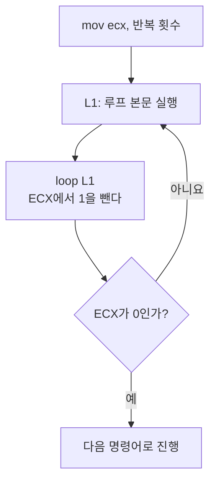

# x86 어셈블리: 데이터 전송, 주소 지정, 산술 연산 (Data Transfers, Addressing, and Arithmetic)


> Kip R. Irvine, *Assembly Language for x86 Processors* — Chapter 4. Data Transfers, Addressing, and Arithmetic 강의 정리
>
> 슬라이드 내용을 절 순서대로 정리하고, 슬라이드에 없는 동작 원리, 추가 예제, 자주 하는 실수를 보충했다. 슬라이드에서 빠진 SUB 명령어와 64비트 프로그래밍(4.6절)도 넣었다.
> 슬라이드의 오타는 본문에 정정 박스로 표시하고 [부록 G](#부록-g-슬라이드-정정-사항-모음)에 모아 두었다.
> 예제 코드의 주석에 적힌 레지스터·플래그·변수 값은 직접 어셈블하고 한 명령어씩 실행해서 확인한 값이다([예제 값 확인 방법](#예제-값-확인-방법)).

---

## 한눈에 보기 (TL;DR)

- 피연산자는 **즉시값**(immediate), **레지스터**(register), **메모리**(memory) 세 종류다.
- `MOV`는 복사다. 두 피연산자의 크기가 같아야 하고, 메모리에서 메모리로는 한 번에 못 옮기며, EIP는 목적지가 될 수 없다.
- 작은 값을 큰 레지스터로 옮길 때 부호 없는 수는 `MOVZX`(0으로 채움), 부호 있는 수는 `MOVSX`(부호 비트로 채움)를 쓴다.
- `XCHG`는 두 값을 맞바꾸고, `LAHF`/`SAHF`는 플래그 하위 바이트를 AH에 저장하고 복원한다.
- `INC`/`DEC`는 1을 더하고 빼지만 **Carry 플래그를 바꾸지 않는다.** `NEG`는 2의 보수로 부호를 뒤집는다.
- CF는 **부호 없는** 연산의 범위 초과, OF는 **부호 있는** 연산의 범위 초과를 알린다. ZF는 결과 0, SF는 결과 음수, AF는 비트 3의 자리올림, PF는 하위 바이트의 1의 개수가 짝수임을 뜻한다.
- `OFFSET`은 변수의 주소, `PTR`은 크기 재지정, `TYPE`·`LENGTHOF`·`SIZEOF`는 원소 크기·원소 개수·전체 바이트 수를 돌려준다.
- 간접 주소 지정 `[esi]`, 인덱스 주소 지정 `array[esi]`, 스케일 `array[esi*4]`로 배열을 다룬다. 주소를 담은 변수가 포인터다.
- `JMP`는 무조건 점프한다. `LOOP`는 ECX를 1 줄이고 0이 아니면 점프한다.

---

## 목차

| 구분 | 내용 |
|---|---|
| [들어가며](#들어가며-3장에서-4장으로) | 3장과의 연결, C 코드와 어셈블리의 대응 |
| [4.1 데이터 전송 명령어](#41-데이터-전송-명령어-data-transfer-instructions) | 피연산자 종류, 직접 메모리 피연산자, MOV, MOVZX, MOVSX, LAHF, SAHF, XCHG, 직접 오프셋 피연산자, Moves 예제 |
| [4.2 덧셈과 뺄셈](#42-덧셈과-뺄셈-addition-and-subtraction) | INC, DEC, ADD, SUB, NEG, 산술식 구현, 플래그 여섯 개, AddSubTest 예제 |
| [4.3 데이터 관련 연산자와 디렉티브](#43-데이터-관련-연산자와-디렉티브-data-related-operators-and-directives) | OFFSET, ALIGN, PTR, TYPE, LENGTHOF, SIZEOF, LABEL |
| [4.4 간접 주소 지정](#44-간접-주소-지정-indirect-addressing) | 간접 피연산자, 배열, 인덱스 피연산자, 스케일, 포인터, TYPEDEF, Pointers 예제 |
| [4.5 JMP와 LOOP 명령어](#45-jmp와-loop-명령어-jmp-and-loop-instructions) | 무조건 점프, 반복, 중첩 루프, 배열 합(SumArray), 문자열 복사(CopyStr) |
| [4.6 64비트 프로그래밍](#46-64비트-프로그래밍-64-bit-programming) | 64비트 MOV, 64비트 SumArray, 64비트 덧셈과 뺄셈 |
| [부록 A](#부록-a-주소-지정-방식-한눈에-보기) | 주소 지정 방식 한눈에 보기 |
| [부록 B](#부록-b-명령어와-연산자-요약) | 명령어와 연산자 요약 |
| [부록 C](#부록-c-자주-하는-실수와-오류-메시지) | 자주 하는 실수와 오류 메시지 |
| [부록 D](#부록-d-핵심-용어-정리) | 핵심 용어 정리 |
| [부록 E](#부록-e-셀프-체크-퀴즈) | 셀프 체크 퀴즈 (정답 접기) |
| [부록 F](#부록-f-프로그래밍-연습-풀이-포함) | 프로그래밍 연습 (풀이 포함) |
| [부록 G](#부록-g-슬라이드-정정-사항-모음) | 슬라이드 정정 사항 모음 |
| [참고 자료](#참고-자료) | 예제 값 확인 방법, 교재, 공식 문서 |

---

## 들어가며: 3장에서 4장으로

3장에서는 프로그램의 뼈대(`.data`, `.code`, `main PROC`)와 데이터를 **정의**하는 방법을 배웠다. 4장에서는 그 데이터를 실제로 **다루는** 방법을 배운다.

| 하고 싶은 일 | 이 장에서 배우는 도구 | 절 |
|---|---|---|
| 값을 옮긴다 | `MOV`, `MOVZX`, `MOVSX`, `XCHG` | 4.1 |
| 계산한다 | `INC`, `DEC`, `ADD`, `SUB`, `NEG`와 상태 플래그 | 4.2 |
| 주소와 크기를 알아낸다 | `OFFSET`, `PTR`, `TYPE`, `LENGTHOF`, `SIZEOF` | 4.3 |
| 배열을 주소로 훑는다 | 간접·인덱스 주소 지정, 포인터 | 4.4 |
| 반복한다 | `JMP`, `LOOP` | 4.5 |

고급 언어의 코드 한 줄이 어셈블리에서는 어떤 모습이 되는지 미리 보면 이 장의 내용이 한눈에 들어온다.

| C 코드 | 어셈블리 | 관련 내용 |
|---|---|---|
| `b = a;` | `mov eax, a` 다음에 `mov b, eax` | MOV, 메모리 간 복사 불가 |
| `int x = (signed char)c;` | `movsx eax, c` | 부호 확장 |
| `x++;` | `inc x` | INC |
| `r = -x + (y - z);` | `neg`, `sub`, `add` 조합 | 산술식 구현 |
| `p = &arr[0];` | `mov esi, OFFSET arr` | OFFSET |
| `v = *p;` | `mov eax, [esi]` | 간접 피연산자 |
| `v = arr[i];` | `mov eax, arr[esi*4]` | 인덱스 피연산자와 스케일 |
| `sizeof(arr)` | `SIZEOF arr` | SIZEOF |
| `for (i = n; i > 0; i--) { ... }` | `mov ecx, n` 다음에 `L1: ... loop L1` | LOOP |

> [!NOTE]
> 어셈블리는 타입 검사를 거의 하지 않는다. 변수의 크기가 맞는지, 부호가 있는 수인지, 배열 범위를 벗어나지 않는지는 모두 프로그래머가 챙겨야 한다. 이 장의 주의 사항 대부분이 여기서 나온다.

---

## 4.1 데이터 전송 명령어 (Data Transfer Instructions)

### 피연산자 종류 (Operand Types)

3장에서 본 명령어 형식을 다시 떠올려 보자.

```
[label:] mnemonic [operands] [;comment]
```

명령어는 피연산자를 0개에서 3개까지 가진다. 목적지(destination)가 먼저 오고 소스(source)가 뒤에 온다.

```
mnemonic
mnemonic [destination]
mnemonic [destination],[source]
mnemonic [destination],[source-1],[source-2]
```

피연산자의 기본 종류는 세 가지다.

| 종류 | 설명 | 예 |
|---|---|---|
| 즉시값 (immediate) | 숫자 리터럴 식. 값이 명령어의 기계어 안에 들어간다 | `mov eax, 5` 의 `5` |
| 레지스터 (register) | CPU 안의 이름 있는 레지스터 | `mov eax, ebx` 의 `ebx` |
| 메모리 (memory) | 메모리의 한 위치를 가리킨다 | `mov eax, var1` 의 `var1` |

속도는 레지스터가 가장 빠르고 메모리가 가장 느리다. 메모리 피연산자는 주소를 어떻게 정하느냐에 따라 직접, 직접 오프셋, 간접, 인덱스 방식으로 다시 나뉜다([부록 A](#부록-a-주소-지정-방식-한눈에-보기)).

교재와 인텔 문서는 명령어 형식을 설명할 때 아래 표기를 쓴다(32비트 모드 기준, 슬라이드의 Table 4-1).

| 표기 | 의미 |
|---|---|
| `reg8` | 8비트 범용 레지스터: AH, AL, BH, BL, CH, CL, DH, DL |
| `reg16` | 16비트 범용 레지스터: AX, BX, CX, DX, SI, DI, SP, BP |
| `reg32` | 32비트 범용 레지스터: EAX, EBX, ECX, EDX, ESI, EDI, ESP, EBP |
| `reg` | 범용 레지스터 아무거나 |
| `sreg` | 16비트 세그먼트 레지스터: CS, DS, SS, ES, FS, GS |
| `imm` | 8, 16, 32비트 즉시값 |
| `imm8` / `imm16` / `imm32` | 8비트 / 16비트 / 32비트 즉시값 |
| `reg/mem8` | 8비트 피연산자. 8비트 범용 레지스터 또는 메모리 바이트 |
| `reg/mem16` | 16비트 피연산자. 16비트 범용 레지스터 또는 메모리 워드 |
| `reg/mem32` | 32비트 피연산자. 32비트 범용 레지스터 또는 메모리 더블워드 |
| `mem` | 8, 16, 32비트 메모리 피연산자 |

예를 들어 `MOVZX reg32, reg/mem8`이라는 표기는 "목적지는 32비트 레지스터, 소스는 8비트 레지스터나 메모리 바이트"라는 뜻이다.

### 직접 메모리 피연산자 (Direct Memory Operands)

**변수 이름은 데이터 세그먼트 안의 오프셋을 가리키는 참조다.** 명령어에 변수 이름을 쓰면 어셈블러가 그 이름을 변수의 주소로 바꿔서 기계어에 넣는다. 이렇게 주소가 명령어 안에 직접 들어가는 피연산자를 직접 메모리 피연산자라고 한다.

```asm
.data
var1 BYTE 10h
.code
mov al, var1            ; AL = 10h
mov al, [var1]          ; AL = 10h  (대괄호를 써도 같은 뜻이다)
```

`var1`이 오프셋 `10400h`에 있다고 하면 `mov al, var1`은 다음 기계어로 바뀐다.

```
A0 00010400
│  └─ var1의 32비트 주소 (실제 메모리에는 리틀 엔디안으로 00 04 01 00)
└─ opcode: "주어진 주소의 바이트를 AL로 복사하라"
```

- 실행할 때 CPU는 주소 `00010400h`에 가서 1바이트(`10h`)를 읽어 AL에 넣는다. 변수 이름이 실행 시점에는 숫자 주소로만 남는다는 점이 중요하다.
- MASM에서 `mov al, var1`과 `mov al, [var1]`은 같다. 대괄호는 "그 주소에 들어 있는 값"이라는 뜻(역참조)을 드러내는 표기인데, 직접 피연산자에서는 생략해도 된다. 보통은 `[var1+1]`처럼 주소 계산이 들어갈 때만 대괄호를 쓴다.
- 변수의 **값**이 아니라 **주소**가 필요하면 `OFFSET var1`을 쓴다([OFFSET 연산자](#offset-연산자)).

> [!WARNING]
> **슬라이드 정정**: 슬라이드에는 `mov al var1`처럼 쉼표가 빠져 있다. 피연산자 사이에는 쉼표가 있어야 하므로 `mov al, var1`이 맞다.

> [!NOTE]
> 어셈블러마다 문법이 다르다. NASM에서는 `mov eax, var1`이 var1의 **주소**를 넣고, 값을 읽으려면 `mov eax, [var1]`이라고 써야 한다. MASM 코드와 NASM 코드를 오갈 때 가장 자주 헷갈리는 부분이다.

### MOV 명령어

`MOV`는 소스 피연산자의 데이터를 목적지 피연산자로 **복사**한다. 이름은 move지만 소스의 값은 그대로 남는다.

```
MOV destination, source        ; C로 쓰면 dest = source;
```

**규칙**

1. 두 피연산자의 크기가 같아야 한다.
2. 두 피연산자가 모두 메모리일 수는 없다.
3. 명령어 포인터(IP, EIP, RIP)는 목적지가 될 수 없다.

**허용되는 형식**

```
MOV reg, reg
MOV mem, reg
MOV reg, mem
MOV mem, imm
MOV reg, imm
```

| 명령어 | 가능 여부 | 이유 |
|---|:---:|---|
| `mov eax, ebx` | ✅ | 레지스터 ← 레지스터, 크기 같음 |
| `mov count, 100` | ✅ | 메모리 ← 즉시값 |
| `mov ax, bl` | ❌ | 크기가 다르다 (16비트 ← 8비트) |
| `mov var2, var1` | ❌ | 메모리 ← 메모리 |
| `mov 5, eax` | ❌ | 즉시값은 목적지가 될 수 없다 |
| `mov eip, eax` | ❌ | EIP는 목적지가 될 수 없다 |
| `mov al, 256` | ❌ | 256은 8비트에 들어가지 않는다 |

- `MOV`는 플래그를 전혀 바꾸지 않는다.
- 세그먼트 레지스터도 MOV로 다룰 수 있지만 CS는 목적지가 될 수 없고, 즉시값을 세그먼트 레지스터에 직접 넣을 수도 없다. 보호 모드 응용 프로그램은 세그먼트 레지스터를 건드릴 일이 없다.

#### 메모리에서 메모리로 (Memory to Memory)

MOV 명령어 하나로는 메모리의 한 위치에서 다른 위치로 데이터를 직접 옮길 수 없다. 소스를 레지스터에 먼저 담았다가 목적지로 옮겨야 한다.

```asm
.data
var1 WORD 1234h
var2 WORD ?
.code
; mov var2, var1        ; 오류: 메모리 ← 메모리
mov ax, var1            ; AX = 1234h
mov var2, ax            ; var2 = 1234h
```

x86 명령어의 기계어 형식에는 메모리 주소를 적는 자리가 하나뿐이다. 그래서 MOV뿐 아니라 ADD, SUB, XCHG 같은 대부분의 명령어가 메모리 피연산자를 하나만 가질 수 있다.

### 값 겹쳐 쓰기 (Overlapping Values)

EAX, AX, AL은 따로 떨어진 레지스터가 아니라 **같은 공간의 일부**다. 크기가 다른 값을 차례로 넣으면 그 크기만큼만 덮어쓰이고 나머지 비트는 그대로 남는다.

```asm
.data
oneByte  BYTE  78h
oneWord  WORD  1234h
oneDword DWORD 12345678h
.code
mov eax, 0              ; EAX = 00000000h
mov al, oneByte         ; EAX = 00000078h
mov ax, oneWord         ; EAX = 00001234h
mov eax, oneDword       ; EAX = 12345678h
mov ax, 0               ; EAX = 12340000h
```

```
 bit 31               16 15        8 7         0
    ┌───────────────────┬───────────┬───────────┐
    │                   │    AH     │    AL     │
    └───────────────────┴───────────┴───────────┘
                        └───────── AX ──────────┘
    └───────────────────── EAX ─────────────────┘
```

- `mov al, oneByte`는 하위 8비트만 바꾼다. 상위 24비트는 앞에서 넣은 0이 그대로다.
- 마지막 줄 `mov ax, 0`은 하위 16비트만 0으로 만든다. 상위 16비트 `1234h`는 남아서 EAX = `12340000h`가 된다.
- 하위 레지스터에 값을 넣기 전에 상위 비트에 무엇이 남아 있는지 모르면 버그가 생긴다. 이 문제가 바로 다음 주제로 이어진다.

### 정수의 제로 확장과 부호 확장 (Zero/Sign Extension)

#### 작은 값을 큰 곳으로 복사할 때 생기는 문제

MOV는 두 피연산자의 크기가 같아야 하므로, 16비트 변수를 32비트 레지스터로 바로 옮길 수 없다. 한 가지 방법은 32비트 레지스터를 먼저 0으로 만든 다음 하위 16비트에 값을 넣는 것이다.

```asm
.data
count WORD 1
.code
mov ecx, 0
mov cx, count           ; ECX = 00000001h
```

부호 없는 수라면 이 방법이 잘 통한다. 하지만 **음수**에 똑같이 하면 값이 달라진다.

```asm
.data
signedVal SWORD -16     ; FFF0h (-16)
.code
mov ecx, 0
mov cx, signedVal       ; ECX = 0000FFF0h (+65,520)

mov ecx, 0FFFFFFFFh
mov cx, signedVal       ; ECX = FFFFFFF0h (-16)
```

- 16비트에서 `FFF0h`는 −16이지만, 상위 16비트가 0인 32비트 값 `0000FFF0h`는 +65,520이다. 같은 수가 아니게 된다.
- 음수를 넓힐 때는 상위 비트를 모두 1로 채워야 값이 유지된다(`FFFFFFF0h` = −16).
- 즉 넓어진 자리를 **부호 없는 수는 0으로, 부호 있는 수는 부호 비트로** 채워야 한다. 값이 양수인지 음수인지 미리 알아야 하는 이 번거로움을 `MOVZX`와 `MOVSX`가 해결한다.

#### MOVZX 명령어

`MOVZX`(move with zero-extend)는 소스의 내용을 목적지로 복사하면서 값을 16비트나 32비트로 **제로 확장**한다. 늘어난 상위 비트를 모두 0으로 채운다. **부호 없는 정수**에만 쓴다.

```
MOVZX reg32, reg/mem8
MOVZX reg32, reg/mem16
MOVZX reg16, reg/mem8
```

```asm
.data
byteVal BYTE 10001111b
.code
movzx ax, byteVal       ; AX = 0000000010001111b
```

```
            0                1 0 0 0 1 1 1 1     소스 (8비트)
            │                │
            ▼                ▼                   상위 8비트는 0으로 채운다
     0 0 0 0 0 0 0 0         1 0 0 0 1 1 1 1     목적지 (16비트)
```

소스가 레지스터인 경우:

```asm
mov   bx, 0A69Bh
movzx eax, bx           ; EAX = 0000A69Bh
movzx edx, bl           ; EDX = 0000009Bh
movzx cx, bl            ; CX = 009Bh
```

소스가 메모리인 경우:

```asm
.data
byte1 BYTE 9Bh
word1 WORD 0A69Bh
.code
movzx eax, word1        ; EAX = 0000A69Bh
movzx edx, byte1        ; EDX = 0000009Bh
movzx cx, byte1         ; CX = 009Bh
```

- 목적지는 반드시 레지스터여야 하고, 소스는 즉시값이 될 수 없다.
- 목적지가 소스보다 커야 한다. 크기가 같으면 그냥 MOV를 쓴다.

#### MOVSX 명령어

`MOVSX`(move with sign-extend)는 소스의 내용을 목적지로 복사하면서 값을 16비트나 32비트로 **부호 확장**한다. 소스의 최상위 비트(부호 비트)를 늘어난 상위 비트 전체에 복사한다. **부호 있는 정수**에만 쓴다.

```
MOVSX reg32, reg/mem8
MOVSX reg32, reg/mem16
MOVSX reg16, reg/mem8
```

```asm
.data
byteVal BYTE 10001111b
.code
movsx ax, byteVal       ; AX = 1111111110001111b
```

```
                     1 0 0 0 1 1 1 1             소스 (8비트)
                     │       │
            ┌────────┘       │                   맨 왼쪽의 부호 비트(1)를
            ▼                ▼                   상위 8비트 전체에 복사한다
     1 1 1 1 1 1 1 1         1 0 0 0 1 1 1 1     목적지 (16비트)
```

```asm
mov   bx, 0A69Bh
movsx eax, bx           ; EAX = FFFFA69Bh
movsx edx, bl           ; EDX = FFFFFF9Bh
movsx cx, bl            ; CX = FF9Bh

mov   bl, 7Bh
movsx cx, bl            ; CX = 007Bh
```

- `A69Bh`와 `9Bh`는 최상위 비트가 1이라 상위 비트가 F(1111)로 채워진다.
- `7Bh`는 최상위 비트가 0인 양수라서 0으로 채워진다. 양수에서는 MOVZX와 결과가 같다.

같은 8비트 값을 두 명령어로 16비트로 넓힌 결과를 비교하면 차이가 분명해진다.

| 소스 (8비트) | 부호 없는 해석 | 부호 있는 해석 | `MOVZX` 결과 | `MOVSX` 결과 |
|:---:|:---:|:---:|---|---|
| `9Bh` | 155 | −101 | `009Bh` = 155 | `FF9Bh` = −101 |
| `7Bh` | 123 | +123 | `007Bh` = 123 | `007Bh` = +123 |

> [!TIP]
> C 컴파일러도 같은 일을 한다. `unsigned char`를 `int`로 바꿀 때는 MOVZX, `signed char`나 `short`를 `int`로 바꿀 때는 MOVSX가 나온다.
> AL, AX, EAX 전용의 부호 확장 명령어도 있다. `CBW`(AL → AX), `CWDE`(AX → EAX), `CWD`(AX → DX:AX), `CDQ`(EAX → EDX:EAX)이며, 7장에서 나눗셈과 함께 배운다.

### LAHF와 SAHF 명령어

`LAHF`(load status flags into AH)는 EFLAGS 레지스터의 **하위 바이트**를 AH로 복사한다. `SAHF`(store AH into status flags)는 반대로 AH를 EFLAGS(또는 RFLAGS)의 하위 바이트로 복사한다. 플래그 상태를 잠시 보관했다가 되돌릴 때 쓴다.

```asm
.data
saveflags BYTE ?
.code
lahf                    ; 플래그를 AH로 읽어 온다
mov  saveflags, ah      ; 변수에 저장한다

mov  ah, saveflags      ; 저장해 둔 플래그를 AH로 가져온다
sahf                    ; 플래그 레지스터로 복사한다
```

하위 바이트에 들어 있는 플래그는 Sign, Zero, Auxiliary Carry, Parity, Carry 다섯 개다.

```
 bit       7    6    5    4    3    2    1    0
         ┌────┬────┬────┬────┬────┬────┬────┬────┐
 AH      │ SF │ ZF │ 0  │ AF │ 0  │ PF │ 1  │ CF │
         └────┴────┴────┴────┴────┴────┴────┴────┘
```

실제 값을 넣어 따라가 보면 다음과 같다.

```asm
.data
saveflags BYTE ?
.code
mov  al, 0FFh
add  al, 1              ; AL = 00h, CF = 1, ZF = 1, AF = 1, PF = 1
lahf                    ; AH = 57h
mov  saveflags, ah      ; saveflags = 57h

mov  bl, 1
add  bl, 1              ; BL = 02h, CF = 0, ZF = 0

mov  ah, saveflags
sahf                    ; CF = 1, ZF = 1
```

- `57h` = `0101 0111b`이므로 ZF, AF, PF, CF가 1이고 SF가 0이다. 비트 1은 항상 1이다.
- 중간의 `add bl, 1`이 CF와 ZF를 0으로 바꿨지만, `sahf`가 저장해 둔 값으로 되돌렸다.
- **Overflow 플래그는 비트 11에 있어서 LAHF와 SAHF로는 저장하거나 복원할 수 없다.** 플래그 전체를 저장하려면 `PUSHFD`와 `POPFD`를 쓴다(5장).
- 64비트 모드에서는 CPU에 따라 LAHF와 SAHF를 지원하지 않을 수 있다.

### XCHG 명령어

`XCHG`(exchange data)는 두 피연산자의 내용을 맞바꾼다.

```
XCHG reg, reg
XCHG reg, mem
XCHG mem, reg
```

```asm
.data
var1 WORD 5555h
.code
mov  ax, 1234h
mov  bx, 0ABCDh
xchg ax, bx             ; AX = ABCDh, BX = 1234h
xchg ah, al             ; AX = CDABh
xchg var1, bx           ; var1 = 1234h, BX = 5555h

mov  eax, 1
mov  ebx, 2
xchg eax, ebx           ; EAX = 2, EBX = 1
```

- 즉시값은 피연산자로 쓸 수 없다. 그 밖의 규칙은 MOV와 같다(크기가 같아야 하고, 둘 다 메모리일 수 없다).
- 플래그를 바꾸지 않는다.
- MOV만으로 두 값을 바꾸려면 임시 레지스터가 하나 더 필요하다. XCHG는 그럴 필요가 없다.

두 **메모리** 값을 바꾸려면 레지스터를 임시 저장소로 쓰면서 MOV와 XCHG를 섞는다.

```asm
.data
val1 WORD 1000h
val2 WORD 2000h
.code
mov  ax, val1           ; AX = 1000h
xchg ax, val2           ; AX = 2000h, val2 = 1000h
mov  val1, ax           ; val1 = 2000h
```

> [!NOTE]
> 한쪽이 메모리인 XCHG는 CPU가 자동으로 버스를 잠그고(LOCK) 실행한다. 다른 코어가 끼어들 수 없는 원자적(atomic) 교환이라 스핀락 같은 동기화 코드의 재료가 되지만, 그만큼 느리다. 단순히 값을 바꿀 목적이라면 레지스터끼리 바꾸는 편이 빠르다.
>
> 3장에서 본 `NOP`의 기계어 `90h`는 원래 `xchg eax, eax`다.

### 직접 오프셋 피연산자 (Direct-Offset Operands)

변수 이름에 상수(변위, displacement)를 더하면 **이름이 따로 붙지 않은 메모리 위치**에 접근할 수 있다. 이런 피연산자를 직접 오프셋 피연산자라고 한다. 배열에서 첫 원소가 아닌 원소를 읽을 때 쓴다.

```asm
.data
arrayB BYTE 10h,20h,30h,40h,50h
.code
mov al, arrayB          ; AL = 10h
mov al, [arrayB+1]      ; AL = 20h
mov al, [arrayB+2]      ; AL = 30h
```

- `arrayB+1`은 arrayB의 오프셋에 1을 더한 주소다. 이렇게 계산된 주소를 **유효 주소**(effective address)라고 하고, 대괄호는 그 주소에 들어 있는 값을 가져오라는 뜻이다.
- MASM에서는 `arrayB+1`처럼 대괄호 없이 써도 같은 코드가 나오지만, 대괄호를 쓰는 편이 의미가 분명하다.

워드 배열과 더블워드 배열에서는 원소 크기만큼 건너뛰어야 한다.

```asm
.data
arrayW WORD 100h,200h,300h
.code
mov ax, arrayW          ; AX = 100h
mov ax, [arrayW+2]      ; AX = 200h
```

```asm
.data
arrayD DWORD 10000h,20000h
.code
mov eax, arrayD         ; EAX = 10000h
mov eax, [arrayD+4]     ; EAX = 20000h
```

`arrayW`가 메모리에 놓인 모습이다(리틀 엔디안이라 각 워드의 하위 바이트가 먼저 온다).

```
offset    +0   +1   +2   +3   +4   +5
value     00   01   00   02   00   03
          └─ 100h ─┘└─ 200h ─┘└─ 300h ─┘
```

> [!CAUTION]
> **범위 검사가 없다.** `mov al, [arrayB+20]`처럼 배열 밖을 가리켜도 어셈블러는 아무 경고 없이 번역하고, 실행하면 배열 뒤에 있는 엉뚱한 메모리를 읽는다. 찾기 어려운 버그의 단골 원인이다.
>
> **원소 크기를 잊으면 엉뚱한 값을 읽는다.** 위 배열에서 둘째 원소를 읽겠다고 `[arrayW+1]`이라고 쓰면 첫 원소의 상위 바이트와 둘째 원소의 하위 바이트가 섞인다.
> ```asm
> .data
> arrayW WORD 100h,200h,300h
> .code
> mov ax, [arrayW+1]      ; AX = 0001h  (200h가 아니다)
> ```

숫자를 직접 쓰는 대신 `TYPE` 연산자를 쓰면 원소 크기를 틀릴 일이 없다. `[arrayD + TYPE arrayD]`는 `[arrayD+4]`와 같다([TYPE 연산자](#type-연산자)).

### 예제 프로그램: Moves

이 절에서 배운 명령어를 모은 프로그램이다. 슬라이드에는 데이터와 코드 부분만 있어서, 그대로 어셈블할 수 있도록 앞부분(`.386`부터 `PROTO`까지)을 붙였다.

```asm
; Data Transfer Examples               (Moves.asm)

.386
.model flat,stdcall
.stack 4096
ExitProcess PROTO, dwExitCode:DWORD

.data
val1   WORD  1000h
val2   WORD  2000h

arrayB BYTE  10h,20h,30h,40h,50h
arrayW WORD  100h,200h,300h
arrayD DWORD 10000h,20000h

.code
main PROC

; MOVZX
    mov   bx,0A69Bh
    movzx eax,bx                    ; EAX = 0000A69Bh
    movzx edx,bl                    ; EDX = 0000009Bh
    movzx cx,bl                     ; CX = 009Bh

; MOVSX
    mov   bx,0A69Bh
    movsx eax,bx                    ; EAX = FFFFA69Bh
    movsx edx,bl                    ; EDX = FFFFFF9Bh
    mov   bl,7Bh
    movsx cx,bl                     ; CX = 007Bh

; Memory-to-memory exchange:
    mov   ax,val1                   ; AX = 1000h
    xchg  ax,val2                   ; AX = 2000h, val2 = 1000h
    mov   val1,ax                   ; val1 = 2000h

; Direct-Offset Addressing (byte array):
    mov   al,arrayB                 ; AL = 10h
    mov   al,[arrayB+1]             ; AL = 20h
    mov   al,[arrayB+2]             ; AL = 30h

; Direct-Offset Addressing (word array):
    mov   ax,arrayW                 ; AX = 100h
    mov   ax,[arrayW+2]             ; AX = 200h

; Direct-Offset Addressing (doubleword array):
    mov   eax,arrayD                ; EAX = 10000h
    mov   eax,[arrayD+4]            ; EAX = 20000h
    mov   eax,[arrayD+TYPE arrayD]  ; EAX = 20000h

    INVOKE ExitProcess,0
main ENDP
END main
```

Visual Studio에서 `mov bx,0A69Bh` 줄에 중단점을 걸고 F10으로 한 줄씩 실행하면서 레지스터 창의 값이 주석과 같은지 확인해 보자. 레지스터 창에는 EAX처럼 32비트 전체가 보이므로, AX나 AL은 EAX의 하위 16비트와 8비트를 보면 된다.

---

## 4.2 덧셈과 뺄셈 (Addition and Subtraction)

### INC와 DEC 명령어

`INC`(increment)는 레지스터나 메모리 피연산자에 1을 더하고, `DEC`(decrement)는 1을 뺀다.

```
INC reg/mem
DEC reg/mem
```

```asm
.data
myWord WORD 1000h
.code
inc  myWord             ; myWord = 1001h
mov  bx, myWord
dec  bx                 ; BX = 1000h
```

INC와 DEC는 결과에 따라 Overflow, Sign, Zero, Auxiliary Carry, Parity 플래그를 바꾼다. 그런데 **Carry 플래그는 건드리지 않는다.** `add x, 1`과 다른 점이다.

```asm
mov  al, 0FFh
add  al, 1              ; AL = 00h, CF = 1
mov  bl, 0FFh
inc  bl                 ; BL = 00h, ZF = 1, CF = 1

clc                     ; CF = 0
mov  bl, 0FFh
inc  bl                 ; BL = 00h, ZF = 1, CF = 0
```

- 첫 번째 `inc bl` 뒤의 CF = 1은 INC가 만든 것이 아니라 앞의 `add al, 1`이 남긴 값이다. MOV와 INC 모두 CF를 바꾸지 않아서 그대로 남았다.
- `clc`로 CF를 0으로 만든 뒤 다시 실행하면, BL이 `FFh`에서 `00h`로 넘어갔는데도 CF는 0이다.
- 그래서 부호 없는 수의 범위 초과를 CF로 확인하려면 INC 대신 `add x, 1`을 써야 한다.

> [!NOTE]
> CF를 건드리지 않는 것은 의도된 설계다. 32비트보다 큰 수를 여러 조각으로 나눠 더할 때 조각 사이의 자리올림을 CF로 넘기는데(ADC 명령어, 7장), 그 사이에 반복 횟수나 포인터를 INC/DEC로 바꿔도 CF가 망가지지 않는다.

### ADD 명령어

`ADD`는 **같은 크기**의 소스 피연산자를 목적지 피연산자에 더한다.

```
ADD dest, source            ; dest = dest + source
```

소스는 바뀌지 않고, 합은 목적지에 저장된다. 쓸 수 있는 피연산자 조합은 MOV와 같다.

```asm
.data
var1 DWORD 10000h
var2 DWORD 20000h
.code
mov  eax, var1          ; EAX = 10000h
add  eax, var2          ; EAX = 30000h
```

**플래그**: Carry, Zero, Sign, Overflow, Auxiliary Carry, Parity 플래그가 목적지에 들어간 값에 따라 바뀐다.

### SUB 명령어 (보충)

슬라이드에는 빠져 있지만 교재 4.2.3절의 내용이고, 뒤의 예제에서 계속 쓰이므로 정리해 둔다. `SUB`는 목적지 피연산자에서 소스 피연산자를 뺀다.

```
SUB dest, source            ; dest = dest - source
```

```asm
.data
var1 DWORD 30000h
var2 DWORD 10000h
.code
mov  eax, var1          ; EAX = 30000h
sub  eax, var2          ; EAX = 20000h
```

- 피연산자 조합과 바뀌는 플래그는 ADD와 같다.
- CPU는 뺄셈을 따로 하지 않는다. 소스를 2의 보수로 바꿔서(부호를 뒤집어서) **더한다.** `4 − 1`은 `4 + (−1)`로 계산된다. 뒤에 나오는 뺄셈의 Carry 플래그 그림이 덧셈 모양인 이유다.

### NEG 명령어

`NEG`(negate)는 수를 **2의 보수**로 바꿔서 부호를 뒤집는다.

```
NEG reg
NEG mem
```

2의 보수는 모든 비트를 뒤집고 1을 더한 값이다.

```
   0 0 0 0 0 1 0 1      (+5 = 05h)
   1 1 1 1 1 0 1 0      모든 비트 반전
 +               1      1을 더함
   ───────────────
   1 1 1 1 1 0 1 1      (-5 = FBh)
```

```asm
.data
valD SDWORD 26
.code
mov  al, 5              ; AL = 05h
neg  al                 ; AL = FBh, CF = 1, SF = 1
neg  al                 ; AL = 05h, CF = 1, SF = 0
mov  al, 0
neg  al                 ; AL = 00h, CF = 0, ZF = 1
neg  valD               ; valD = -26
```

**플래그**: ADD와 마찬가지로 여섯 개의 상태 플래그가 결과에 따라 바뀐다. NEG는 `0 − 피연산자`를 계산하는 것과 같아서, 피연산자가 0이 아니면 항상 CF = 1이 된다.

### 산술식 구현하기 (Implementing Arithmetic Expressions)

ADD, SUB, NEG만 있으면 덧셈, 뺄셈, 부호 반전으로 이루어진 산술식을 어셈블리로 옮길 수 있다. 컴파일러가 하는 일을 손으로 해 보는 셈이다.

```
Rval = -Xval + (Yval - Zval);
```

식을 항으로 나눠 하나씩 계산하고, 마지막에 더해서 저장한다.

```asm
.data
Rval SDWORD ?
Xval SDWORD 26
Yval SDWORD 30
Zval SDWORD 40
.code
; 첫째 항: -Xval
mov  eax, Xval
neg  eax                ; EAX = -26

; 둘째 항: (Yval - Zval)
mov  ebx, Yval
sub  ebx, Zval          ; EBX = -10

; 두 항을 더해서 저장
add  eax, ebx
mov  Rval, eax          ; Rval = -36
```

- 변수를 레지스터로 **복사한 뒤** 계산한다. `neg Xval`처럼 변수에 직접 연산하면 원래 값이 바뀌어 버린다.
- 항마다 다른 레지스터(EAX, EBX)를 써서 중간 결과가 서로 덮어쓰이지 않게 한다.
- −36은 메모리에 `FFFFFFDCh`로 저장된다. 디버거의 조사식 창에서 16진수 표시를 끄면 −36으로 보인다.

연습 삼아 식을 하나 더 옮겨 보자. `Rval = (Xval + Yval) - (Zval - 5)`는 (26 + 30) − (40 − 5) = 21이다.

```asm
.data
Rval SDWORD ?
Xval SDWORD 26
Yval SDWORD 30
Zval SDWORD 40
.code
mov  eax, Xval
add  eax, Yval          ; EAX = 56
mov  ebx, Zval
sub  ebx, 5             ; EBX = 35
sub  eax, ebx           ; EAX = 21
mov  Rval, eax          ; Rval = 21
```

### 덧셈과 뺄셈이 바꾸는 플래그

산술 명령어를 실행하면 CPU는 결과의 성질을 상태 플래그에 기록한다. 결과가 0인지, 음수인지, 범위를 넘었는지를 이 플래그로 확인하고, 6장에서 배울 조건부 점프가 이 플래그를 보고 분기한다.

| 플래그 | 알려 주는 것 |
|---|---|
| Carry (CF) | **부호 없는** 정수의 범위 초과 (unsigned overflow) |
| Overflow (OF) | **부호 있는** 정수의 범위 초과 (signed overflow) |
| Zero (ZF) | 결과가 0 |
| Sign (SF) | 결과가 음수 (최상위 비트가 1) |
| Parity (PF) | 결과의 최하위 바이트에서 1인 비트의 개수가 짝수 |
| Auxiliary Carry (AF) | 비트 3에서 비트 4로 자리올림 또는 빌림 발생 |

> [!IMPORTANT]
> CPU는 피연산자가 부호 있는 수인지 없는 수인지 모른다. 그래서 덧셈이나 뺄셈을 할 때마다 부호 없는 기준의 CF와 부호 있는 기준의 OF를 **둘 다** 계산해 둔다. 어느 쪽을 볼지는 그 값을 어떤 수로 쓰고 있는지 아는 프로그래머가 정한다.

#### 부호 없는 연산: Zero, Carry, Auxiliary Carry, Parity

**Zero 플래그**는 산술 연산의 결과가 0일 때 1이 된다.

```asm
mov  ecx, 1
sub  ecx, 1             ; ECX = 0, ZF = 1
mov  eax, 0FFFFFFFFh
inc  eax                ; EAX = 0, ZF = 1
inc  eax                ; EAX = 1, ZF = 0
dec  eax                ; EAX = 0, ZF = 1
```

"Zero 플래그가 1"이라는 말이 헷갈리기 쉽다. 플래그 값 1은 "결과가 0이라는 조건이 참"이라는 뜻이다.

**덧셈과 Carry 플래그.** 부호 없는 수를 더한 결과가 목적지에 다 들어가지 않으면 CF = 1이 된다. 목적지의 최상위 비트 밖으로 나간 자리올림이 CF에 들어간다고 생각하면 된다.

```asm
mov  al, 0FFh
add  al, 1              ; AL = 00h, CF = 1
```

```
          1 1 1 1 1 1 1          ← 자리올림
          1 1 1 1 1 1 1 1        (FFh = 255)
        + 0 0 0 0 0 0 0 1        (01h)
        ─────────────────
 CF = 1   0 0 0 0 0 0 0 0        (00h)   255 + 1 = 256은 8비트에 들어가지 않는다
```

같은 값이라도 목적지가 넓으면 넘치지 않는다. CF는 **피연산자 크기**를 기준으로 정해진다.

```asm
mov  ax, 00FFh
add  ax, 1              ; AX = 0100h, CF = 0
mov  ax, 0FFFFh
add  ax, 1              ; AX = 0000h, CF = 1
```

**뺄셈과 Carry 플래그.** 뺄셈에서는 작은 부호 없는 수에서 더 큰 수를 뺄 때 CF = 1이 된다. 윗자리에서 빌려 와야 한다는 뜻이라 빌림(borrow)이라고도 한다.

```asm
mov  al, 1
sub  al, 2              ; AL = FFh, CF = 1
```

```
          0 0 0 0 0 0 0 1        (1)
        + 1 1 1 1 1 1 1 0        (-2: 2의 2의 보수)
        ─────────────────
 CF = 1   1 1 1 1 1 1 1 1        (FFh)
```

CPU는 `1 − 2`를 `1 + (−2)`로 계산한다. 이 덧셈에서는 비트 7 밖으로 나가는 자리올림이 없는데, 뺄셈일 때는 그 자리올림을 **뒤집은 값**이 CF에 들어간다. 그래서 CF = 1이다.

슬라이드의 두 경우를 나란히 놓으면 CF의 의미가 정리된다.

```asm
; 자리(범위)를 넘어간 경우
mov  al, 0FFh
add  al, 1              ; CF = 1, AL = 00h

; 0보다 작은 값이 되는 경우
mov  al, 0
sub  al, 1              ; CF = 1, AL = FFh
```

부호 없는 8비트 수의 범위는 0부터 255까지다. 위로 넘어가도(255 + 1) 아래로 넘어가도(0 − 1) CF = 1이다.

> [!WARNING]
> **INC와 DEC는 Carry 플래그에 영향을 주지 않는다. 0이 아닌 피연산자에 NEG를 적용하면 항상 Carry 플래그가 1이 된다.**
> ```asm
> mov  al, 1
> neg  al                 ; AL = FFh, CF = 1
> mov  al, 0
> neg  al                 ; AL = 00h, CF = 0
> ```

**Auxiliary Carry 플래그**(AF, 슬라이드의 AC)는 목적지의 비트 3에서 자리올림이나 빌림이 생겼음을 알린다. 하위 4비트(니블)에서 윗자리로 넘어갔다는 뜻이다.

```asm
mov  al, 0Fh
add  al, 1              ; AL = 10h, AF = 1
mov  al, 10h
sub  al, 1              ; AL = 0Fh, AF = 1
```

```
        0 0 0 0 1 1 1 1          (0Fh)
      + 0 0 0 0 0 0 0 1          (01h)
      ─────────────────
        0 0 0 1 0 0 0 0          (10h)   비트 3에서 비트 4로 자리올림
```

AF는 10진수 한 자리를 4비트로 표현하는 BCD 연산에서 쓰인다. 일반적인 정수 계산에서는 볼 일이 거의 없다.

**Parity 플래그**(PF)는 목적지의 **최하위 바이트**에 1인 비트가 짝수 개일 때 1이 된다.

```asm
mov  al, 10001100b
add  al, 00000010b      ; AL = 10001110b, PF = 1
sub  al, 10000000b      ; AL = 00001110b, PF = 0

mov  ax, 0103h
add  ax, 0              ; AX = 0103h, PF = 1
```

- `10001110b`에는 1이 네 개(짝수)라서 PF = 1, `00001110b`에는 세 개(홀수)라서 PF = 0이다.
- 16비트나 32비트 연산에서도 맨 아래 8비트만 본다. `0103h`는 전체로 보면 1이 세 개지만 하위 바이트 `03h`에는 두 개뿐이라 PF = 1이다.
- PF는 원래 통신에서 데이터가 깨졌는지 검사하는 패리티 비트를 계산하려고 만들어졌다.

#### 부호 있는 연산: Sign, Overflow

**Sign 플래그**는 부호 있는 산술 연산의 결과가 음수일 때 1이 된다. 실제로는 결과의 최상위 비트를 그대로 복사한 값이다.

```asm
mov  eax, 4
sub  eax, 5             ; EAX = -1, SF = 1

mov  bl, 1              ; BL = 01h
sub  bl, 2              ; BL = FFh, SF = 1
```

**Overflow 플래그**는 부호 있는 산술 연산의 결과가 목적지에 담을 수 있는 범위를 위로 넘거나(overflow) 아래로 넘을(underflow) 때 1이 된다. 8비트 부호 있는 수의 범위는 −128부터 +127까지다.

```asm
mov  al, +127
add  al, 1              ; AL = 80h, OF = 1

mov  al, -128
sub  al, 1              ; AL = 7Fh, OF = 1
```

- `127 + 1`의 결과 `80h`는 부호 있는 수로 −128이다. 양수에 양수를 더했는데 음수가 나왔다.
- `−128 − 1`의 결과 `7Fh`는 +127이다. 음수에서 양수를 뺐는데 양수가 나왔다.

**덧셈 판별법 (The Addition Test).** 두 수를 더했을 때 오버플로는 다음 두 경우에만 생긴다.

- 양수 두 개를 더했는데 합이 음수다.
- 음수 두 개를 더했는데 합이 양수다.

부호가 서로 다른 두 수를 더하면 결과가 반드시 두 수 사이에 있으므로 오버플로가 절대 생기지 않는다.

**하드웨어가 오버플로를 찾아내는 방법.** CPU는 부호를 따지지 않고 아주 단순한 방법을 쓴다. 최상위 비트 **밖으로 나가는** 자리올림과 최상위 비트로 **들어오는** 자리올림을 XOR한 값을 Overflow 플래그에 넣는다. 두 값이 다르면 오버플로다.

```asm
mov  al, 80h            ; AL = 80h
add  al, 0FEh           ; AL = 7Eh, CF = 1, OF = 1
```

```
          1 0 0 0 0 0 0 0        (80h = -128)
        + 1 1 1 1 1 1 1 0        (FEh = -2)
        ─────────────────
 CF = 1   0 1 1 1 1 1 1 0        (7Eh = +126)

 비트 7로 들어온 자리올림 = 0,  비트 7에서 나간 자리올림 = 1   →   OF = 0 XOR 1 = 1
```

−128 + (−2) = −130은 8비트 부호 있는 범위를 벗어난다. 음수 두 개를 더했는데 결과가 양수(+126)로 나온 것이 그 증거다.

**NEG와 오버플로.** NEG는 결과를 목적지에 올바로 담을 수 없으면 잘못된 결과를 낸다. 8비트에서 −128의 부호를 뒤집은 +128은 표현할 수 없으므로 값이 그대로 남고 OF = 1이 된다.

```asm
mov  al, -128           ; AL = 10000000b
neg  al                 ; AL = 10000000b, OF = 1

mov  al, +127           ; AL = 01111111b
neg  al                 ; AL = 10000001b, OF = 0
```

**CF와 OF 나란히 보기.** 같은 연산을 두 가지로 해석하면 CF와 OF가 서로 독립적으로 정해진다는 것을 알 수 있다.

```asm
mov  al, 0FFh
add  al, 1              ; AL = 00h, CF = 1, OF = 0
mov  al, 7Fh
add  al, 1              ; AL = 80h, CF = 0, OF = 1
mov  al, 80h
add  al, 0FEh           ; AL = 7Eh, CF = 1, OF = 1
mov  al, 1
sub  al, 2              ; AL = FFh, CF = 1, OF = 0
mov  al, 80h
sub  al, 1              ; AL = 7Fh, CF = 0, OF = 1
```

| 연산 (8비트) | 결과 | 부호 없는 수로 보면 | 부호 있는 수로 보면 | CF | OF |
|---|:---:|---|---|:---:|:---:|
| `FFh + 01h` | `00h` | 255 + 1 = 256, 범위 초과 | −1 + 1 = 0, 정상 | 1 | 0 |
| `7Fh + 01h` | `80h` | 127 + 1 = 128, 정상 | 127 + 1 = 128, 범위 초과 | 0 | 1 |
| `80h + FEh` | `7Eh` | 128 + 254 = 382, 범위 초과 | −128 + (−2) = −130, 범위 초과 | 1 | 1 |
| `01h − 02h` | `FFh` | 1 − 2 = −1, 범위 초과 | 1 − 2 = −1, 정상 | 1 | 0 |
| `80h − 01h` | `7Fh` | 128 − 1 = 127, 정상 | −128 − 1 = −129, 범위 초과 | 0 | 1 |

#### 명령어별 플래그 영향 정리

| 명령어 | CF | OF | SF | ZF | AF | PF |
|---|:---:|:---:|:---:|:---:|:---:|:---:|
| `MOV`, `MOVZX`, `MOVSX`, `XCHG`, `LAHF` | – | – | – | – | – | – |
| `ADD`, `SUB` | ● | ● | ● | ● | ● | ● |
| `INC`, `DEC` | – | ● | ● | ● | ● | ● |
| `NEG` | ● | ● | ● | ● | ● | ● |
| `SAHF` | AH | – | AH | AH | AH | AH |
| `JMP`, `LOOP` | – | – | – | – | – | – |

● 결과에 따라 바뀜 · – 바뀌지 않음 · AH: AH의 해당 비트로 덮어씀

### 예제 프로그램: AddSubTest

ADD, SUB, INC, DEC, NEG와 그 명령어들이 상태 플래그에 주는 영향을 한 번에 보여 주는 프로그램이다.

```asm
; Addition and Subtraction        (AddSubTest.asm)

; Chapter 4 example. Demonstration of ADD, SUB,
; INC, DEC, and NEG instructions, and how
; they affect the CPU status flags.

.386
.model flat,stdcall
.stack 4096
ExitProcess proto,dwExitCode:dword

.data
Rval SDWORD ?
Xval SDWORD 26
Yval SDWORD 30
Zval SDWORD 40

.code
main proc
    ; INC and DEC
    mov  ax,1000h
    inc  ax                 ; AX = 1001h
    dec  ax                 ; AX = 1000h

    ; Expression: Rval = -Xval + (Yval - Zval)
    mov  eax,Xval
    neg  eax                ; EAX = -26
    mov  ebx,Yval
    sub  ebx,Zval           ; EBX = -10
    add  eax,ebx
    mov  Rval,eax           ; Rval = -36

    ; Zero flag example:
    mov  cx,1
    sub  cx,1               ; ZF = 1
    mov  ax,0FFFFh
    inc  ax                 ; ZF = 1

    ; Sign flag example:
    mov  cx,0
    sub  cx,1               ; SF = 1
    mov  ax,7FFFh
    add  ax,2               ; SF = 1

    ; Carry flag example:
    mov  al,0FFh
    add  al,1               ; CF = 1, AL = 00h

    ; Overflow flag example:
    mov  al,+127
    add  al,1               ; OF = 1
    mov  al,-128
    sub  al,1               ; OF = 1

    invoke ExitProcess,0
main endp
end main
```

- Sign 플래그 예제의 `7FFFh + 2`는 결과가 `8001h`다. 최상위 비트가 1이 되어 SF = 1이고, 양수 두 개를 더해 음수가 나왔으므로 OF도 1이다.
- Visual Studio에서 플래그를 보려면 레지스터 창에서 우클릭 → **플래그**를 체크한다. 표시 이름이 조금 다르다.

| Visual Studio 표기 | OV | PL | ZR | AC | PE | CY |
|---|:---:|:---:|:---:|:---:|:---:|:---:|
| 플래그 | OF | SF | ZF | AF | PF | CF |

---

## 4.3 데이터 관련 연산자와 디렉티브 (Data-Related Operators and Directives)

연산자(operator)와 디렉티브(directive)는 CPU가 실행하는 명령어가 아니다. **어셈블러가 어셈블할 때** 해석해서 주소나 상수로 바꿔 넣는다. 이 절의 도구들은 변수의 주소와 크기에 관한 정보를 알려 준다.

| 이름 | 종류 | 하는 일 |
|---|---|---|
| `OFFSET` | 연산자 | 변수의 오프셋(세그먼트 시작에서 떨어진 거리)을 돌려준다 |
| `PTR` | 연산자 | 피연산자의 기본 크기를 다른 크기로 재지정한다 |
| `TYPE` | 연산자 | 피연산자 또는 배열 원소 하나의 크기(바이트)를 돌려준다 |
| `LENGTHOF` | 연산자 | 배열의 원소 개수를 돌려준다 |
| `SIZEOF` | 연산자 | 배열이 차지하는 전체 바이트 수를 돌려준다 |
| `ALIGN` | 디렉티브 | 다음 변수를 지정한 경계 주소에 맞춘다 |
| `LABEL` | 디렉티브 | 저장 공간을 잡지 않고 이름과 크기 속성만 붙인다 |

### OFFSET 연산자

`OFFSET` 연산자는 데이터 레이블의 **오프셋**을 돌려준다. 오프셋은 그 레이블이 데이터 세그먼트의 시작에서 몇 바이트 떨어져 있는지를 나타낸다.

```
                 |<-- offset -->|
 data segment:   ┌──────────────┬────────┬─────────────────────────┐
                 │              │ myByte │                         │
                 └──────────────┴────────┴─────────────────────────┘
```

32비트 보호 모드의 평면(flat) 메모리 모델에서는 세그먼트가 주소 0에서 시작하므로, 오프셋이 곧 그 변수의 32비트 주소다. C 언어의 `&변수`와 같다고 보면 된다.

`bVal`이 오프셋 `00404000h`에 있다고 가정하면 뒤따르는 변수들의 오프셋은 앞 변수의 크기만큼씩 늘어난다.

```asm
.data
bVal  BYTE  ?
wVal  WORD  ?
dVal  DWORD ?
dVal2 DWORD ?
.code
mov esi, OFFSET bVal        ; ESI = 00404000h
mov esi, OFFSET wVal        ; ESI = 00404001h
mov esi, OFFSET dVal        ; ESI = 00404003h
mov esi, OFFSET dVal2       ; ESI = 00404007h
```

| 변수 | 크기 | 오프셋 | 계산 |
|---|:---:|---|---|
| `bVal` | 1 | `00404000h` | 시작 |
| `wVal` | 2 | `00404001h` | 앞 변수 1바이트 뒤 |
| `dVal` | 4 | `00404003h` | 앞 변수 2바이트 뒤 |
| `dVal2` | 4 | `00404007h` | 앞 변수 4바이트 뒤 |

실제 주소는 프로그램이 메모리에 올라가는 위치에 따라 달라진다. 변하지 않는 것은 변수 사이의 간격(0, 1, 3, 7)이다.

OFFSET에 상수를 더해 배열 중간의 주소를 구할 수도 있다.

```asm
.data
myArray WORD 1,2,3,4,5
.code
mov esi, OFFSET myArray + 4     ; ESI는 배열의 세 번째 정수를 가리킨다
mov ax, [esi]                   ; AX = 3
```

WORD 배열이라 원소 하나가 2바이트이므로, 시작 주소에 4를 더하면 세 번째 원소다.

변수를 다른 변수의 오프셋으로 초기화하면 **포인터**가 된다.

```asm
.data
bigArray DWORD 500 DUP(?)
pArray   DWORD bigArray         ; pArray는 bigArray의 시작 주소를 담는다
.code
mov esi, pArray                 ; ESI는 bigArray의 시작을 가리킨다
```

> [!TIP]
> `mov esi, OFFSET var`는 주소를 **어셈블할 때** 계산해서 즉시값으로 넣는다. 비슷한 일을 하는 `LEA`(load effective address) 명령어는 주소를 **실행할 때** 계산한다. 스택에 있는 지역 변수처럼 어셈블할 때 주소를 알 수 없는 경우에는 LEA를 써야 한다(8장).

### ALIGN 디렉티브

`ALIGN` 디렉티브는 변수를 바이트, 워드, 더블워드, 패러그래프 경계에 맞춘다.

```
ALIGN bound                 ; bound는 1, 2, 4, 8, 16 중 하나
```

- 1이면 다음 변수가 바로 이어지고(기본값), 2면 짝수 주소, 4면 4의 배수 주소에 놓인다. 패러그래프(paragraph)는 16바이트를 뜻한다.
- 어셈블러는 주소를 맞추려고 변수 앞에 빈 바이트를 하나 이상 끼워 넣는다.

```asm
.data
bVal  BYTE  ?           ; 00404000h
ALIGN 2
wVal  WORD  ?           ; 00404002h
bVal2 BYTE  ?           ; 00404004h
ALIGN 4
dVal  DWORD ?           ; 00404008h
dVal2 DWORD ?           ; 0040400Ch
```

| 주소 | 내용 | 설명 |
|---|---|---|
| `00404000h` | `bVal` (1바이트) | |
| `00404001h` | 빈 바이트 1개 | `ALIGN 2`가 끼워 넣음 |
| `00404002h` | `wVal` (2바이트) | 짝수 주소 |
| `00404004h` | `bVal2` (1바이트) | |
| `00404005h` ~ `00404007h` | 빈 바이트 3개 | `ALIGN 4`가 끼워 넣음 |
| `00404008h` | `dVal` (4바이트) | 4의 배수 주소 |
| `0040400Ch` | `dVal2` (4바이트) | 4의 배수 주소 |

- `ALIGN 2`가 없었다면 wVal은 `00404001h`에 놓였을 것이다. 1바이트를 건너뛰어 짝수 주소 `00404002h`에 맞췄다.
- bVal2 다음 주소는 `00404005h`다. `ALIGN 4`가 3바이트를 건너뛰어 dVal을 `00404008h`에 놓았다.
- dVal2는 dVal 바로 뒤인데 이미 4의 배수 주소라서 따로 정렬할 필요가 없다.

**왜 데이터를 정렬할까?** CPU는 짝수 주소에 저장된 데이터를 홀수 주소에 저장된 데이터보다 빠르게 처리할 수 있기 때문이다. 좀 더 일반적으로는 데이터가 자기 크기의 배수 주소에 있을 때 가장 빠르다(DWORD는 4의 배수 주소). 정렬되지 않은 데이터는 캐시 라인이나 페이지의 경계에 걸쳐 두 번에 나눠 읽게 될 수 있다. C 컴파일러가 구조체 멤버 사이에 패딩을 넣는 것도 같은 이유다.

> [!NOTE]
> 세그먼트 자체의 정렬 단위보다 큰 값은 쓸 수 없다. `.model flat`에서 `.data`는 기본으로 4바이트(DWORD) 단위로 정렬되기 때문에 `ALIGN 8`이나 `ALIGN 16`을 쓰려면 세그먼트의 정렬 단위부터 바꿔야 한다. 이 장의 예제에서는 2와 4면 충분하다.

### PTR 연산자

`PTR` 연산자는 피연산자의 **선언된 크기를 재지정**한다. 변수를 선언한 크기와 다른 크기로 접근하고 싶을 때 쓴다. `BYTE PTR`, `WORD PTR`, `DWORD PTR`처럼 표준 데이터 타입과 함께 쓴다.

```asm
.data
myDouble DWORD 12345678h
.code
; mov ax, myDouble              ; 오류: 크기가 다르다 (WORD ← DWORD)
mov ax, WORD PTR myDouble       ; AX = 5678h
mov bl, BYTE PTR myDouble       ; BL = 78h
```

`WORD PTR myDouble`이 상위 워드 `1234h`가 아니라 하위 워드 `5678h`를 가져오는 이유는 x86이 **리틀 엔디안**이기 때문이다. 낮은 자리 바이트가 낮은 주소에 먼저 저장된다.

| 오프셋 | 이름 | 바이트 | 워드로 읽으면 | 더블워드로 읽으면 |
|:---:|---|:---:|:---:|:---:|
| 0000 | `myDouble` | `78` | `5678` | `12345678` |
| 0001 | `myDouble + 1` | `56` | `3456` | |
| 0002 | `myDouble + 2` | `34` | `1234` | |
| 0003 | `myDouble + 3` | `12` | | |

```asm
.data
myDouble DWORD 12345678h
.code
mov al, BYTE PTR myDouble           ; AL = 78h
mov al, BYTE PTR [myDouble + 1]     ; AL = 56h
mov al, BYTE PTR [myDouble + 2]     ; AL = 34h
mov al, BYTE PTR [myDouble + 3]     ; AL = 12h
mov ax, WORD PTR myDouble           ; AX = 5678h
mov ax, WORD PTR [myDouble + 1]     ; AX = 3456h
mov ax, WORD PTR [myDouble + 2]     ; AX = 1234h
```

PTR은 읽을 때뿐 아니라 쓸 때도 쓸 수 있다. 변수의 일부만 바꾸게 된다.

```asm
.data
myDouble DWORD 12345678h
.code
mov WORD PTR myDouble, 4321h        ; myDouble = 12344321h
```

> [!WARNING]
> **슬라이드 정정** (PTR 연산자 슬라이드의 어두운 코드 상자)
> - `myDouble DWORD 12346578h`는 `12345678h`의 오타다. 주석의 "loads 5678h"와 맞으려면 `12345678h`여야 한다.
> - `mov ax, WORD PTR [myDouble + 1]  ; AX = 1234h`는 틀렸다. `myDouble + 1`부터 2바이트는 `56 34`이므로 AX = `3456h`다. `1234h`를 얻으려면 `[myDouble + 2]`를 써야 한다.

**작은 값들을 큰 목적지로 한 번에 옮기기.** 반대 방향으로도 쓸 수 있다. 워드 두 개를 더블워드 하나로 읽으면 리틀 엔디안 순서에 따라 뒤의 워드가 상위 절반이 된다.

```asm
.data
wordList WORD 5678h, 1234h
.code
mov eax, DWORD PTR wordList         ; EAX = 12345678h
```

- PTR은 값을 **변환하지 않는다.** 같은 메모리를 다른 크기로 **다시 해석**할 뿐이다. 값의 크기를 실제로 넓히려면 MOVZX나 MOVSX를 쓴다.
- 변수보다 큰 크기로 읽으면 뒤에 있는 다른 변수의 바이트까지 딸려 온다. 위 예에서는 의도한 것이지만, 의도하지 않았다면 버그다.
- `inc [esi]`처럼 피연산자만 봐서는 크기를 알 수 없는 명령어에는 PTR이 반드시 필요하다([간접 피연산자](#간접-피연산자-indirect-operands)).

### TYPE 연산자

`TYPE` 연산자는 변수의 **원소 하나**의 크기를 바이트 단위로 돌려준다.

```asm
.data
var1 BYTE  ?
var2 WORD  ?
var3 DWORD ?
var4 QWORD ?
.code
mov eax, TYPE var1      ; EAX = 1
mov eax, TYPE var2      ; EAX = 2
mov eax, TYPE var3      ; EAX = 4
mov eax, TYPE var4      ; EAX = 8
```

| 식 | 값 |
|---|:---:|
| `TYPE var1` | 1 |
| `TYPE var2` | 2 |
| `TYPE var3` | 4 |
| `TYPE var4` | 8 |

배열에 쓰면 배열 전체가 아니라 원소 하나의 크기가 나온다. `arrayD DWORD 1,2,3,4`에서 `TYPE arrayD`는 4다. 다음 원소로 넘어갈 때 더할 값으로 자주 쓴다(`add esi, TYPE arrayD`).

### LENGTHOF 연산자

`LENGTHOF` 연산자는 배열의 **원소 개수**를 센다. 레이블과 **같은 줄**에 나오는 값들을 기준으로 한다.

```asm
.data
byte1    BYTE  10,20,30
array1   WORD  30 DUP(?),0,0
array2   WORD  5 DUP(3 DUP(?))
array3   DWORD 1,2,3,4
digitStr BYTE  "12345678",0
.code
mov eax, LENGTHOF byte1         ; EAX = 3
mov eax, LENGTHOF array1        ; EAX = 32
mov eax, LENGTHOF array2        ; EAX = 15
mov eax, LENGTHOF array3        ; EAX = 4
mov eax, LENGTHOF digitStr      ; EAX = 9
```

| 식 | 값 | 설명 |
|---|:---:|---|
| `LENGTHOF byte1` | 3 | 값 세 개 |
| `LENGTHOF array1` | 30 + 2 | DUP로 만든 30개와 뒤의 0 두 개 |
| `LENGTHOF array2` | 5 * 3 | 중첩된 DUP는 곱한다 |
| `LENGTHOF array3` | 4 | 값 네 개 |
| `LENGTHOF digitStr` | 9 | 문자 8개와 널 바이트 1개 |

> [!CAUTION]
> **여러 줄에 걸친 배열은 첫 줄만 센다.** 둘째 줄부터는 이름 없는 별개의 데이터로 취급된다. 첫 줄 끝에 쉼표를 붙여 다음 줄로 이으면 한 선언이 되어 전체를 센다.
> ```asm
> .data
> myArray  BYTE 10,20,30,40,50
>          BYTE 60,70,80,90,100
> myArray2 BYTE 10,20,30,40,50,
>               60,70,80,90,100
> .code
> mov eax, LENGTHOF myArray       ; EAX = 5
> mov eax, LENGTHOF myArray2      ; EAX = 10
> ```

### SIZEOF 연산자

`SIZEOF` 연산자는 `LENGTHOF`에 `TYPE`을 곱한 값, 즉 배열이 차지하는 **전체 바이트 수**를 돌려준다.

```asm
.data
intArray WORD 32 DUP(0)
.code
mov eax, SIZEOF intArray        ; EAX = 64
```

원소 32개에 원소당 2바이트이므로 64다. 세 연산자의 관계를 앞의 선언들로 정리하면 다음과 같다.

| 선언 | `TYPE` | `LENGTHOF` | `SIZEOF` |
|---|:---:|:---:|:---:|
| `byte1 BYTE 10,20,30` | 1 | 3 | 3 |
| `array1 WORD 30 DUP(?),0,0` | 2 | 32 | 64 |
| `array2 WORD 5 DUP(3 DUP(?))` | 2 | 15 | 30 |
| `array3 DWORD 1,2,3,4` | 4 | 4 | 16 |
| `digitStr BYTE "12345678",0` | 1 | 9 | 9 |

```asm
.data
array1   WORD  30 DUP(?),0,0
array2   WORD  5 DUP(3 DUP(?))
array3   DWORD 1,2,3,4
.code
mov eax, SIZEOF array1          ; EAX = 64
mov eax, SIZEOF array2          ; EAX = 30
mov eax, SIZEOF array3          ; EAX = 16
```

- 3장에서는 배열 크기를 `($ - array)`로 구했다. 그 방법은 배열 바로 다음 줄에 써야 한다는 제약이 있지만, `SIZEOF`와 `LENGTHOF`는 프로그램 어디에서나 쓸 수 있다.
- 세 연산자 모두 어셈블할 때 상수로 바뀐다. `mov ecx, LENGTHOF array3`는 `mov ecx, 4`와 똑같은 기계어가 된다. 배열 선언을 고치면 값이 자동으로 따라 바뀌므로 숫자를 직접 쓰는 것보다 안전하다.
- C의 `sizeof(arr)`가 `SIZEOF`, `sizeof(arr[0])`가 `TYPE`, `sizeof(arr) / sizeof(arr[0])`가 `LENGTHOF`에 해당한다.

### LABEL 디렉티브

`LABEL` 디렉티브는 **저장 공간을 잡지 않고** 레이블을 끼워 넣으면서 크기 속성을 붙인다. 바로 뒤에 선언된 변수와 같은 주소에 다른 이름, 다른 크기를 하나 더 붙이는 셈이다. PTR을 매번 쓰지 않아도 된다.

더블워드 변수의 앞부분을 워드로 읽기:

```asm
.data
val16 LABEL WORD
val32 DWORD 12345678h
.code
mov ax, val16           ; AX = 5678h
mov dx, [val16+2]       ; DX = 1234h
```

`val16`과 `val32`는 같은 주소를 가리킨다. `val16`은 그 자리를 WORD로, `val32`는 DWORD로 본다.

워드 두 개를 더블워드 하나로 읽기:

```asm
.data
LongValue LABEL DWORD
val1 WORD 5678h
val2 WORD 1234h
.code
mov eax, LongValue      ; EAX = 12345678h
```

| 하고 싶은 일 | PTR 사용 | LABEL 사용 |
|---|---|---|
| DWORD의 하위 워드 읽기 | `mov ax, WORD PTR val32` | `mov ax, val16` |
| WORD 두 개를 DWORD로 읽기 | `mov eax, DWORD PTR val1` | `mov eax, LongValue` |

한두 번 쓸 때는 PTR이 간단하고, 같은 자리를 다른 크기로 여러 번 접근할 때는 LABEL로 이름을 붙여 두는 편이 읽기 좋다.

---

## 4.4 간접 주소 지정 (Indirect Addressing)

직접 주소 지정은 배열을 다루기에 불편하다. `[arrayB+1]`, `[arrayB+2]`처럼 원소마다 오프셋을 코드에 적어야 하고, 그 숫자는 어셈블할 때 굳어 버려서 반복문 안에서 바꿀 수 없다. 해결책은 **레지스터에 주소를 넣고**, 그 레지스터를 통해 메모리에 접근하는 것이다. 레지스터의 값을 바꾸면 같은 명령어가 다른 원소를 가리키게 된다. 이것이 간접 주소 지정이고, 주소를 담은 레지스터는 고급 언어의 포인터 역할을 한다.

### 간접 피연산자 (Indirect Operands)

보호 모드에서는 **대괄호로 감싼 32비트 범용 레지스터**(EAX, EBX, ECX, EDX, ESI, EDI, EBP, ESP)가 모두 간접 피연산자가 될 수 있다. 레지스터에 어떤 데이터의 주소가 들어 있다고 보고, 그 주소에 있는 값을 읽거나 쓴다.

```asm
.data
byteVal BYTE 10h
.code
mov esi, OFFSET byteVal     ; ESI에 byteVal의 주소를 넣는다
mov al, [esi]               ; AL = 10h
```

`esi`라고 쓰면 레지스터에 든 값(주소) 그 자체이고, `[esi]`라고 쓰면 그 주소가 가리키는 메모리의 내용이다. C 포인터에 대응시키면 이해하기 쉽다.

| C | 어셈블리 | 의미 |
|---|---|---|
| `char *p = &byteVal;` | `mov esi, OFFSET byteVal` | 포인터에 주소를 넣는다 |
| `al = *p;` | `mov al, [esi]` | 포인터가 가리키는 값을 읽는다 |
| `*p = bl;` | `mov [esi], bl` | 포인터가 가리키는 곳에 쓴다 |
| `p++;` | `inc esi` | 포인터를 다음 바이트로 옮긴다 |
| `(*p)++;` | `inc BYTE PTR [esi]` | 가리키는 값을 1 늘린다 |

**PTR과 함께 쓰기.** 간접 피연산자만 봐서는 그 자리에 있는 데이터가 몇 바이트인지 알 수 없다. 다른 피연산자가 레지스터면 그 크기를 따르지만, 그런 단서가 없으면 어셈블러가 오류를 낸다. 이때 PTR로 크기를 알려 준다.

```asm
.data
byteVal BYTE 10h
.code
mov esi, OFFSET byteVal
; inc [esi]                 ; 오류: 피연산자의 크기를 알 수 없다 (operand must have size)
inc BYTE PTR [esi]          ; byteVal = 11h
```

| 명령어 | PTR이 필요한가 | 이유 |
|---|:---:|---|
| `mov al, [esi]` | 아니요 | AL이 8비트이므로 1바이트를 읽는다 |
| `mov [esi], bx` | 아니요 | BX가 16비트이므로 2바이트를 쓴다 |
| `add eax, [esi]` | 아니요 | EAX가 32비트이므로 4바이트를 읽는다 |
| `inc [esi]` | 예 | 크기를 알려 줄 다른 피연산자가 없다 |
| `mov [esi], 5` | 예 | 즉시값 5에는 크기 정보가 없다 |

> [!CAUTION]
> 레지스터에 올바른 주소가 들어 있지 않은 상태로 `[esi]`를 쓰면, 보호 모드에서는 CPU가 일반 보호 오류(general protection fault)를 일으키고 Windows가 프로그램을 강제로 끝낸다(액세스 위반). 가장 흔한 원인은 레지스터를 초기화하지 않았거나 `OFFSET`을 빠뜨린 경우다. `mov esi, arrayD`는 주소가 아니라 배열의 **첫 원소 값**을 ESI에 넣는다.

### 배열 (Arrays)

간접 피연산자는 배열을 훑는 데 딱 맞는다. 레지스터에 배열의 시작 주소를 넣고, 원소 하나를 처리할 때마다 레지스터를 **원소 크기만큼** 늘린다.

바이트 배열은 1씩 늘린다.

```asm
.data
arrayB BYTE 10h,20h,30h
.code
mov esi, OFFSET arrayB
mov al, [esi]               ; AL = 10h
inc esi
mov al, [esi]               ; AL = 20h
inc esi
mov al, [esi]               ; AL = 30h
```

워드 배열은 2씩 늘린다.

```asm
.data
arrayW WORD 1000h,2000h,3000h
.code
mov esi, OFFSET arrayW
mov ax, [esi]               ; AX = 1000h
add esi, 2
mov ax, [esi]               ; AX = 2000h
add esi, 2
mov ax, [esi]               ; AX = 3000h
```

`arrayW`가 오프셋 `10200h`에 있다고 하면 ESI는 다음과 같이 움직인다.

| 오프셋 | 값 | ESI가 가리키는 시점 |
|:---:|:---:|---|
| `10200` | `1000h` | 처음 |
| `10202` | `2000h` | 첫 번째 `add esi, 2` 다음 |
| `10204` | `3000h` | 두 번째 `add esi, 2` 다음 |

**예: 32비트 정수 더하기.** 더블워드 배열은 4씩 늘린다.

```asm
.data
arrayD DWORD 10000h,20000h,30000h
.code
mov esi, OFFSET arrayD
mov eax, [esi]              ; EAX = 10000h (첫 번째 수)
add esi, 4
add eax, [esi]              ; EAX = 30000h (두 번째 수를 더함)
add esi, 4
add eax, [esi]              ; EAX = 60000h (세 번째 수를 더함)
```

| 오프셋 | 값 | 접근 |
|:---:|:---:|---|
| `10200` | `10000h` | `[esi]` |
| `10204` | `20000h` | `[esi] + 4` |
| `10208` | `30000h` | `[esi] + 8` |

더하는 값 2나 4를 직접 쓰는 대신 `add esi, TYPE arrayW`처럼 쓰면 배열의 타입을 바꿔도 코드를 고칠 필요가 없다. 같은 코드가 세 번 반복되는 것이 눈에 띌 텐데, 이 반복을 `LOOP`로 줄이는 방법을 [4.5절](#정수-배열의-합-구하기-sumarray)에서 다룬다.

### 인덱스 피연산자 (Indexed Operands)

인덱스 피연산자는 **상수에 레지스터를 더해서** 유효 주소를 만든다. 32비트 범용 레지스터는 모두 인덱스 레지스터로 쓸 수 있다. MASM에서는 두 가지로 표기할 수 있고 뜻은 같다.

```
constant[reg]
[constant + reg]
```

| 첫 번째 표기 | 두 번째 표기 |
|---|---|
| `arrayB[esi]` | `[arrayB + esi]` |
| `arrayD[ebx]` | `[arrayD + ebx]` |

상수 자리에 배열 이름을 쓰면, 배열의 시작 주소에 레지스터 값을 더한 위치에 접근한다. 인덱스 레지스터는 보통 0으로 초기화해서 쓴다.

```asm
.data
arrayB BYTE 10h,20h,30h
.code
mov esi, 0
mov al, arrayB[esi]         ; AL = 10h
mov esi, 2
mov al, [arrayB + esi]      ; AL = 30h
```

간접 피연산자와 역할이 다르다는 점에 주의한다. `[esi]`에서는 ESI에 **주소 전체**가 들어 있고, `arrayB[esi]`에서는 ESI에 **배열 시작으로부터의 거리**가 들어 있다.

**변위 더하기 (Adding Displacements).** 반대로 레지스터에 주소를 넣고 상수 변위를 더하는 형태도 인덱스 피연산자다.

```asm
.data
arrayW WORD 1000h,2000h,3000h
.code
mov esi, OFFSET arrayW
mov ax, [esi]               ; AX = 1000h
mov ax, [esi+2]             ; AX = 2000h
mov ax, [esi+4]             ; AX = 3000h
```

ESI를 바꾸지 않고도 주변 원소에 접근할 수 있다. 구조체의 멤버에 접근할 때도 이 형태를 쓴다(시작 주소 + 멤버의 오프셋).

**16비트 레지스터 사용.** 16비트 실제 주소 모드에서는 인덱스 피연산자에 16비트 레지스터를 쓰는데, SI, DI, BX, BP만 쓸 수 있다. BP는 스택의 데이터를 가리킬 때만 쓰는 것이 좋다.

```
mov al, arrayB[si]
mov ax, arrayW[di]
mov eax, arrayD[bx]
```

#### 스케일 인수 (Scale Factors in Indexed Operands)

인덱스 피연산자로 오프셋을 계산할 때는 **배열 원소의 크기**를 반드시 고려해야 한다. 더블워드 배열에서 첨자 3인 원소는 시작에서 3바이트가 아니라 12바이트 떨어져 있다.

```asm
.data
arrayD DWORD 100h, 200h, 300h, 400h
.code
mov esi, 3 * TYPE arrayD    ; ESI = 12
mov eax, arrayD[esi]        ; EAX = 400h
```

곱셈을 직접 하지 않아도 된다. x86에는 인덱스 레지스터에 **스케일 인수**(scale factor)를 곱해 주는 주소 지정 방식이 있다. 레지스터에는 첨자만 넣고 `*4`를 붙이면 CPU가 주소를 계산할 때 곱해 준다.

```asm
.data
arrayD DWORD 1,2,3,4
.code
mov esi, 3                          ; 첨자(subscript)
mov eax, arrayD[esi*4]              ; EAX = 4
mov eax, arrayD[esi*TYPE arrayD]    ; EAX = 4
```

- 스케일 인수는 1, 2, 4, 8만 쓸 수 있다. 각각 BYTE, WORD, DWORD, QWORD 배열에 맞는다.
- `TYPE` 연산자를 쓰면 배열의 타입이 바뀌어도 코드를 그대로 둘 수 있다.
- C의 `arrayD[3]`이 내부적으로 하는 일이 바로 이것이다. 컴파일러가 첨자에 원소 크기를 곱해서 주소를 만든다.

x86이 지원하는 메모리 주소의 가장 일반적인 형태는 `[베이스 + 인덱스*스케일 + 변위]`다. 이 절에서 본 방식은 모두 이 형태의 일부만 쓴 것이다.

```asm
.data
table DWORD 10h,20h,30h,40h,50h,60h
.code
mov ebx, OFFSET table       ; 베이스: 배열의 시작 주소
mov esi, 2                  ; 인덱스: 첨자
mov eax, [ebx + esi*4]      ; EAX = 30h
mov eax, [ebx + esi*4 + 8]  ; EAX = 50h
```

같은 원소 `arrayD[3]`을 세 가지 방식으로 읽어 보면 레지스터에 넣는 값이 어떻게 다른지 알 수 있다.

```asm
.data
arrayD DWORD 100h, 200h, 300h, 400h
.code
; 1) 간접: ESI에 원소의 주소를 넣는다
mov esi, OFFSET arrayD
add esi, 3 * TYPE arrayD
mov eax, [esi]                      ; EAX = 400h

; 2) 인덱스: ESI에 바이트 단위 오프셋을 넣는다
mov esi, 3 * TYPE arrayD            ; ESI = 12
mov eax, arrayD[esi]                ; EAX = 400h

; 3) 스케일 인덱스: ESI에 첨자를 넣는다
mov esi, 3                          ; ESI = 3
mov eax, arrayD[esi*TYPE arrayD]    ; EAX = 400h
```

| 방식 | 피연산자 | 레지스터에 넣는 값 | 다음 원소로 가려면 |
|---|---|---|---|
| 간접 | `[esi]` | 원소의 주소 | 원소 크기만큼 더한다 |
| 인덱스 | `arrayD[esi]` | 시작에서 떨어진 바이트 수 | 원소 크기만큼 더한다 |
| 스케일 인덱스 | `arrayD[esi*4]` | 첨자 | 1을 더한다 |

### 포인터 (Pointers)

**다른 변수의 주소를 담고 있는 변수**를 포인터라고 한다. 포인터는 배열과 자료 구조를 다루는 핵심 도구이고, 실행 중에 메모리를 할당받아 쓰는 동적 메모리 할당도 포인터가 있어야 가능하다.

| 종류 | 16비트 모드 | 32비트 모드 |
|---|---|---|
| NEAR 포인터 | 16비트 오프셋 | 32비트 오프셋 |
| FAR 포인터 | 32비트 (세그먼트 + 오프셋) | 48비트 (세그먼트 셀렉터 + 오프셋) |

이 교재의 32비트 프로그램은 NEAR 포인터를 쓰므로, 포인터 변수는 **DWORD**(4바이트)에 저장한다. 변수를 다른 변수의 이름으로 초기화하면 그 변수의 오프셋이 들어간다.

```asm
.data
arrayB BYTE  10h,20h,30h,40h
arrayW WORD  1000h,2000h,3000h
ptrB   DWORD arrayB             ; ptrB는 arrayB의 오프셋을 담는다
ptrW   DWORD arrayW             ; ptrW는 arrayW의 오프셋을 담는다
.code
mov esi, ptrB                   ; 포인터 변수의 값(주소)을 레지스터로
mov al, [esi]                   ; AL = 10h
mov esi, ptrW
mov ax, [esi+2]                 ; AX = 2000h
```

`OFFSET` 연산자를 붙여도 뜻은 같고, 주소를 넣는다는 의도가 더 분명해진다.

```asm
.data
arrayB BYTE  10h,20h,30h,40h
arrayW WORD  1000h,2000h,3000h
ptrB   DWORD OFFSET arrayB
ptrW   DWORD OFFSET arrayW
```

- 포인터를 쓰려면 두 단계가 필요하다. 먼저 포인터 변수의 값(주소)을 레지스터로 가져오고(`mov esi, ptrB`), 그다음 그 레지스터로 간접 접근한다(`mov al, [esi]`). `mov eax, [ptrB]`라고 써도 한 번에 되지 않는다. MASM에서 `[ptrB]`는 `ptrB`와 같아서, ptrB가 가리키는 값이 아니라 ptrB에 들어 있는 주소가 EAX에 들어갈 뿐이다.
- 고급 언어는 포인터의 물리적인 세부 사항을 일부러 감춘다. 기계 구조마다 구현이 달라서다. 어셈블리에서는 한 가지 구조만 다루므로 포인터를 물리적인 수준에서 그대로 보게 된다.

#### TYPEDEF 연산자 사용하기

`TYPEDEF` 연산자는 **사용자 정의 타입**을 만든다. 이렇게 만든 타입은 변수를 정의할 때 내장 타입과 똑같이 쓸 수 있다. 포인터 변수를 만드는 데 특히 잘 맞는다.

```asm
PBYTE TYPEDEF PTR BYTE          ; PBYTE = 바이트를 가리키는 포인터 타입

.data
arrayB BYTE 10h,20h,30h,40h
ptr1   PBYTE ?                  ; 초기화하지 않음
ptr2   PBYTE arrayB             ; 배열을 가리킨다
```

- `ptr2 DWORD arrayB`라고만 써도 동작은 같다. 하지만 `PBYTE`라고 쓰면 "이 변수는 바이트를 가리키는 포인터"라는 사실이 선언에 드러난다. C의 `typedef char *PBYTE;`와 같은 역할이다.
- TYPEDEF 선언은 보통 프로그램 앞쪽, 데이터 세그먼트보다 먼저 둔다.

### 예제 프로그램: Pointers

TYPEDEF로 세 가지 포인터 타입(PBYTE, PWORD, PDWORD)을 만들고, 포인터 변수를 통해 배열의 첫 원소를 읽는 프로그램이다.

```asm
; Pointers                       (Pointers.asm)

; Demonstration of pointers and TYPEDEF.

.386
.model flat,stdcall
.stack 4096
ExitProcess PROTO, dwExitCode:dword

; Create user-defined types.
PBYTE  TYPEDEF PTR BYTE         ; pointer to bytes
PWORD  TYPEDEF PTR WORD         ; pointer to words
PDWORD TYPEDEF PTR DWORD        ; pointer to doublewords

.data
arrayB BYTE  10h,20h,30h
arrayW WORD  1,2,3
arrayD DWORD 4,5,6

; Create some pointer variables.
ptr1 PBYTE  arrayB
ptr2 PWORD  arrayW
ptr3 PDWORD arrayD

.code
main PROC

; Use the pointers to access data.
    mov esi,ptr1
    mov al,[esi]                ; AL = 10h
    mov esi,ptr2
    mov ax,[esi]                ; AX = 1
    mov esi,ptr3
    mov eax,[esi]               ; EAX = 4

    invoke ExitProcess,0
main ENDP
END main
```

포인터도 변수이므로 값을 바꿀 수 있다. 레지스터로 가져온 주소를 늘려도 되고, 포인터 변수 자체를 늘려도 된다.

```asm
PBYTE TYPEDEF PTR BYTE

.data
arrayB BYTE 10h,20h,30h
ptr1   PBYTE arrayB
.code
mov esi, ptr1
mov al, [esi]               ; AL = 10h
inc esi                     ; 레지스터에 든 주소를 다음 바이트로
mov al, [esi]               ; AL = 20h

add ptr1, 2                 ; 포인터 변수 자체를 2바이트 뒤로
mov esi, ptr1
mov al, [esi]               ; AL = 30h
```

---

## 4.5 JMP와 LOOP 명령어 (JMP and LOOP Instructions)

CPU는 기본적으로 프로그램을 메모리에 놓인 순서대로 실행한다. 명령어 하나를 실행하면 명령어 포인터(EIP)가 다음 명령어를 가리키게 되는 식이다. 이 순서를 바꾸는 것을 **제어 이동**(transfer of control) 또는 분기(branch)라고 한다. 반복문과 조건문은 모두 제어 이동으로 만들어진다.

### 제어 이동의 두 종류

| 종류 | 설명 | 명령어 |
|---|---|---|
| 무조건 이동 (Unconditional Transfer) | **언제나** 새 위치로 제어가 넘어간다. 새 주소가 명령어 포인터에 들어가고, 실행은 그 주소에서 이어진다 | `JMP` |
| 조건부 이동 (Conditional Transfer) | **조건이 참일 때만** 분기한다. CPU는 ECX 레지스터나 플래그의 값으로 참과 거짓을 판단한다 | `LOOP`, 조건부 점프(6장) |

### JMP 명령어

`JMP` 명령어는 목적지로 **무조건** 제어를 옮긴다. 목적지는 코드 레이블로 지정하고, 어셈블러가 그 레이블을 오프셋으로 바꾼다.

```
JMP destination
```

CPU가 JMP를 실행하면 목적지의 오프셋이 명령어 포인터에 들어가서, 다음 명령어가 그 위치에서 실행된다. 뒤쪽으로 점프하면 명령어를 건너뛰게 되고, 앞쪽으로 점프하면 반복이 된다.

```asm
    mov  eax, 1
    jmp  skip           ; 아래 한 줄을 건너뛴다
    mov  eax, 2
skip:
    add  eax, 10        ; EAX = 11
```

**루프 만들기 (Creating a Loop).** JMP로 앞쪽 레이블로 돌아가면 반복문이 된다. JMP는 무조건 점프하므로, 빠져나갈 방법을 따로 만들지 않으면 끝없이 반복된다.

```asm
top:
    inc  eax            ; (반복할 명령어들)
    jmp  top            ; top으로 돌아간다. 빠져나갈 길이 없는 무한 루프
```

C로 치면 JMP는 `goto`이고, 위 코드는 `while (1) { ... }`이다.

> [!NOTE]
> **점프는 상대 주소로 인코딩된다.** 위의 건너뛰기 예제를 어셈블한 리스팅을 보면 `jmp skip`의 기계어는 `EB 05`다.
> ```
> 00000000  B8 00000001      mov  eax, 1
> 00000005  EB 05            jmp  skip
> 00000007  B8 00000002      mov  eax, 2
> 0000000C               skip:
> 0000000C  83 C0 0A         add  eax, 10
> ```
> `EB`는 짧은 점프(short jump)의 opcode이고, `05`는 "다음 명령어(오프셋 07)에서 5바이트 앞으로"라는 뜻이다. 07 + 05 = 0C가 `skip`의 오프셋이다. 목적지가 −128 ~ +127바이트 안에 있으면 이렇게 2바이트짜리 짧은 점프가 되고, 더 멀면 어셈블러가 4바이트 변위를 쓰는 가까운 점프(near jump, opcode `E9`)로 바꿔 준다.

### LOOP 명령어

`LOOP` 명령어의 정식 이름은 *Loop According to ECX Counter*다. 명령어 블록을 **정해진 횟수만큼** 반복한다. ECX가 자동으로 카운터로 쓰이고, 반복할 때마다 1씩 줄어든다.

```
LOOP destination
```

LOOP는 두 단계로 실행된다.

1. ECX에서 1을 뺀다.
2. ECX가 0이 아니면 destination 레이블로 점프한다. 0이면 점프하지 않고 바로 다음 명령어로 넘어간다.



```asm
    mov  ax, 0
    mov  ecx, 5         ; 반복 횟수
L1:
    inc  ax
    loop L1
    mov  bx, ax         ; BX = 5, ECX = 0
```

| 반복 | `inc ax` 다음의 AX | `loop L1` 다음의 ECX | 점프 여부 |
|:---:|:---:|:---:|---|
| 1 | 1 | 4 | L1으로 점프 |
| 2 | 2 | 3 | L1으로 점프 |
| 3 | 3 | 2 | L1으로 점프 |
| 4 | 4 | 1 | L1으로 점프 |
| 5 | 5 | 0 | 점프하지 않음 (루프 끝) |

- 루프 본문이 먼저 실행되고 **끝에서** 횟수를 검사한다. C의 `do { ax++; } while (--ecx != 0);`과 같아서, 본문은 최소 한 번은 실행된다.
- LOOP는 ECX를 줄이면서도 **플래그를 바꾸지 않는다.**
- 목적지는 다음 명령어를 기준으로 **−128 ~ +127바이트 안**에 있어야 한다. LOOP에는 짧은 점프 형식밖에 없기 때문이다. 루프 본문이 너무 길면 "jump destination too far" 오류가 난다.
- 16비트 실제 주소 모드에서는 CX가, 64비트 모드에서는 RCX가 카운터다. `LOOPD`는 항상 ECX를, `LOOPW`는 항상 CX를 쓴다.

> [!CAUTION]
> **LOOP에서 가장 흔한 실수 세 가지**
> 1. **ECX가 0인 채로 루프를 시작한다.** LOOP가 먼저 1을 빼므로 ECX는 `FFFFFFFFh`가 되고, 루프는 4,294,967,296번 돈다. 반복 횟수를 계산해서 넣는다면 0이 될 수 있는지 꼭 확인한다.
> 2. **루프 안에서 ECX를 바꾼다.** 카운터가 엉뚱한 값이 되어 횟수가 틀리거나 끝나지 않는다.
> 3. **루프 본문이 너무 길다.** 목적지가 127바이트보다 멀어져 어셈블 오류가 난다.

두 번째 실수의 예다. LOOP가 1을 빼기 전에 INC가 1을 더해 버려서 ECX는 영원히 0이 되지 않는다.

```asm
    mov  ecx, 5
top:
    inc  ecx            ; 루프 안에서 카운터를 건드린다
    loop top            ; ECX가 줄지 않으므로 끝나지 않는 무한 루프
```

루프 안에서 ECX를 꼭 써야 한다면 루프 시작에서 변수에 저장해 두고, LOOP 직전에 되돌린다.

```asm
.data
count DWORD ?
.code
    mov  ecx, 100       ; 반복 횟수
top:
    mov  count, ecx     ; 카운터를 저장한다
    mov  ecx, 20        ; ECX를 다른 용도로 쓴다
    mov  ecx, count     ; 카운터를 되돌린다
    loop top
```

#### 중첩 루프 (Nested Loops)

루프 안에 루프를 만들 때도 같은 방법을 쓴다. ECX는 하나뿐이므로, 안쪽 루프가 ECX를 쓰는 동안 바깥 루프의 카운터를 변수에 보관한다.

```asm
.data
count DWORD ?
.code
    mov  eax, 0
    mov  ecx, 100       ; 바깥 루프 횟수 설정
L1:
    mov  count, ecx     ; 바깥 루프 카운터 저장
    mov  ecx, 20        ; 안쪽 루프 횟수 설정
L2:
    inc  eax            ; (루프 본문) 실행된 횟수를 센다
    loop L2             ; 안쪽 루프 반복
    mov  ecx, count     ; 바깥 루프 카운터 복원
    loop L1             ; 바깥 루프 반복

    mov  ebx, eax       ; EBX = 2000
```

- 슬라이드의 코드에서 본문 자리(점 두 개)에 `inc eax`를 넣은 것이다. 바깥 100번 × 안쪽 20번 = 2000번 실행된다.
- 중첩이 두 단계를 넘어가면 카운터를 관리하기가 매우 어려워진다. 알고리즘에 깊은 중첩이 필요하다면 안쪽 루프를 별도의 프로시저로 떼어 내는 편이 좋다(5장).
- 카운터를 변수 대신 스택에 넣어 두는 방법(`push ecx` … `pop ecx`)도 있다(5장).

> [!TIP]
> `loop L1`은 `dec ecx` 다음에 `jnz L1`(0이 아니면 점프)을 쓴 것과 거의 같다. 차이는 DEC가 플래그를 바꾼다는 점뿐이다. 최신 CPU에서는 LOOP가 오히려 느려서 컴파일러는 대부분 DEC와 조건부 점프 조합을 쓴다. 조건부 점프는 6장에서 배운다.

### Visual Studio 디버거에서 배열 보기 (보충)

교재 4.5.3절의 내용이다. 배열을 다루는 루프를 디버깅할 때는 레지스터 창만으로는 부족하고, 메모리 창에서 배열의 내용을 직접 봐야 한다.

1. 디버깅 중에 디버그 → 창 → 메모리 → **메모리 1**을 연다.
2. 주소 칸에 `&` 뒤에 배열 이름을 붙여 입력하고 Enter를 누른다(예: `&intarray`). 배열의 시작 주소부터 메모리 내용이 나온다.
3. 창 안에서 우클릭해 표시 형식을 고른다. DWORD 배열이면 **4바이트 정수**와 **16진수 표시**를 선택한다.
4. F10으로 한 줄씩 실행하면 방금 바뀐 값이 빨간색으로 표시된다.

1바이트 단위로 보면 리틀 엔디안 때문에 `10000h`가 `00 00 01 00`으로 보인다. 4바이트 정수 형식으로 바꾸면 `00010000`으로 읽기 쉽게 나온다.

### 정수 배열의 합 구하기 (SumArray)

배열의 합을 구하는 일은 프로그래밍을 처음 배울 때 가장 자주 하는 작업이다. 어셈블리에서는 다음 순서를 따른다.

| 단계 | 할 일 | 코드 |
|:---:|---|---|
| 1 | 배열의 시작 주소를 레지스터에 넣는다 | `mov edi, OFFSET intarray` |
| 2 | 루프 카운터를 배열의 원소 개수로 초기화한다 | `mov ecx, LENGTHOF intarray` |
| 3 | 합을 담을 레지스터를 0으로 만든다 | `mov eax, 0` |
| 4 | 루프의 시작을 표시할 레이블을 만든다 | `L1:` |
| 5 | 간접 주소 지정으로 현재 원소를 합에 더한다 | `add eax, [edi]` |
| 6 | 레지스터를 다음 원소로 옮긴다 | `add edi, TYPE intarray` |
| 7 | LOOP로 반복한다 | `loop L1` |

```asm
; Summing an Array                (SumArray.asm)
; This program sums an array of words.

.386
.model flat,stdcall
.stack 4096
ExitProcess PROTO, dwExitCode:dword

.data
intarray DWORD 10000h,20000h,30000h,40000h

.code
main proc

    mov  edi,OFFSET intarray        ; 1: EDI = address of intarray
    mov  ecx,LENGTHOF intarray      ; 2: initialize loop counter
    mov  eax,0                      ; 3: sum = 0
L1:                                 ; 4: mark beginning of loop
    add  eax,[edi]                  ; 5: add an integer
    add  edi,TYPE intarray          ; 6: point to next element
    loop L1                         ; 7: repeat until ECX = 0

    invoke ExitProcess,0
main endp
end main
```

루프가 도는 동안 레지스터는 이렇게 바뀐다.

| 반복 | EDI가 가리키는 원소 | `add eax,[edi]` 다음의 EAX | `loop L1` 다음의 ECX |
|:---:|:---:|:---:|:---:|
| 1 | `10000h` | `00010000h` | 3 |
| 2 | `20000h` | `00030000h` | 2 |
| 3 | `30000h` | `00060000h` | 1 |
| 4 | `40000h` | `000A0000h` | 0 |

- 최종 합은 EAX = `000A0000h`(10진수 655,360)다. 프로그램이 값을 출력하지 않으므로 `invoke` 줄에 중단점을 걸고 레지스터 창에서 확인한다.
- 숫자 4를 직접 쓰지 않고 `LENGTHOF`와 `TYPE`을 쓴 덕분에, 배열에 원소를 추가하거나 타입을 WORD로 바꿔도(레지스터를 AX로 맞추면) 나머지 코드는 그대로 동작한다.
- 맨 위 주석에는 "array of words"라고 되어 있지만 실제로는 더블워드(DWORD) 배열이다. 교재 원문의 주석이 그렇다.

같은 일을 인덱스 피연산자와 스케일 인수로 할 수도 있다. 이번에는 레지스터에 주소가 아니라 첨자를 넣는다.

```asm
.data
intarray DWORD 10000h,20000h,30000h,40000h
.code
    mov  esi, 0                             ; 첨자
    mov  ecx, LENGTHOF intarray             ; 반복 횟수
    mov  eax, 0                             ; 합
L1:
    add  eax, intarray[esi*TYPE intarray]   ; 현재 원소를 더한다
    inc  esi                                ; 다음 첨자로
    loop L1

    mov  ebx, eax                           ; EBX = 000A0000h
```

### 문자열 복사하기 (CopyStr)

문자열은 바이트 배열이므로 루프로 한 글자씩 복사할 수 있다. 이번에는 인덱스 주소 지정을 쓴다. 같은 인덱스 레지스터 하나로 원본과 대상 문자열을 함께 가리킬 수 있어서 편하다.

```asm
; Copying a String                (CopyStr.asm)
; This program copies a string.

.386
.model flat,stdcall
.stack 4096
ExitProcess PROTO, dwExitCode:dword

.data
source byte "This is the source string",0
target byte SIZEOF source DUP(0)

.code
main proc

    mov  esi,0                      ; index register
    mov  ecx,SIZEOF source          ; loop counter
L1:
    mov  al,source[esi]             ; get a character from source
    mov  target[esi],al             ; store it in the target
    inc  esi                        ; move to next character
    loop L1                         ; repeat for entire string

    invoke ExitProcess,0
main endp
end main
```

- `SIZEOF source`는 26이다. 문자 25개에 끝의 널 바이트까지 포함한 값이라, 루프가 26번 돌면서 널 바이트까지 복사한다.
- `target`은 `SIZEOF source DUP(0)`으로 원본과 같은 크기를 잡는다. 대상 버퍼가 원본보다 작으면 뒤에 있는 다른 변수를 덮어쓰게 된다. 어셈블리에는 이를 막아 주는 장치가 없다.
- `mov target[esi], source[esi]`라고 쓸 수 없다. MOV는 메모리에서 메모리로 옮기지 못하므로 AL을 거친다.
- 슬라이드에는 `target byte SIZEOF source DUP(0),0`으로 끝에 `,0`이 하나 더 붙어 있다. 대상이 1바이트 더 커질 뿐 동작에는 문제가 없다. 위 코드는 교재 원문을 따랐다.
- C로 쓰면 `for (i = 0; i < sizeof(source); i++) target[i] = source[i];`와 같다. 이런 복사를 명령어 하나로 해 주는 문자열 전용 명령어(`MOVSB`와 `REP`)는 9장에서 배운다.

---

## 4.6 64비트 프로그래밍 (64-Bit Programming)

슬라이드에서는 다루지 않았지만 교재 4.6절의 내용이다. 이 장에서 배운 명령어는 64비트 모드에서도 거의 그대로 쓸 수 있다. 달라지는 점만 정리한다.

### 64비트 MOV 명령어

64비트 모드의 MOV는 64비트 레지스터(RAX, RBX …)를 쓸 수 있고, 즉시값으로 64비트 상수까지 넣을 수 있다. 눈여겨볼 것은 **목적지의 크기에 따라 레지스터의 나머지 비트가 다르게 처리된다**는 점이다.

```asm
.data
myByte  BYTE  55h
myWord  WORD  6666h
myDword DWORD 80000000h
.code
mov rax, 0FFFFFFFFh             ; RAX = 00000000FFFFFFFFh

mov rax, 0FFFFFFFFFFFFFFFFh
mov eax, myDword                ; RAX = 0000000080000000h

mov rax, 0FFFFFFFFFFFFFFFFh
mov ax, myWord                  ; RAX = FFFFFFFFFFFF6666h

mov rax, 0FFFFFFFFFFFFFFFFh
mov al, myByte                  ; RAX = FFFFFFFFFFFFFF55h
```

| 목적지 | 레지스터의 나머지 비트 |
|---|---|
| 64비트 (RAX) | 레지스터 전체가 새 값으로 바뀐다 |
| 32비트 (EAX) | **상위 32비트가 0으로 지워진다** |
| 16비트 (AX) | 상위 48비트는 그대로 남는다 |
| 8비트 (AL) | 상위 56비트는 그대로 남는다 |

32비트 연산만 상위 비트를 지운다는 점이 특이한데, 이것은 MOV뿐 아니라 ADD, SUB 등 32비트 레지스터에 결과를 쓰는 모든 명령어에 해당한다. 그래서 부호 없는 32비트 값을 64비트로 넓힐 때는 따로 명령어가 필요 없다. 부호 있는 값을 넓힐 때는 `MOVSXD`(move with sign-extension, 32비트 → 64비트)를 쓴다.

```asm
mov    ebx, 0FFFFFFFFh
movsxd rax, ebx                 ; RAX = FFFFFFFFFFFFFFFFh
mov    eax, ebx                 ; RAX = 00000000FFFFFFFFh
```

64비트 모드에서 `OFFSET` 연산자는 64비트 주소를 만든다. 따라서 주소는 64비트 레지스터나 QWORD 변수에 담아야 하고, 포인터 변수도 8바이트가 된다.

### 64비트 버전 SumArray

32비트 SumArray를 64비트로 옮긴 프로그램이다. 64비트 정수(QWORD) 배열을 더한다.

```asm
; Summing an Array                (SumArray_64.asm)

ExitProcess PROTO

.data
intarray QWORD 1000000000000h,2000000000000h,3000000000000h,4000000000000h

.code
main PROC
    mov  rdi,OFFSET intarray        ; 1: RDI = address of intarray
    mov  rcx,LENGTHOF intarray      ; 2: initialize loop counter
    mov  rax,0                      ; 3: sum = 0
L1:                                 ; 4: mark beginning of loop
    add  rax,[rdi]                  ; 5: add an integer
    add  rdi,TYPE intarray          ; 6: point to next element
    loop L1                         ; 7: repeat until RCX = 0

    mov  ecx,0                      ; ExitProcess return value
    call ExitProcess
main ENDP
END
```

합은 RAX = `000A000000000000h`다. 32비트 버전과 달라진 곳은 다음과 같다.

| 항목 | 32비트 버전 | 64비트 버전 |
|---|---|---|
| 앞부분 디렉티브 | `.386`, `.model flat,stdcall`, `.stack 4096` | 쓰지 않는다 |
| 함수 원형 | `ExitProcess PROTO, dwExitCode:dword` | `ExitProcess PROTO` |
| 배열 원소 | `DWORD` (`TYPE` = 4) | `QWORD` (`TYPE` = 8) |
| 주소를 담는 레지스터 | EDI | RDI |
| LOOP의 카운터 | ECX | RCX |
| 합을 담는 레지스터 | EAX | RAX |
| 프로그램 종료 | `invoke ExitProcess,0` | `mov ecx,0` 다음에 `call ExitProcess` |
| 마지막 줄 | `end main` | `END` |

> [!NOTE]
> 3장에서 본 대로 64비트 어셈블러(`ml64.exe`)는 `INVOKE`와 `.model`을 지원하지 않는다. 첫 번째 인자는 RCX 레지스터로 넘기고 `CALL`로 직접 호출한다.

### 64비트 덧셈과 뺄셈

ADD, SUB, INC, DEC는 64비트 모드에서도 32비트 모드와 같은 방식으로 플래그를 바꾼다. 레지스터가 넓어진 만큼 넘치는 지점이 달라질 뿐이다.

```asm
mov rax, 0FFFFFFFFh
add rax, 1                      ; RAX = 0000000100000000h, CF = 0
```

32비트였다면 `FFFFFFFFh + 1`은 0이 되면서 CF = 1이었을 것이다. 64비트 레지스터에서는 비트 31의 자리올림이 비트 32로 자연스럽게 올라간다.

레지스터의 일부만 써서 계산할 때는 앞에서 본 규칙이 그대로 적용된다.

```asm
mov rax, 0FFFFh
mov bx, 1
add ax, bx                      ; RAX = 0000000000000000h, CF = 1

mov rax, 0
mov ebx, 1
sub eax, ebx                    ; RAX = 00000000FFFFFFFFh

mov rax, 0
mov bx, 1
sub ax, bx                      ; RAX = 000000000000FFFFh
```

- 첫 번째는 16비트 덧셈이다. `FFFFh + 1`이 16비트 안에서 0으로 넘어가고, 자리올림은 RAX의 상위 비트로 올라가지 않고 CF에 들어간다.
- 두 번째는 32비트 뺄셈이다. 결과 `FFFFFFFFh`가 EAX에 들어가고 상위 32비트는 0이 된다. 64비트 전체로 보면 −1이 아니라 4,294,967,295다.
- 세 번째는 16비트 뺄셈이라 하위 16비트만 `FFFFh`가 된다.

간접 피연산자에는 64비트 범용 레지스터를 써야 한다. 크기를 알 수 없을 때 PTR이 필요한 것은 32비트와 같다.

```asm
.data
bytes BYTE  10h,20h
words WORD  1000h,2000h
quads QWORD 1,2
.code
mov rdi, OFFSET bytes
dec BYTE PTR [rdi]              ; bytes = 0Fh
mov rbx, OFFSET words
inc WORD PTR [rbx]              ; words = 1001h
mov rsi, OFFSET quads
inc QWORD PTR [rsi]             ; quads = 2
```

> [!TIP]
> 64비트 프로그램에서 `array[rsi*8]`처럼 **변수 이름과 인덱스 레지스터를 함께** 쓰면 링크할 때 `ADDR32` 재배치 오류(LNK2017)가 날 수 있다. 이 형태는 변수의 주소를 32비트로 인코딩하는데 64비트 실행 파일은 기본적으로 4GB 위에도 올라갈 수 있기 때문이다. 링커 옵션 `/LARGEADDRESSAWARE:NO`를 주거나, 주소를 레지스터에 담아 `[rdi + rsi*8]`처럼 쓰면 해결된다.

---

## 부록 A. 주소 지정 방식 한눈에 보기

이 장에서 나온 피연산자 형태를 한 표에 모았다. 메모리 피연산자는 결국 "어느 주소를 읽고 쓸 것인가"를 정하는 방법의 차이다.

| 방식 | 형태 | 예 | 접근하는 주소 |
|---|---|---|---|
| 즉시 (immediate) | 상수 | `mov eax, 5` | 없음 (값이 명령어 안에 있다) |
| 레지스터 (register) | 레지스터 이름 | `mov eax, ebx` | 없음 (CPU 안에서 끝난다) |
| 직접 (direct) | 변수 이름 | `mov al, var1` | var1의 주소 |
| 직접 오프셋 (direct-offset) | `[변수 + 상수]` | `mov al, [arrayB+2]` | arrayB의 주소 + 2 |
| 간접 (indirect) | `[레지스터]` | `mov al, [esi]` | ESI에 들어 있는 주소 |
| 인덱스 (indexed) | `변수[레지스터]`, `[레지스터 + 상수]` | `mov al, arrayB[esi]` | arrayB의 주소 + ESI |
| 스케일 인덱스 (scaled) | `변수[레지스터*배율]` | `mov eax, arrayD[esi*4]` | arrayD의 주소 + ESI × 4 |
| 베이스 + 인덱스 | `[레지스터 + 레지스터*배율 + 상수]` | `mov eax, [ebx+esi*4+8]` | EBX + ESI × 4 + 8 |

같은 배열을 여러 방식으로 읽어 보면 차이가 분명해진다.

```asm
.data
arrayD DWORD 10h,20h,30h,40h
.code
mov eax, 5                      ; EAX = 5      (즉시)
mov ebx, eax                    ; EBX = 5      (레지스터)
mov eax, arrayD                 ; EAX = 10h    (직접)
mov eax, [arrayD+4]             ; EAX = 20h    (직접 오프셋)

mov esi, OFFSET arrayD
mov eax, [esi]                  ; EAX = 10h    (간접)
mov eax, [esi+8]                ; EAX = 30h    (레지스터 + 변위)

mov esi, 4
mov eax, arrayD[esi]            ; EAX = 20h    (인덱스)
mov esi, 3
mov eax, arrayD[esi*4]          ; EAX = 40h    (스케일 인덱스)

mov ebx, OFFSET arrayD
mov esi, 1
mov eax, [ebx+esi*4+4]          ; EAX = 30h    (베이스 + 인덱스 + 변위)
```

**어떤 방식을 고를까**

| 상황 | 알맞은 방식 |
|---|---|
| 변수 하나를 읽고 쓴다 | 직접 |
| 배열에서 위치가 정해진 원소 한두 개에 접근한다 | 직접 오프셋 |
| 루프로 배열을 처음부터 끝까지 훑는다 | 간접(주소를 늘려 감) 또는 스케일 인덱스(첨자를 늘려 감) |
| 배열 두 개를 같은 첨자로 함께 다룬다 (문자열 복사 등) | 인덱스 |
| 포인터 변수가 가리키는 곳에 접근한다 | 포인터를 레지스터로 옮긴 뒤 간접 |
| 2차원 배열이나 구조체의 멤버에 접근한다 | 베이스 + 인덱스 + 변위 (9장, 10장) |

---

## 부록 B. 명령어와 연산자 요약

### 명령어

| 명령어 | 형식 | 동작 | 바뀌는 플래그 |
|---|---|---|---|
| `MOV` | `MOV dest, src` | dest ← src (복사) | 없음 |
| `MOVZX` | `MOVZX reg, reg/mem` | 상위 비트를 0으로 채워 넓혀서 복사 | 없음 |
| `MOVSX` | `MOVSX reg, reg/mem` | 상위 비트를 부호 비트로 채워 넓혀서 복사 | 없음 |
| `XCHG` | `XCHG a, b` | 두 피연산자의 값을 맞바꾼다 | 없음 |
| `LAHF` | `LAHF` | AH ← 플래그의 하위 바이트 | 없음 |
| `SAHF` | `SAHF` | 플래그의 하위 바이트 ← AH | SF, ZF, AF, PF, CF |
| `INC` | `INC reg/mem` | 1을 더한다 | OF, SF, ZF, AF, PF |
| `DEC` | `DEC reg/mem` | 1을 뺀다 | OF, SF, ZF, AF, PF |
| `ADD` | `ADD dest, src` | dest ← dest + src | CF, OF, SF, ZF, AF, PF |
| `SUB` | `SUB dest, src` | dest ← dest − src | CF, OF, SF, ZF, AF, PF |
| `NEG` | `NEG reg/mem` | 부호를 뒤집는다 (2의 보수) | CF, OF, SF, ZF, AF, PF |
| `JMP` | `JMP label` | 무조건 label로 점프 | 없음 |
| `LOOP` | `LOOP label` | ECX ← ECX − 1, 0이 아니면 label로 점프 | 없음 |

### 연산자와 디렉티브

`arr DWORD 1,2,3,4`가 선언되어 있다고 할 때의 예다.

| 이름 | 형식 | 결과 | 예 |
|---|---|---|---|
| `OFFSET` | `OFFSET 변수` | 변수의 주소 | `mov esi, OFFSET arr` |
| `PTR` | `타입 PTR 피연산자` | 피연산자를 그 타입의 크기로 다룬다 | `mov ax, WORD PTR arr` |
| `TYPE` | `TYPE 변수` | 원소 하나의 바이트 수 | `TYPE arr` = 4 |
| `LENGTHOF` | `LENGTHOF 변수` | 원소 개수 | `LENGTHOF arr` = 4 |
| `SIZEOF` | `SIZEOF 변수` | 전체 바이트 수 | `SIZEOF arr` = 16 |
| `ALIGN` | `ALIGN n` | 다음 데이터를 n의 배수 주소에 놓는다 | `ALIGN 4` |
| `LABEL` | `이름 LABEL 타입` | 공간 없이 이름과 크기만 붙인다 | `arrW LABEL WORD` |
| `TYPEDEF` | `이름 TYPEDEF 타입` | 사용자 정의 타입을 만든다 | `PDWORD TYPEDEF PTR DWORD` |

### 부호 없는 수와 부호 있는 수

같은 비트 패턴이라도 어떤 수로 쓰느냐에 따라 골라야 할 도구가 달라진다.

| 상황 | 부호 없는 수 | 부호 있는 수 |
|---|---|---|
| 작은 값을 큰 레지스터로 넓히기 | `MOVZX` | `MOVSX` |
| 범위를 넘었는지 알려 주는 플래그 | CF | OF |
| 8비트로 표현하는 범위 | 0 ~ 255 | −128 ~ +127 |
| 16비트로 표현하는 범위 | 0 ~ 65,535 | −32,768 ~ +32,767 |
| 32비트로 표현하는 범위 | 0 ~ 4,294,967,295 | −2,147,483,648 ~ +2,147,483,647 |

---

## 부록 C. 자주 하는 실수와 오류 메시지

### 어셈블할 때 걸리는 오류

MASM이 내는 대표적인 메시지다. 버전에 따라 문구는 조금 다를 수 있다.

| 잘못된 코드 | MASM 오류 메시지 | 원인 | 고치는 방법 |
|---|---|---|---|
| `mov ax, bl` | A2022: instruction operands must be the same size | 두 피연산자의 크기가 다르다 | `movzx ax, bl` 또는 `movsx ax, bl` |
| `mov ax, myDouble` | A2022: instruction operands must be the same size | DWORD 변수를 16비트 레지스터로 옮기려 했다 | `mov ax, WORD PTR myDouble` |
| `mov esi, arrayB` | A2022: instruction operands must be the same size | BYTE 배열의 값을 ESI에 넣으려 했다. `OFFSET`을 빠뜨렸다 | `mov esi, OFFSET arrayB` |
| `mov var2, var1` | A2070: invalid instruction operands | 메모리에서 메모리로 옮기려 했다 | 레지스터를 거친다 |
| `movzx eax, 5` | A2070: invalid instruction operands | MOVZX의 소스가 즉시값이다 | `mov eax, 5` |
| `inc [esi]` | A2023: instruction operand must have size | 간접 피연산자의 크기를 알 수 없다 | `inc BYTE PTR [esi]` |
| `mov al var1` | A2008: syntax error | 피연산자 사이의 쉼표가 빠졌다 | `mov al, var1` |
| `loop L1` (본문이 긴 경우) | A2075: jump destination too far | 목적지가 127바이트보다 멀다 | 본문을 줄이거나 프로시저로 나눈다 |

### 어셈블은 되지만 틀리게 동작하는 실수

오류 메시지가 나오지 않아서 더 찾기 어렵다.

| 실수 | 증상 | 원인 | 고치는 방법 |
|---|---|---|---|
| DWORD 배열에서 `mov esi, arrayD` | 액세스 위반으로 종료되거나 엉뚱한 값을 읽는다 | 주소가 아니라 첫 원소의 값이 ESI에 들어갔다 | `OFFSET`을 붙인다 |
| WORD 배열의 둘째 원소를 `[arrayW+1]`로 읽는다 | 두 원소의 바이트가 섞인 값이 나온다 | 원소 크기를 고려하지 않았다 | `[arrayW+2]` 또는 `[arrayW + TYPE arrayW]` |
| 음수가 든 변수를 `MOVZX`로 넓힌다 | 큰 양수가 된다 | 상위 비트가 0으로 채워졌다 | `MOVSX`를 쓴다 |
| `mov ax, 5`만 하고 EAX 전체가 5라고 가정한다 | 상위 16비트에 이전 값이 남아 있다 | 레지스터의 일부만 바뀐다 | `mov eax, 5` 또는 `movzx` |
| ECX가 0인 상태로 `LOOP`에 들어간다 | 약 42억 번 반복한다 | LOOP가 먼저 1을 뺀다 | 루프 전에 ECX가 0인지 확인한다 |
| 루프 안에서 ECX를 다른 용도로 쓴다 | 반복 횟수가 틀리거나 끝나지 않는다 | 카운터가 망가졌다 | 변수나 스택에 저장했다가 되돌린다 |
| `INC` 다음에 CF로 범위 초과를 확인한다 | 넘쳤는데도 CF가 그대로다 | INC와 DEC는 CF를 바꾸지 않는다 | `add x, 1`을 쓴다 |
| 부호 있는 계산의 범위 초과를 CF로 확인한다 | 판단이 틀린다 | CF는 부호 없는 수, OF는 부호 있는 수의 범위 초과다 | 수의 종류에 맞는 플래그를 본다 |
| 여러 줄로 선언한 배열에 `LENGTHOF`를 쓴다 | 첫 줄의 원소 개수만 나온다 | 둘째 줄부터는 별개의 선언이다 | 줄 끝에 쉼표를 붙여 한 선언으로 만든다 |
| 복사할 대상 버퍼를 원본보다 작게 잡는다 | 뒤에 있는 변수가 덮어써진다 | 범위 검사가 없다 | `SIZEOF source DUP(0)`으로 크기를 맞춘다 |
| 문자열 길이에 널 바이트를 넣지 않는다 | 복사한 문자열에 끝 표시가 없다 | 글자 수만 셌다 | `SIZEOF`를 쓴다 |

> [!TIP]
> **디버깅할 때 확인할 순서**
> 1. 문제가 생기는 명령어 직전에 중단점을 걸고, 레지스터 창에서 주소 레지스터(ESI, EDI)와 카운터(ECX)의 값을 본다.
> 2. 메모리 창에 `&변수이름`을 입력해 실제 바이트를 확인한다. 리틀 엔디안 순서로 보인다는 점을 기억한다.
> 3. 레지스터 창에서 플래그 표시를 켜고, 산술 명령어를 한 줄 실행할 때마다 CF, OF, ZF, SF가 예상과 같은지 본다.

---

## 부록 D. 핵심 용어 정리

| 용어 | 설명 |
|---|---|
| 피연산자 (operand) | 명령어가 다루는 값. 즉시값, 레지스터, 메모리 세 종류가 있다 |
| 즉시값 (immediate) | 명령어 안에 직접 적은 상수 |
| 직접 메모리 피연산자 (direct memory operand) | 변수 이름으로 메모리를 가리키는 피연산자. 주소가 기계어 안에 들어간다 |
| 직접 오프셋 피연산자 (direct-offset operand) | 변수 이름에 상수를 더한 피연산자. `[arrayB+1]` |
| 유효 주소 (effective address) | 피연산자가 최종적으로 가리키는 메모리 주소 |
| 변위 (displacement) | 주소 계산에 더해지는 상수 |
| 제로 확장 (zero extension) | 값을 넓히면서 상위 비트를 0으로 채우는 것. `MOVZX` |
| 부호 확장 (sign extension) | 값을 넓히면서 상위 비트를 부호 비트로 채우는 것. `MOVSX` |
| 2의 보수 (two's complement) | 모든 비트를 뒤집고 1을 더한 값. 음수의 표현 방식 |
| 상태 플래그 (status flags) | 산술 연산 결과의 성질을 기록하는 플래그. CF, OF, ZF, SF, AF, PF |
| Carry 플래그 (CF) | 부호 없는 연산의 결과가 목적지 크기를 넘었음을 알린다 |
| Overflow 플래그 (OF) | 부호 있는 연산의 결과가 표현 범위를 넘었음을 알린다 |
| Zero 플래그 (ZF) | 결과가 0임을 알린다 |
| Sign 플래그 (SF) | 결과의 최상위 비트. 1이면 음수 |
| Auxiliary Carry 플래그 (AF) | 비트 3에서 비트 4로 자리올림이나 빌림이 있었음을 알린다 |
| Parity 플래그 (PF) | 결과의 최하위 바이트에 1인 비트가 짝수 개임을 알린다 |
| 오프셋 (offset) | 세그먼트 시작에서 떨어진 거리. 평면 모델에서는 곧 주소 |
| 정렬 (alignment) | 데이터를 특정 배수의 주소에 놓는 것. `ALIGN` |
| 간접 피연산자 (indirect operand) | 대괄호로 감싼 레지스터. 레지스터에 든 주소의 메모리를 가리킨다 |
| 인덱스 피연산자 (indexed operand) | 상수와 레지스터를 더해 주소를 만드는 피연산자. `array[esi]` |
| 스케일 인수 (scale factor) | 인덱스 레지스터에 곱하는 배율. 1, 2, 4, 8 |
| 포인터 (pointer) | 다른 변수의 주소를 담고 있는 변수 |
| NEAR 포인터 / FAR 포인터 | 오프셋만 담은 포인터 / 세그먼트와 오프셋을 함께 담은 포인터 |
| 사용자 정의 타입 | `TYPEDEF`로 만든 타입 이름. `PBYTE TYPEDEF PTR BYTE` |
| 제어 이동 (transfer of control) | 실행 순서를 바꾸는 것. 분기라고도 한다 |
| 무조건 이동 / 조건부 이동 | 항상 점프하는 것(`JMP`) / 조건이 참일 때만 점프하는 것(`LOOP`, 조건부 점프) |
| 루프 카운터 (loop counter) | 남은 반복 횟수. LOOP는 ECX를 쓴다 |
| 중첩 루프 (nested loop) | 루프 안에 들어 있는 루프 |

---

## 부록 E. 셀프 체크 퀴즈

각 문제의 **정답 보기**를 누르면 답과 해설이 펼쳐진다. 답에 나오는 레지스터와 플래그 값은 실행해서 확인했다.

**Q1.** 다음 중 어셈블되지 않는 명령어를 모두 고르고 이유를 말하라. `mov ax, bx` · `mov al, bx` · `mov var2, var1` · `mov eip, eax` · `mov eax, 5`

<details>
<summary>정답 보기</summary>

`mov al, bx`(크기가 다르다), `mov var2, var1`(메모리에서 메모리로 옮길 수 없다), `mov eip, eax`(EIP는 목적지가 될 수 없다). 나머지 둘은 올바르다.

</details>

**Q2.** `mov eax, 12345678h` 다음에 `mov ax, 0`과 `mov al, 0FFh`를 차례로 실행하면 EAX의 값은?

<details>
<summary>정답 보기</summary>

`123400FFh`. `mov ax, 0`은 하위 16비트만 0으로 만들어 `12340000h`가 되고, `mov al, 0FFh`는 하위 8비트만 바꾼다.

</details>

**Q3.** `mov bl, 0F0h` 다음에 `movzx eax, bl`과 `movsx edx, bl`을 실행하면 EAX와 EDX의 값은?

<details>
<summary>정답 보기</summary>

EAX = `000000F0h`, EDX = `FFFFFFF0h`. `F0h`의 최상위 비트가 1이므로 MOVSX는 상위 24비트를 1로 채운다. 부호 없는 수로 보면 240, 부호 있는 수로 보면 −16이다.

</details>

**Q4.** `signedVal SWORD -16`을 ECX로 값이 바뀌지 않게 옮기는 명령어 한 줄을 쓰라.

<details>
<summary>정답 보기</summary>

`movsx ecx, signedVal`. ECX = `FFFFFFF0h`(−16)가 된다. `movzx`를 쓰면 `0000FFF0h`(+65,520)가 되어 값이 달라진다.

</details>

**Q5.** `val1 WORD 1000h`와 `val2 WORD 2000h`의 값을 서로 바꾸는 코드를 쓰라.

<details>
<summary>정답 보기</summary>

XCHG는 두 피연산자가 모두 메모리일 수 없으므로 레지스터를 거친다.

```asm
.data
val1 WORD 1000h
val2 WORD 2000h
.code
mov  ax, val1
xchg ax, val2           ; AX = 2000h, val2 = 1000h
mov  val1, ax           ; val1 = 2000h
```

</details>

**Q6.** `arrayW WORD 100h,200h,300h`가 있을 때 `mov ax, [arrayW+4]`와 `mov ax, [arrayW+1]`은 AX에 각각 무엇을 넣는가?

<details>
<summary>정답 보기</summary>

`300h`와 `0001h`. `+4`는 세 번째 원소의 시작이다. `+1`은 첫 원소의 상위 바이트(`01`)와 둘째 원소의 하위 바이트(`00`)를 묶어 읽으므로 `0001h`가 된다.

</details>

**Q7.** CF가 0인 상태에서 `mov al, 0FFh` 다음에 `inc al`을 실행하면 AL, ZF, CF는?

<details>
<summary>정답 보기</summary>

AL = `00h`, ZF = 1, CF = 0. INC는 Carry 플래그를 바꾸지 않으므로, 값이 넘쳤어도 CF는 이전 값 그대로다.

</details>

**Q8.** `mov al, 80h` 다음에 `add al, 80h`를 실행하면 AL, CF, OF, ZF, SF는?

<details>
<summary>정답 보기</summary>

AL = `00h`, CF = 1, OF = 1, ZF = 1, SF = 0. 부호 없는 수로는 128 + 128 = 256이라 범위를 넘고(CF), 부호 있는 수로는 −128 + (−128) = −256이라 역시 범위를 넘는다(OF). 결과가 0이므로 ZF = 1이다.

</details>

**Q9.** `mov al, 5` 다음에 `sub al, 6`을 실행하면 AL, CF, SF, OF는?

<details>
<summary>정답 보기</summary>

AL = `FFh`, CF = 1, SF = 1, OF = 0. 부호 없는 수로는 작은 수에서 큰 수를 뺐으므로 CF = 1이다. 부호 있는 수로는 5 − 6 = −1로 정상 범위라 OF = 0이다.

</details>

**Q10.** `mov ax, 8000h` 다음에 `neg ax`를 실행하면 AX, CF, OF는?

<details>
<summary>정답 보기</summary>

AX = `8000h`, CF = 1, OF = 1. `8000h`는 16비트로 −32,768인데, 부호를 뒤집은 +32,768은 16비트로 표현할 수 없다. 값은 그대로 남고 OF가 1이 된다. 0이 아닌 값에 NEG를 썼으므로 CF = 1이다.

</details>

**Q11.** Xval = 26, Yval = 30, Zval = 40일 때 `Rval = Xval - (-Yval + Zval)`을 어셈블리로 구현하라.

<details>
<summary>정답 보기</summary>

괄호 안을 먼저 계산한다. 결과는 26 − (−30 + 40) = 16이다.

```asm
.data
Rval SDWORD ?
Xval SDWORD 26
Yval SDWORD 30
Zval SDWORD 40
.code
mov  ebx, Yval
neg  ebx                ; EBX = -30
add  ebx, Zval          ; EBX = 10
mov  eax, Xval
sub  eax, ebx           ; EAX = 16
mov  Rval, eax          ; Rval = 16
```

</details>

**Q12.** 데이터 세그먼트 맨 앞에 `var1 BYTE 1`, `var2 WORD 2`, `var3 DWORD 3`, `var4 BYTE 4`가 차례로 선언되어 있다. var1의 오프셋이 0이면 var4의 오프셋은?

<details>
<summary>정답 보기</summary>

**7**이다. 앞의 세 변수가 1 + 2 + 4 = 7바이트를 차지한다.

</details>

**Q13.** `myDouble DWORD 12345678h`가 있을 때 `mov ax, WORD PTR [myDouble+1]`은 AX에 무엇을 넣는가?

<details>
<summary>정답 보기</summary>

`3456h`. 메모리에는 `78 56 34 12` 순서로 저장되어 있고, 오프셋 1부터 2바이트는 `56 34`다. 리틀 엔디안으로 읽으면 `3456h`다.

</details>

**Q14.** `arr WORD 10 DUP(5 DUP(0))`의 `TYPE`, `LENGTHOF`, `SIZEOF`는?

<details>
<summary>정답 보기</summary>

TYPE = 2, LENGTHOF = 50, SIZEOF = 100. 중첩된 DUP는 곱해서 10 × 5 = 50개이고, 원소당 2바이트다.

</details>

**Q15.** `myStr BYTE "ABC",0`의 `LENGTHOF`와 `SIZEOF`는?

<details>
<summary>정답 보기</summary>

둘 다 **4**다. 문자 3개와 널 바이트 1개이고, BYTE는 원소당 1바이트라 개수와 바이트 수가 같다.

</details>

**Q16.** `inc [esi]`가 어셈블 오류가 되는 이유를 설명하고 고쳐 쓰라.

<details>
<summary>정답 보기</summary>

`[esi]`만으로는 그 주소의 데이터가 1바이트인지 2바이트인지 4바이트인지 알 수 없기 때문이다. PTR로 크기를 알려 준다. 바이트라면 `inc BYTE PTR [esi]`, 더블워드라면 `inc DWORD PTR [esi]`다.

</details>

**Q17.** `arrayD DWORD 10,20,30,40`에서 30을 EAX로 읽는 방법을 세 가지 쓰라.

<details>
<summary>정답 보기</summary>

```asm
.data
arrayD DWORD 10,20,30,40
.code
mov eax, [arrayD+8]         ; EAX = 30   (직접 오프셋)

mov esi, OFFSET arrayD
mov eax, [esi+8]            ; EAX = 30   (간접 + 변위)

mov esi, 2
mov eax, arrayD[esi*4]      ; EAX = 30   (스케일 인덱스)
```

</details>

**Q18.** 다음 코드가 끝났을 때 EAX의 값은?

```asm
    mov  eax, 0
    mov  ecx, 4
L1:
    add  eax, ecx
    loop L1
```

<details>
<summary>정답 보기</summary>

**10**이다. ECX가 4, 3, 2, 1일 때 한 번씩 더해져 4 + 3 + 2 + 1 = 10이 된다. 루프가 끝나면 ECX는 0이다.

</details>

**Q19.** `mov ecx, 0` 다음에 `L1: inc eax`와 `loop L1`을 실행하면 루프는 몇 번 도는가?

<details>
<summary>정답 보기</summary>

4,294,967,296번(2의 32제곱). LOOP가 먼저 ECX에서 1을 빼서 `FFFFFFFFh`를 만들고, 그 값이 다시 0이 될 때까지 반복한다.

</details>

**Q20.** 반복문을 JMP만으로 만들면 어떤 문제가 생기는가?

<details>
<summary>정답 보기</summary>

JMP는 무조건 점프하므로 루프를 끝낼 방법이 없다. 무한 루프가 된다. 횟수가 정해진 반복에는 LOOP를, 조건에 따라 끝나는 반복에는 조건부 점프(6장)를 써야 한다.

</details>

**Q21.** `source BYTE "Hello",0`을 CopyStr 방식으로 복사하려면 ECX에 무엇을 넣어야 하는가?

<details>
<summary>정답 보기</summary>

`SIZEOF source`, 즉 **6**이다. 글자 5개에 널 바이트 1개를 더한 값이다. 5를 넣으면 널 바이트가 복사되지 않아 대상 문자열에 끝 표시가 없게 된다.

</details>

**Q22.** (64비트) RAX가 `FFFFFFFFFFFFFFFFh`일 때 `mov eax, 1`을 실행한 결과와, 같은 상태에서 `mov ax, 1`을 실행한 결과는?

<details>
<summary>정답 보기</summary>

`mov eax, 1`은 RAX = `0000000000000001h`, `mov ax, 1`은 RAX = `FFFFFFFFFFFF0001h`. 32비트 레지스터에 쓰면 상위 32비트가 0으로 지워지고, 16비트 레지스터에 쓰면 나머지 비트가 그대로 남는다.

</details>

---

## 부록 F. 프로그래밍 연습 (풀이 포함)

교재 4.10절 Programming Exercises와 같은 유형의 문제를 이 장에서 배운 명령어만으로 풀어 본다. 먼저 직접 풀어 본 다음 **풀이 보기**를 펼쳐 비교해 보자. 모든 풀이는 그대로 붙여 넣어 실행할 수 있는 완전한 프로그램이고, 실행 결과를 확인했다.

**연습 1. 빅 엔디안을 리틀 엔디안으로.** 32비트 값 `12345678h`가 빅 엔디안 순서의 바이트 배열로 주어졌다. MOV 명령어만 써서 `littleEndian` 변수에 올바른 값이 들어가도록 바이트 순서를 뒤집어 복사하라.

```
bigEndian    BYTE  12h,34h,56h,78h
littleEndian DWORD ?
```

<details>
<summary>풀이 보기</summary>

리틀 엔디안에서는 가장 낮은 자리 바이트(`78h`)가 가장 낮은 주소에 와야 한다. 원본의 마지막 바이트부터 차례로 대상의 첫 바이트부터 채운다. 메모리에서 메모리로는 옮길 수 없으므로 AL을 거치고, DWORD 변수에 바이트 단위로 쓰기 위해 `BYTE PTR`을 붙인다.

```asm
; 연습 1: 빅 엔디안 → 리틀 엔디안
.386
.model flat,stdcall
.stack 4096
ExitProcess PROTO, dwExitCode:DWORD

.data
bigEndian    BYTE  12h,34h,56h,78h
littleEndian DWORD ?

.code
main PROC
    mov  al, [bigEndian+3]
    mov  BYTE PTR littleEndian, al
    mov  al, [bigEndian+2]
    mov  BYTE PTR [littleEndian+1], al
    mov  al, [bigEndian+1]
    mov  BYTE PTR [littleEndian+2], al
    mov  al, bigEndian
    mov  BYTE PTR [littleEndian+3], al      ; littleEndian = 12345678h

    INVOKE ExitProcess,0
main ENDP
END main
```

</details>

**연습 2. 배열 원소를 두 개씩 맞바꾸기.** 원소 개수가 짝수인 배열에서 첫째와 둘째, 셋째와 넷째 … 식으로 이웃한 두 원소를 서로 바꾸는 루프를 작성하라. `1,2,3,4,5,6`은 `2,1,4,3,6,5`가 되어야 한다.

<details>
<summary>풀이 보기</summary>

한 번 반복할 때마다 한 쌍을 처리하므로 반복 횟수는 원소 개수의 절반이다. ESI는 한 번에 원소 두 개만큼 건너뛴다. 두 메모리 값을 바꾸는 부분은 XCHG 절에서 본 방법 그대로다.

```asm
; 연습 2: 이웃한 원소끼리 맞바꾸기
.386
.model flat,stdcall
.stack 4096
ExitProcess PROTO, dwExitCode:DWORD

.data
array DWORD 1,2,3,4,5,6

.code
main PROC
    mov  esi, OFFSET array
    mov  ecx, LENGTHOF array / 2        ; 쌍의 개수
L1:
    mov  eax, [esi]                     ; 쌍의 첫째 원소
    xchg eax, [esi+TYPE array]          ; 둘째 원소와 교환
    mov  [esi], eax
    add  esi, 2 * TYPE array            ; 다음 쌍으로
    loop L1

    INVOKE ExitProcess,0
main ENDP
END main
```

실행 후 배열은 `2,1,4,3,6,5`가 된다.

</details>

**연습 3. 원소 사이 간격의 합.** 값이 커지는 순서로 정렬된 배열에서 이웃한 원소 사이의 차이를 모두 더하라. `0,2,5,9,10`이면 간격은 2, 3, 4, 1이고 합은 10이다.

<details>
<summary>풀이 보기</summary>

간격의 개수는 원소 개수보다 하나 적다. 현재 원소와 다음 원소를 한 번에 보기 위해 `[esi]`와 `[esi+TYPE array]`를 함께 쓴다.

```asm
; 연습 3: 이웃한 원소 사이 간격의 합
.386
.model flat,stdcall
.stack 4096
ExitProcess PROTO, dwExitCode:DWORD

.data
array DWORD 0,2,5,9,10
sum   DWORD ?

.code
main PROC
    mov  esi, OFFSET array
    mov  ecx, LENGTHOF array - 1        ; 간격의 개수
    mov  eax, 0                         ; 합
L1:
    mov  ebx, [esi+TYPE array]          ; 다음 원소
    sub  ebx, [esi]                     ; 다음 원소 - 현재 원소
    add  eax, ebx
    add  esi, TYPE array
    loop L1
    mov  sum, eax                       ; sum = 10

    INVOKE ExitProcess,0
main ENDP
END main
```

간격을 모두 더하면 결국 마지막 원소에서 첫 원소를 뺀 값(10 − 0)과 같다. 결과를 검산할 때 쓸 수 있다.

</details>

**연습 4. WORD 배열을 DWORD 배열로 복사하기.** 부호 없는 16비트 정수 배열의 모든 원소를 32비트 배열로 복사하는 루프를 작성하라.

<details>
<summary>풀이 보기</summary>

크기가 다른 두 배열을 같은 첨자로 다루려면 스케일 인수가 편하다. ESI에는 첨자만 넣고, 원본에는 `*2`, 대상에는 `*4`를 곱한다. 부호 없는 값이므로 MOVZX로 넓힌다.

```asm
; 연습 4: WORD 배열 → DWORD 배열
.386
.model flat,stdcall
.stack 4096
ExitProcess PROTO, dwExitCode:DWORD

.data
wArray WORD  1000h,2000h,0F000h
dArray DWORD LENGTHOF wArray DUP(?)

.code
main PROC
    mov  esi, 0                             ; 첨자
    mov  ecx, LENGTHOF wArray
L1:
    movzx eax, wArray[esi*TYPE wArray]      ; 16비트 → 32비트 제로 확장
    mov  dArray[esi*TYPE dArray], eax
    inc  esi
    loop L1

    INVOKE ExitProcess,0
main ENDP
END main
```

실행 후 dArray는 `00001000h, 00002000h, 0000F000h`가 된다. 원본이 부호 있는 수(SWORD)라면 MOVZX를 MOVSX로 바꿔야 한다. 그러지 않으면 `F000h`(−4096)가 `0000F000h`(+61,440)로 바뀐다.

</details>

**연습 5. 피보나치 수.** Fib(1) = 1, Fib(2) = 1, Fib(n) = Fib(n − 1) + Fib(n − 2)로 정의되는 피보나치 수열의 처음 일곱 값 `1, 1, 2, 3, 5, 8, 13`을 계산해서 배열에 저장하라.

<details>
<summary>풀이 보기</summary>

처음 두 값은 직접 넣고, 세 번째 원소부터 루프로 채운다. ESI가 "지금 채울 원소"를 가리키게 하면 바로 앞의 두 원소는 `[esi-4]`와 `[esi-8]`이다.

```asm
; 연습 5: 피보나치 수열의 처음 일곱 값
.386
.model flat,stdcall
.stack 4096
ExitProcess PROTO, dwExitCode:DWORD

.data
fib DWORD 7 DUP(?)

.code
main PROC
    mov  fib, 1                             ; Fib(1)
    mov  [fib+4], 1                         ; Fib(2)
    mov  esi, OFFSET fib + 2 * TYPE fib     ; 세 번째 원소부터 채운다
    mov  ecx, LENGTHOF fib - 2
L1:
    mov  eax, [esi-4]                       ; Fib(n-1)
    add  eax, [esi-8]                       ; + Fib(n-2)
    mov  [esi], eax
    add  esi, TYPE fib
    loop L1

    INVOKE ExitProcess,0
main ENDP
END main
```

실행 후 fib 배열은 `1, 1, 2, 3, 5, 8, 13`이 된다.

</details>

**연습 6. 배열 뒤집기.** 간접 또는 인덱스 주소 지정과 루프를 써서 정수 배열의 원소 순서를 **제자리에서** 뒤집어라. 다른 배열에 복사하면 안 된다. `SIZEOF`, `TYPE`, `LENGTHOF`를 써서 배열의 크기나 타입이 바뀌어도 동작하게 만든다.

<details>
<summary>풀이 보기</summary>

포인터 두 개를 쓴다. ESI는 앞에서, EDI는 뒤에서 출발해 서로 다가오면서 가리키는 원소를 맞바꾼다. 원소 개수의 절반만큼만 반복하면 된다. 원소가 홀수 개면 가운데 원소는 그대로 둔다.

```asm
; 연습 6: 배열을 제자리에서 뒤집기
.386
.model flat,stdcall
.stack 4096
ExitProcess PROTO, dwExitCode:DWORD

.data
array DWORD 1,5,6,8,0Ah,1Bh,1Eh,22h,2Ah,32h

.code
main PROC
    mov  esi, OFFSET array                              ; 첫 원소
    mov  edi, OFFSET array + SIZEOF array - TYPE array  ; 마지막 원소
    mov  ecx, LENGTHOF array / 2
L1:
    mov  eax, [esi]
    xchg eax, [edi]                     ; 앞쪽 원소와 뒤쪽 원소를 교환
    mov  [esi], eax
    add  esi, TYPE array                ; 앞 포인터는 뒤로
    sub  edi, TYPE array                ; 뒤 포인터는 앞으로
    loop L1

    INVOKE ExitProcess,0
main ENDP
END main
```

실행 후 배열은 `32h,2Ah,22h,1Eh,1Bh,0Ah,8,6,5,1`이 된다.

</details>

**연습 7. 문자열을 거꾸로 복사하기.** `source` 문자열의 글자를 역순으로 `target`에 복사하라. 널 바이트는 맨 끝에 와야 한다.

```
source BYTE "This is the source string",0
target BYTE SIZEOF source DUP('#')
```

<details>
<summary>풀이 보기</summary>

원본은 뒤에서 앞으로(ESI 감소), 대상은 앞에서 뒤로(EDI 증가) 움직인다. 널 바이트는 뒤집으면 안 되므로 글자 수(SIZEOF − 1)만큼만 복사하고, 마지막에 널 바이트를 따로 넣는다.

```asm
; 연습 7: 문자열을 거꾸로 복사
.386
.model flat,stdcall
.stack 4096
ExitProcess PROTO, dwExitCode:DWORD

.data
source BYTE "This is the source string",0
target BYTE SIZEOF source DUP('#')

.code
main PROC
    mov  esi, SIZEOF source - 2         ; 마지막 글자의 첨자 (널 바로 앞)
    mov  edi, 0                         ; 대상의 첫 위치
    mov  ecx, SIZEOF source - 1         ; 널을 뺀 글자 수
L1:
    mov  al, source[esi]
    mov  target[edi], al
    dec  esi
    inc  edi
    loop L1
    mov  target[edi], 0                 ; 끝에 널 바이트

    INVOKE ExitProcess,0
main ENDP
END main
```

실행 후 target은 `"gnirts ecruos eht si sihT"`와 널 바이트가 된다.

</details>

**연습 8. 배열 원소 회전시키기.** 인덱스 주소 지정과 루프를 써서 32비트 정수 배열의 원소를 한 칸씩 뒤로 밀고, 마지막 원소는 맨 앞으로 보내라. `10,20,30,40`은 `40,10,20,30`이 되어야 한다.

<details>
<summary>풀이 보기</summary>

앞에서부터 옮기면 아직 옮기지 않은 값을 덮어쓰게 된다. 마지막 원소를 EAX에 보관해 두고 **뒤에서부터** 한 칸씩 당긴 다음, 보관한 값을 맨 앞에 넣는다.

```asm
; 연습 8: 원소를 한 칸씩 뒤로 회전
.386
.model flat,stdcall
.stack 4096
ExitProcess PROTO, dwExitCode:DWORD

.data
array DWORD 10,20,30,40

.code
main PROC
    mov  esi, SIZEOF array - TYPE array     ; 마지막 원소의 오프셋
    mov  eax, array[esi]                    ; 마지막 원소를 보관
    mov  ecx, LENGTHOF array - 1
L1:
    mov  ebx, array[esi - TYPE array]       ; 앞 칸의 값을
    mov  array[esi], ebx                    ; 현재 칸으로 옮긴다
    sub  esi, TYPE array
    loop L1
    mov  array, eax                         ; 보관한 값을 맨 앞에

    INVOKE ExitProcess,0
main ENDP
END main
```

실행 후 배열은 `40,10,20,30`이 된다.

</details>

---

## 부록 G. 슬라이드 정정 사항 모음

| 위치 | 슬라이드 표기 | 올바른 내용 |
|---|---|---|
| 4.1 Direct Memory Operands | `mov al var1` | `mov al, var1` (피연산자 사이에 쉼표가 필요하다) |
| 4.3 PTR Operator, 위쪽 코드 상자 | `myDouble DWORD 12346578h` | `12345678h` (주석의 "loads 5678h"와 맞지 않는 오타) |
| 4.3 PTR Operator, 아래쪽 코드 상자 | `mov ax, WORD PTR [myDouble + 1] ; AX = 1234h` | `[myDouble + 1]`이면 AX = `3456h`다. `1234h`는 `[myDouble + 2]`로 읽는다 |
| 4.2 Subtraction and the Carry Flag, 코드 상자 | "0 이하의 값으로 연산되는 경우" | "0보다 작은 값이 되는 경우"가 정확하다. 결과가 0이 되는 것만으로는 CF가 1이 되지 않는다 |

슬라이드에 없어서 보충한 부분은 다음과 같다.

| 내용 | 근거 |
|---|---|
| SUB 명령어 | 교재 4.2.3절. 슬라이드는 ADD에서 NEG로 바로 넘어간다 |
| Moves 프로그램의 앞부분 (`.386` ~ `PROTO`, `main PROC`의 제목 주석) | 슬라이드에는 데이터와 코드만 있다 |
| Visual Studio 디버거에서 배열 보기 | 교재 4.5.3절 |
| 64비트 프로그래밍 | 교재 4.6절 |

---

## 참고 자료

### 예제 값 확인 방법

이 문서의 예제는 눈으로만 검토하지 않고 실제로 돌려서 확인했다.

- `asm` 코드 블록 99개를 모두 MASM 호환 어셈블러(JWasm 2.21)로 어셈블했다. 조각 코드는 프로그램 틀을 씌워서 어셈블했다.
- 만들어진 실행 파일을 디버거(gdb)로 한 명령어씩 실행하면서, 주석에 적힌 레지스터·플래그·변수 값 293개를 실제 값과 하나씩 비교했다.
- 부록의 퀴즈 정답과 연습 문제의 실행 결과도 같은 방법으로 확인했다.

다만 다음은 확인 범위 밖이다.

- Windows의 `ml.exe`와 Visual Studio에서 직접 실행한 것은 아니다. 명령어의 동작과 플래그는 어셈블러와 운영체제에 상관없이 같지만, 빌드 과정의 사소한 차이는 있을 수 있다.
- 변수의 실제 주소는 실행 환경마다 다르다. `00404000h` 같은 주소는 슬라이드의 가정을 그대로 옮긴 것이고, 변수 사이의 간격만 확인했다.
- 부록 C의 MASM 오류 번호와 문구는 Microsoft 문서 등과 대조해서 적었다. 각 코드가 실제로 그 번호의 오류를 내는지 MASM에서 재현해 보지는 못했다.

### 문헌과 링크

- Kip R. Irvine, *Assembly Language for x86 Processors* (7th / 8th Edition), Pearson — Chapter 4. Data Transfers, Addressing, and Arithmetic
- [Kip Irvine 교재 공식 사이트](https://www.asmirvine.com/)
- [intelligentcm 블로그 — Assembly 카테고리](https://intelligentcm.tistory.com/category/Assembly)
- [Microsoft Learn — Microsoft Macro Assembler(MASM) 참조](https://learn.microsoft.com/ko-kr/cpp/assembler/masm/microsoft-macro-assembler-reference) (연산자와 디렉티브, 오류 메시지 공식 문서)
- [Intel® 64 and IA-32 Architectures Software Developer's Manuals](https://www.intel.com/content/www/us/en/developer/articles/technical/intel-sdm.html) (명령어별 동작과 플래그 영향)

<br>

> 이 문서는 강의 슬라이드를 바탕으로 개인 학습용으로 정리한 노트입니다.
